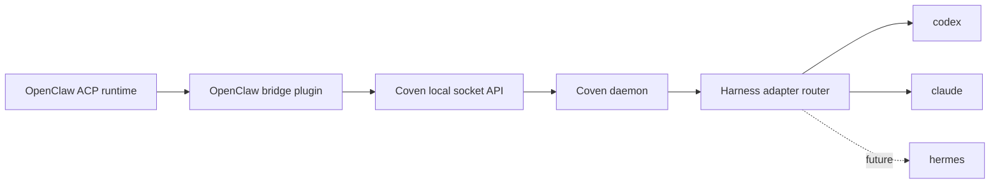

# OpenClaw bridge

OpenClaw is Coven's first external integration boundary. It should not be modeled as a daemon-owned harness like `coven run openclaw`. Instead, OpenClaw connects through the external OpenClaw bridge plugin package and uses Coven as a local session runtime.

## Integration shape



The bridge is a client of the daemon. It does not make OpenClaw a privileged Coven harness and it does not move OpenClaw code into Coven core.

## Responsibilities

OpenClaw owns:

- ACP runtime registration and plugin lifecycle;
- chat/session routing;
- user-facing delivery;
- fallback selection for non-Coven ACP backends; and
- mapping OpenClaw ACP agent ids to Coven harness ids.

Coven owns:

- the local socket API;
- project-root validation;
- harness id validation;
- PTY supervision;
- session metadata and event history; and
- input, attach, kill, archive, summon, and sacrifice policy.

## Configuration

Install the external plugin:

```bash
openclaw plugins install clawhub:OpenClaw bridge
```

Then opt into the Coven ACP backend in OpenClaw config:

```json5
{
  acp: {
    enabled: true,
    backend: "coven",
    defaultAgent: "codex",
  },
  plugins: {
    entries: {
      "opencoven-coven": {
        enabled: true,
        config: {
          covenHome: "~/.coven",
        },
      },
    },
  },
}
```

The plugin maps OpenClaw ACP agent ids to Coven harness ids. Future harnesses such as Hermes should be enabled through explicit adapter support and plugin mapping, not by hardcoding a special OpenClaw path in the daemon.

## Boundary

Do not add Coven code into OpenClaw core, and do not add OpenClaw internals into the Coven daemon. The compatibility contract is the Coven socket API plus adapter discovery.

Provider credentials stay with the target harness CLI. The OpenClaw bridge does not receive Codex, Claude, Hermes, OpenAI, Anthropic, GitHub, or other provider credentials from Coven.
