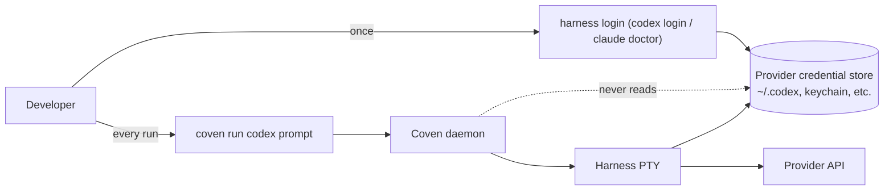

Coven supervises harness PTYs. It never reads, proxies, persists, or mints provider credentials. Every supported harness keeps using **its own** login flow for OpenAI, Anthropic, or any future provider it speaks to. This page records why, what that means in practice, and the exact boundary the Rust daemon enforces.

## TL;DR

- Provider tokens live wherever the harness already puts them — typically `~/.codex/`, `~/.config/anthropic/`, `~/.copilot/`, or a system keychain managed by that CLI.
- The Coven daemon never reads them, never stores them in SQLite, never forwards them over the socket API, and never logs them into the event ledger.
- `coven doctor` only checks whether the harness binary exists; it does **not** test provider credentials. Each harness already ships its own `login` / `doctor` for that.
- Treat Coven as having **zero** knowledge of provider auth state. The boundary is intentional.

## Why Coven refuses to own credentials

The arrow that matters is the missing one: the daemon has no dotted line into the provider credential store. Three reasons:

1. **Smaller blast radius.** A compromised Coven daemon, socket, or client cannot leak provider tokens it never had. A bug in event logging cannot accidentally record a token Coven never possessed.
2. **No credential drift.** Codex, Claude Code, Copilot CLI, and future harnesses iterate on their own auth flows (OAuth refresh, device codes, on-device keys). Coven would have to chase every change. By staying out, we never get out of sync.
3. **Audit clarity.** When something goes wrong with billing, rate limits, or revoked tokens, the user knows the answer lives in **one** place — the harness's own CLI. Coven is not a credential layer to debug.

## What this means at each surface

### CLI

`coven run codex|claude <prompt>` launches the harness with an empty argument vector apart from the validated prompt and adapter prefix args. It does not inject `OPENAI_API_KEY`, `ANTHROPIC_API_KEY`, or any token-bearing env var. If the harness needs a credential, it reads it the same way it would when launched directly from your shell.

### Daemon API

`POST /api/v1/sessions` accepts a project root, cwd, harness id, prompt, and optional title. There is no field for an API key, OAuth token, refresh token, account id, or organization id. The schema is documented in [API contract](/API-CONTRACT) — none of those fields exist.

### Event log

The append-only event log records harness stdout/stderr as it is emitted. The daemon does not introspect or redact it; that means if **you** ask a harness to print `cat ~/.codex/auth.json` the output **will** land in the ledger. See the [Safety model](/SAFETY-MODEL#event-log-caution) for the user-side guidance.

### Client integrations

Clients (CastCodes, comux, the OpenClaw plugin) connect to the local socket. They cannot fetch provider tokens from the daemon because the daemon does not have them. Any client that wants to display "logged in as ..." must call the harness's own status command directly.

## Provider login per harness

| Harness | Login command | Where credentials live | Notes |
|---|---|---|---|
| `codex` | `codex login` | `~/.codex/auth.json` (or platform keychain, depending on Codex version) | Use `codex logout` to revoke. Coven does not need to be restarted. |
| `claude` | `claude doctor` then follow prompts | `~/.config/anthropic/` and/or system keychain | `claude doctor` is also a general health check; Coven only relies on the binary being present. |
| `copilot` | `copilot login` | `~/.copilot/` (GitHub device-flow token managed by the CLI) | Use `copilot logout` to revoke. GitHub-side Copilot access is governed by your GitHub plan. |
| `grok` (experimental recipe) | `grok login` or `grok login --device-code` | `~/.grok/` and/or provider-managed local auth | `XAI_API_KEY` is also supported for headless use; Coven inherits it but never reads or stores it. |

If the harness's `login` flow itself has a problem (expired refresh token, revoked org, network failure), Coven surfaces this as a normal harness exit — the session ends with whatever exit code the CLI returned, and the event log contains the error message printed by the CLI.

## What Coven enforces

The daemon's responsibility is to **stay out of the credential path**. Concretely:

- The daemon does not read environment variables that look like provider credentials before launching a harness.
- The daemon does not inject provider env vars into the PTY child beyond inheriting what the daemon process itself was started with.
- The CLI does not accept a `--token`, `--api-key`, `--openai-key`, or similar flag on `coven run`. If you see one in a fork or PR, that is a regression — please file an issue.
- The socket API does not accept credential fields. Unknown fields are ignored; explicit credential fields would be rejected and treated as a contract violation.

## What the user must do

Because Coven refuses to own credentials, **the user** is responsible for:

- Running each harness's own `login` / `doctor` flow at least once before expecting `coven run` to succeed.
- Rotating provider tokens through the harness CLI when needed.
- Treating any harness output that prints a credential (because you asked it to) as ledger-recorded — clean it up with [`coven sacrifice`](/SESSION-LIFECYCLE#sacrifice) if needed.

## Related

- [Authentication and local access](/AUTH)
- [Safety model](/SAFETY-MODEL)
- [Install harness CLIs](/harnesses/installing)
- [Harness adapters](/HARNESS-ADAPTERS)
- [Codex harness](/harnesses/codex)
- [Claude Code harness](/harnesses/claude-code)
