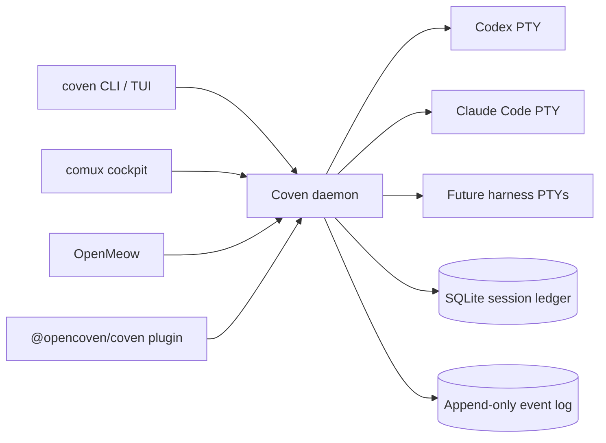

<div class="home-intro">
  
  <div>
    <p class="home-intro-kicker"><strong>Bring any familiar into the circle.</strong></p>
    <p><strong>OpenCoven is an open ecosystem for persistent AI familiars. Coven is the local runtime substrate that supervises every harness — Codex, Claude Code, and future Hermes, Aider, and Gemini CLIs — inside explicit project boundaries.</strong></p>
    <p>Launch a session, watch the PTY, attach later, archive when done. One daemon, one socket, every familiar on equal footing.</p>
  </div>
</div>

<Columns>
  <Card title="Get started" href="/GETTING-STARTED" icon="rocket">
    Install Coven, run `coven doctor`, and launch a project-scoped harness session.
  </Card>
  <Card title="Runtime model" href="/ARCHITECTURE" icon="compass">
    Daemon, PTY supervision, project-root validation, sessions, events, and local socket authority.
  </Card>
  <Card title="CLI reference" href="/reference/cli" icon="terminal">
    Current `coven` commands: run, sessions, attach, daemon, doctor, archive, summon, and sacrifice.
  </Card>
</Columns>

## What is Coven?

Coven is a **local-first runtime substrate**: a single Rust daemon that owns harness PTYs, session state, and an append-only event ledger on your own machine. Clients like the `coven` CLI/TUI, the comux cockpit, OpenMeow, and the external OpenClaw plugin all coordinate through one versioned HTTP-over-Unix-socket contract.

**Who is it for?** Developers and operators who want their AI familiars to keep running locally, remember what they did, and stay inside project boundaries you can audit.

**What makes it different today?**

- **Local-first** — the daemon, the store, and the socket all live under `$COVEN_HOME`. No cloud relay, no daemon OAuth.
- **Harness-neutral** — Codex and Claude Code today, with a documented adapter bar for future harnesses. Same lifecycle, same rituals.
- **Project-rooted** — every launch carries an explicit project root and canonicalized working directory. The Rust daemon revalidates each request.
- **Inspectable** — sessions and events are SQLite rows you can browse with `coven sessions`, replay with `coven attach`, or sacrifice when you no longer need them.
- **MIT licensed** — packaged for early adopters under `@opencoven/*`, command always `coven`.

**What do you need?** A Rust stable toolchain (or the published `@opencoven/cli` wrapper), at least one supported harness CLI on `PATH`, and a project to run inside.

## How it works



The daemon is the single source of truth for sessions, PTY lifecycle, and capability routing.

## Key capabilities

<Columns>
  <Card title="Harness-neutral runtime" icon="layers" href="/HARNESS-ADAPTERS">
    Codex and Claude Code launched through one supervised PTY layer.
  </Card>
  <Card title="Project-scoped sessions" icon="folder-tree" href="/SESSION-LIFECYCLE">
    Every session pins a canonical project root and refuses to wander.
  </Card>
  <Card title="Append-only event log" icon="scroll" href="/SESSION-LIFECYCLE">
    Replay output, recover from daemon restarts, and audit what a harness actually did.
  </Card>
  <Card title="Rituals" icon="moon" href="/SESSION-LIFECYCLE">
    Archive, summon, and sacrifice — explicit, beginner-safe verbs around destructive operations.
  </Card>
  <Card title="Local socket API" icon="plug" href="/API">
    `GET /api/v1/health` first; then sessions, events, capabilities, and actions over Unix socket.
  </Card>
  <Card title="Client integration" icon="plug-zap" href="/CLIENT-INTEGRATION">
    comux, OpenMeow, and the OpenClaw bridge integrate as socket clients, not launch authorities.
  </Card>
</Columns>

## Quick start

<Steps>
  <Step title="Install Coven">
    ```bash
    npm install -g @opencoven/cli
    ```
    Building from source? See [Getting started](/GETTING-STARTED).
  </Step>
  <Step title="Check your environment">
    ```bash
    coven doctor
    ```
    `doctor` reports whether `codex` and `claude` are on `PATH`, whether the daemon socket can bind, and what to install next.
  </Step>
  <Step title="Start the daemon">
    ```bash
    coven daemon start
    coven daemon status
    ```
  </Step>
  <Step title="Launch your first session">
    ```bash
    cd /path/to/your/project
    coven run codex "describe this repo"
    ```
    Or open the human session browser:

    ```bash
    coven sessions
    ```
  </Step>
</Steps>

Need the full install and developer setup? See [Getting started](/GETTING-STARTED).

## Session browser

`coven sessions` opens a human-friendly browser of every live and archived session. Pick one, then choose a ritual:

- **Rejoin** — attach to a live PTY and follow its output.
- **View log** — open the append-only event log.
- **Summon** — restore an archived session into the active list.
- **Archive** — hide a finished session without deleting events.
- **Sacrifice** — permanently delete a non-running session (requires `--yes`).

Pipe-friendly variants exist too: `coven sessions --plain` for tables, `coven sessions --json` for clients.

## Configuration (optional)

Coven state lives under `$COVEN_HOME` (defaulting to `~/.coven` on macOS/Linux). The daemon binds a Unix socket at `<covenHome>/coven.sock` and refuses TCP by default.

- If you **do nothing**, Coven uses your existing local harness logins.
- If you want to lock it down, scope `$COVEN_HOME` per project root or per familiar.

Example:

```bash
export COVEN_HOME="$HOME/.local/share/coven"
coven daemon restart
```

## Start here

<Columns>
  <Card title="Concepts" href="/CONCEPTS" icon="book-open">
    Runtime topology, authority boundary, session lifecycle, and the control plane.
  </Card>
  <Card title="Harnesses" href="/HARNESS-ADAPTERS" icon="layers">
    Per-harness setup, provider auth boundary, and adapter expectations.
  </Card>
  <Card title="Local API" href="/API" icon="plug">
    Versioned socket API for comux, OpenMeow, OpenClaw plugin, and your own clients.
  </Card>
  <Card title="Sessions" href="/SESSION-LIFECYCLE" icon="moon">
    Archive, summon, and sacrifice — the beginner-safe verbs around session state.
  </Card>
  <Card title="Help" href="/TROUBLESHOOTING" icon="life-buoy">
    Common setup issues, environment variables, and how to file a diagnostics bundle.
  </Card>
</Columns>

## Learn more

<Columns>
  <Card title="Operational model" href="/OPERATIONAL-MODEL" icon="list">
    Authority boundary, store guarantees, supported harnesses, and roadmap signals.
  </Card>
  <Card title="Safety model" href="/SAFETY-MODEL" icon="shield">
    Trust boundary, secret handling, socket posture, and automation approvals.
  </Card>
  <Card title="Troubleshooting" href="/TROUBLESHOOTING" icon="wrench">
    Daemon diagnostics, harness install hints, orphan recovery, and verification.
  </Card>
  <Card title="Roadmap" href="/ROADMAP" icon="map">
    Current milestones, adapter direction, and public product boundaries.
  </Card>
</Columns>
