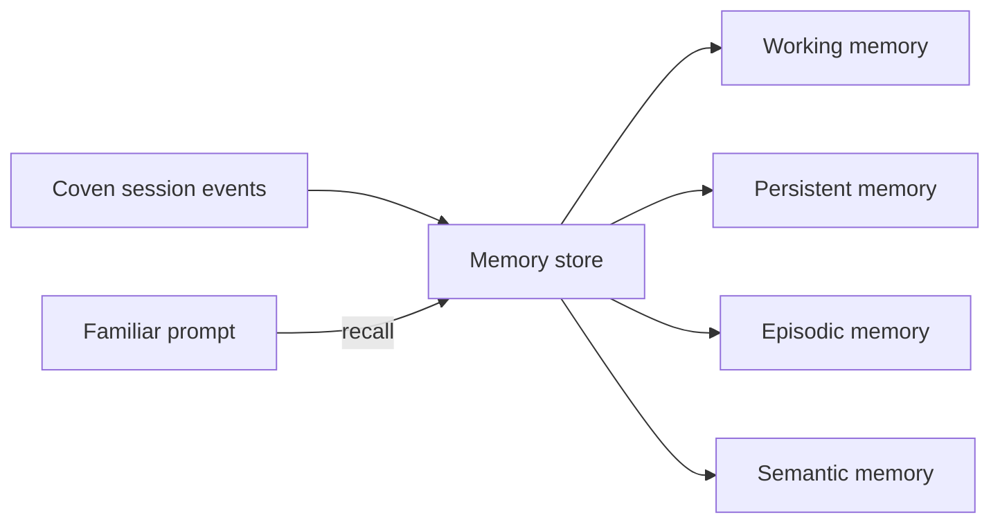

Memory is what turns a harness session into a persistent familiar. OpenCoven treats memory as a first-class concept with four layers:

<Columns>
  <Card title="Working memory" href="/memory/working-memory" icon="brain">
    In-session context tied to one PTY run.
  </Card>
  <Card title="Persistent memory" href="/memory/persistent-memory" icon="database">
    Cross-session memory that survives daemon restarts.
  </Card>
  <Card title="Episodic memory" href="/memory/episodic" icon="film">
    Remembering specific events, turns, and outcomes.
  </Card>
  <Card title="Semantic memory" href="/memory/semantic" icon="lightbulb">
    Embeddings and concept-based recall.
  </Card>
</Columns>

## How memory relates to Coven sessions

Coven stores **session events** — that is the ground truth for what happened. Memory is the layer above that derives, summarizes, and indexes those events for future familiars to consult.

The Coven daemon does not enforce a single memory backend. The memory layer is a client concern; Coven only guarantees the event ledger is durable and queryable.

## Search

[Memory search](/memory/search) lets a familiar query its own memory inside a session. The exact backend (sqlite-vss, lancedb, a hosted vector store) is up to the client.

## Related

- [Familiars](/familiars)
- [Sessions and events](/sessions/events)
- [comux JSON sessions](/sessions/comux-json)
