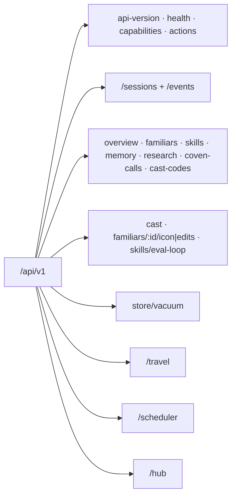

The Coven daemon exposes its public API as HTTP over a Unix socket under `<covenHome>/coven.sock`. The active contract is **`coven.daemon.v1`** served under `/api/v1`. This page is the canonical endpoint index — every route the daemon serves is listed here.



All error responses use the structured envelope documented in the [API contract](/API-CONTRACT#structured-error-envelope): `{ "error": { "code", "message", "details" } }`. Unknown routes, action ids, and API versions fail closed. Capability groups (`sessions`, `events`, `travel`, `scheduler`, `hub`) are advertised in the `GET /api/v1/health` `capabilities` block — treat a group as unavailable unless health advertises it.

## Contract and discovery

| Method | Path | Purpose | Success |
|---|---|---|---|
| GET | `/api/v1/api-version` | Active API version + supported versions. | `{ apiVersion, supportedApiVersions }` |
| GET | `/api/v1/health` | Daemon reachability, version, capabilities, pid, hub summary. | `{ ok, apiVersion, covenVersion, capabilities, daemon, hub }` |
| GET | `/api/v1/capabilities` | Control-plane capability catalog with policy hints and action ids. | `{ capabilities: [...] }` |
| GET | `/api/v1/capabilities/:harness` | One harness's capability manifest. | manifest object · `404` unknown harness |
| POST | `/api/v1/actions` | Route a known control-plane action id (intent envelope). | `{ ok, accepted, status, event }` · `400 invalid_request` |

## Sessions and events

| Method | Path | Purpose | Body / query | Success | Errors |
|---|---|---|---|---|---|
| GET | `/api/v1/sessions` | List sessions. | — | `SessionRecord[]` | — |
| POST | `/api/v1/sessions` | Launch a project-scoped harness session. | `{ projectRoot, cwd?, harness, prompt, title?, launchMode?, conversation?, conversationId? }` | `SessionRecord` | `400 invalid_request`, `500 launch_failed` |
| POST | `/api/v1/sessions/external` | Register (or idempotently re-register) an externally launched session. | session descriptor | `201` new / `200` existing | `400`, `409 session_id_conflict` |
| GET | `/api/v1/sessions/:id` | Fetch one session. | — | `SessionRecord` | `404 session_not_found` |
| POST | `/api/v1/sessions/:id/complete` | Mark an external session completed. | `{ exitCode?, ... }` | updated record | `404`, `409` (not external) |
| GET | `/api/v1/sessions/:id/events` | Read redacted session events. | `?afterSeq`, `?afterEventId`, `?limit` | `{ events, nextCursor, hasMore }` | `404 session_not_found` |
| GET | `/api/v1/sessions/:id/log` | Read bounded redacted log previews. | — | `[{ ts, level, message }]` | `404 session_not_found` |
| POST | `/api/v1/sessions/:id/input` | Forward input to a live session. | `{ data }` | `{ ok, accepted }` | `400`, `404`, `409 session_not_live`, `500 send_input_failed` |
| POST | `/api/v1/sessions/:id/kill` | Kill a live session. | — | `{ ok, accepted }` | `404`, `409 session_not_live`, `500 kill_failed` |
| GET | `/api/v1/sessions/:id/artifacts/:artifactId` | Read one raw (unredacted) artifact. | `?raw=1` required | raw payload | `400` (missing `raw=1`), `403 raw_artifacts_disabled`, `404` |
| GET | `/api/v1/events` | Read paginated redacted events for a session. | `?sessionId` required, `?afterSeq`, `?afterEventId`, `?limit` | `{ events, nextCursor, hasMore }` | `400 invalid_request` |

Event payloads are redacted by default; the raw artifact route requires explicit local raw-artifact persistence. See [STREAM-JSON](/STREAM-JSON) for event payload shapes.

## Observability reads

These power `coven status`, `coven familiars`, `coven skills`, `coven memory`, `coven research`, `coven calls`, and the Cave cockpit — the CLI `--json` output is exactly these bodies (see [cli-observe](cli-observe.md)). Missing files degrade to empty lists.

| Method | Path | Purpose | Success |
|---|---|---|---|
| GET | `/api/v1/overview` | Dashboard aggregate: open sessions, roster/skill/research counts. | overview object |
| GET | `/api/v1/familiars` | Familiar roster from `familiars.toml`. | `FamiliarDto[]` |
| GET | `/api/v1/skills` | Installed skills from `~/.coven/skills/`. | `SkillDto[]` |
| GET | `/api/v1/memory` | Familiar memory files from `~/.coven/memory/`. | memory list |
| GET | `/api/v1/research` | Research loop log rows. | research list |
| GET | `/api/v1/coven-calls` | Coven Calls delegation ledger. | `{ ok, calls }` |
| GET | `/api/v1/coven-calls/:id` | One delegation call. | `{ ok, call }` · `404 call_not_found` |
| GET | `/api/v1/cast-codes` | Cast code catalog (`~?`, `~>` …). | code list |

## Cast and familiar writes

| Method | Path | Purpose | Success | Errors |
|---|---|---|---|---|
| POST | `/api/v1/cast` | Submit a cast line (status/delegation shorthand) to the cockpit session. | `202 { accepted, cast_id, echo }` | `400 invalid_request` |
| PUT | `/api/v1/familiars/:id/icon` | Update a familiar's icon glyph. | updated familiar | `400`, `404` |
| POST | `/api/v1/familiars/:id/edits` | Ward-adjudicated writes into a familiar home (Gates 1–2, fail-closed, audited). | edit report | `400`, `403` (ward denial), `404` |

## Skills: eval-loop

| Method | Path | Purpose | Success | Errors |
|---|---|---|---|---|
| GET | `/api/v1/skills/eval-loop/:familiarId` | Eval-loop skill state for a familiar. | `{ ok, state }` | `404 skill_not_active` |
| POST | `/api/v1/skills/eval-loop/:familiarId/run` | Enqueue an eval-loop run (`{ track? }`, default `synthesis`). | `202 { ok, runId, track }` | `400`, `409 run_in_progress` |
| DELETE | `/api/v1/skills/eval-loop/:familiarId/run-lock` | Clear a stale run lock (`{ force? }`). | `{ ok, cleared, familiarId }` | `409 lock_not_stale` |

## Store

| Method | Path | Purpose | Success |
|---|---|---|---|
| POST | `/api/v1/store/vacuum` | Rebuild the event FTS index and compact the SQLite store (CLI: [cli-vacuum](cli-vacuum.md)). | `{ ok, eventIndexRebuilt, integrityCheck }` · `500` on repair failure |

`eventIndexRebuilt` reports whether the `events_fts` index was present and rebuilt — the rebuild always runs when the index exists, so `true` does not imply the index was stale. `false` means the store has no `events_fts` table to rebuild.

## Travel (advertised by `capabilities.travel`)

| Method | Path | Purpose | Success | Errors |
|---|---|---|---|---|
| POST | `/api/v1/travel/profiles` | Generate a signed, compressed offline travel profile for a familiar. | `201` profile envelope (`profileId`, `expiresAt`, `staleAfter`, `permissions`, `contentHash`, `profileBlob`) | `400 invalid_request` |
| POST | `/api/v1/travel/deltas` | Upload offline deltas recorded against a profile (`?defer=1` to queue). | delta acceptance | `404 travel_profile_not_found`, `409 source_hub_mismatch`, `409 travel_profile_expired` |
| GET | `/api/v1/travel/state` | Client sync state (`?clientId`, `?profileId`). | `{ state, profileId, pendingDeltaBytes, hubReachable, profileFreshness, travelExecutionAllowed, validStates }` | `400`, `404` |

## Scheduler (advertised by `capabilities.scheduler`)

| Method | Path | Purpose | Success | Errors |
|---|---|---|---|---|
| POST | `/api/v1/scheduler/decisions` | Place a job on an eligible node by capability and queue pressure. | decision record | `400`, `409` (no eligible node) |
| GET | `/api/v1/scheduler/decisions/:id` | Fetch one placement decision. | decision record | `404` |
| POST | `/api/v1/scheduler/redispatch` | Re-route a persistent loop's job (`{ loopId, jobId, ... }`). | decision record | `400`, `404`, `409` |
| GET | `/api/v1/scheduler/loops/:id` | Persistent loop state incl. preserved subqueue and node availability. | loop state object | `404` |

## Hub control plane (advertised by `capabilities.hub`)

The hub is the only side that initiates executor contact (`coven.executor.v1`); see [cli-executor](cli-executor.md) and [HUB-OPERATIONS](/HUB-OPERATIONS). Read routes back `coven hub status/nodes/jobs/routing/dispatch` ([cli-observe](cli-observe.md)).

| Method | Path | Purpose |
|---|---|---|
| GET | `/api/v1/hub/status` | Hub role, hubId, node availability, queue depths. |
| POST | `/api/v1/hub/nodes` | Register or re-register an executor node. |
| GET | `/api/v1/hub/nodes` | List registered nodes. |
| GET | `/api/v1/hub/nodes/:id` | Fetch one registered node. |
| POST | `/api/v1/hub/nodes/:id/health` | Record an executor health report (holds/resumes its subqueue). |
| POST | `/api/v1/hub/nodes/:id/poll` | Poll executor availability outbound over its dispatch transport. |
| POST | `/api/v1/hub/nodes/:id/dispatch` | Dispatch a job outbound to a stateless executor. |
| GET | `/api/v1/hub/dispatches/:jobId` | Fetch a persisted dispatch record (job spec + result envelope). |
| POST | `/api/v1/hub/jobs` | Enqueue a job on the persistent global queue. |
| GET | `/api/v1/hub/jobs` | List jobs (`?state=queued\|assigned\|held\|completed\|failed\|cancelled`). |
| GET | `/api/v1/hub/jobs/:id` | Fetch one job with its routing entry. |
| POST | `/api/v1/hub/jobs/:id/assign` | Assign a job to an executor from the node registry. |
| POST | `/api/v1/hub/jobs/:id/complete` | Mark a job completed/failed/cancelled. |
| GET | `/api/v1/hub/routing` | Read the persistent routing table. |

Full hub request/response shapes live in the [API contract](/API-CONTRACT).

## Always begin with health

```http
GET /api/v1/health
```

The response tells you the active `apiVersion`, the daemon's `capabilities`, and the running pid/uptime. Treat the rest of the API as undefined until you have read those fields.

See [Coven Local API](/API) for response examples and architecture notes, and the [API contract](/API-CONTRACT) for stable shapes, versioning, and failure envelopes.

## Related

- [Coven Local API](/API)
- [API contract](/API-CONTRACT)
- [Authentication and local access](/AUTH)
- [Client integration](/CLIENT-INTEGRATION)
