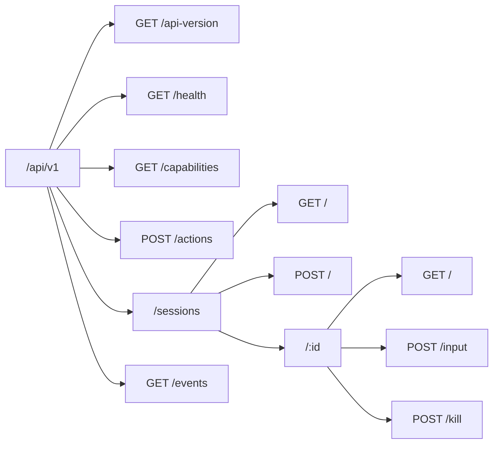

The Coven daemon exposes its public API as HTTP over a Unix socket under `<covenHome>/coven.sock`. The active contract is **`coven.daemon.v1`** served under `/api/v1`.



## Endpoints

| Method | Path | Purpose | Body | Success | Errors |
|---|---|---|---|---|---|
| GET | `/api/v1/api-version` | Active API version + supported versions. | — | `{ apiVersion, supportedApiVersions }` | — |
| GET | `/api/v1/health` | Daemon reachability, version, capabilities, pid. | — | `{ ok, apiVersion, covenVersion, capabilities, daemon }` | `503 runtime_unavailable` |
| GET | `/api/v1/capabilities` | Capability catalog with policy hints. | — | `{ capabilities: [...] }` | — |
| POST | `/api/v1/actions` | Route a known control-plane action id. | `{ action, origin, intentId, args }` | `{ ok, accepted, status, event }` | `400 invalid_request` (unknown action) |
| GET | `/api/v1/sessions` | List active sessions. | — | `SessionRecord[]` | — |
| POST | `/api/v1/sessions` | Launch a project-scoped harness session. | `{ projectRoot, cwd?, harness, prompt, title?, launchMode?, conversation?, conversationId? }` | `SessionRecord` | `400 invalid_request` (includes cwd-outside-project-root, unknown harness id, malformed body, etc.), `500 launch_failed` (runtime spawn / initial-message-write / harness startup failed; row marked `failed`) |
| GET | `/api/v1/sessions/:id` | Fetch one session. | — | `SessionRecord` | `404 session_not_found` |
| POST | `/api/v1/sessions/:id/input` | Forward input to a live session. | `{ data }` | `{ ok, accepted }` | `400 invalid_request` (malformed body / missing or non-string `data`), `404 session_not_found`, `409 session_not_live`, `500 send_input_failed` |
| POST | `/api/v1/sessions/:id/kill` | Kill a live session. | — | `{ ok, accepted }` | `404 session_not_found`, `409 session_not_live`, `500 kill_failed` |
| GET | `/api/v1/events` | Read paginated session events. | — (`?sessionId`, `?afterSeq`, `?afterEventId`, `?limit`) | `{ events, nextCursor, hasMore }` | `400 invalid_request` |

All error responses use the structured envelope documented in [API contract](/API-CONTRACT#structured-error-envelope).

## Always begin with health

```http
GET /api/v1/health
```

The response tells you the active `apiVersion`, the daemon's `capabilities`, and the running pid/uptime. Treat the rest of the API as undefined until you have read those fields.

See [Coven Local API](/API) for response examples and [API contract](/API-CONTRACT) for stable shapes and failure envelopes.

## Related

- [Coven Local API](/API)
- [API contract](/API-CONTRACT)
- [Authentication and local access](/AUTH)
- [Client integration](/CLIENT-INTEGRATION)
