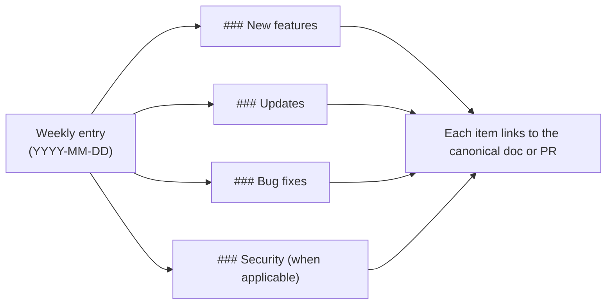

## Week of May 17, 2026

### Bug fixes

- **TUI no longer panics on small terminals.** Both `coven tui` and `coven chat` now guard their layout math against very small terminal sizes, so resizing to a narrow or short window will no longer crash the session. See [Coven TUI](/start/coven-tui).

### Security

- **Ratatui dependency advisory cleared.** Updated the underlying Ratatui rendering stack so the patched `lru` crate is pulled in, resolving advisory [GHSA-rhfx-m35p-ff5j](https://github.com/advisories/GHSA-rhfx-m35p-ff5j). No action required — pick up the latest release.

## Week of May 15, 2026

### Updates

- **Brand-aligned TUI theme.** Both `coven tui` and `coven chat` now share a unified, brand-aligned palette with consistent semantic tokens for primary, agent, user, hint, surface, and dim styles. Colors adapt to your terminal automatically: truecolor on 24-bit terminals, 256-color on legacy terminals, and no color when output is piped or `NO_COLOR` is set. See [Environment variables](/help/environment).
- **Documented terminal color controls.** The environment variables that drive Coven's color output (`NO_COLOR`, `COLORTERM`, `TERM`) are now documented with examples for disabling color in CI, forcing truecolor, and selecting a 256-color render. See [Environment variables](/help/environment).

### Bug fixes

- **Release secret guard false positives.** The public-release secret guard now allows documented OpenCoven repo links and local worktree paths as benign high-entropy tokens while still flagging explicit secret patterns.

## How to read this changelog

Entries are weekly, newest first. Items inside each week are grouped by category. Anything affecting the public API (CLI surface, socket routes, response shapes) also lands in [API contract](/API-CONTRACT) — the changelog is a pointer, not a substitute.

## Week of May 11, 2026

### New features

- **Prompt-first Coven TUI.** Running `coven` (or `coven tui`) now opens a Ratatui-based interactive interface. Type free-form tasks, run slash commands (`/help`, `/agent`, `/clear`, `/export`, `/exit`), and navigate ritual menus with arrow keys. Works over SSH and resizes safely. See [Coven TUI](/start/coven-tui).
- **`coven pc` diagnostics and relief.** A macOS-first system pressure tool. Read-only commands surface CPU, memory, disk, and top-process snapshots; write operations (`coven pc kill`, `coven pc cache clear`) require an explicit `--confirm` gate. See the [CLI reference](/reference/cli) and [Troubleshooting](/help/troubleshooting).
- **Local API v1 contract.** The daemon socket API now exposes versioned health and capabilities endpoints, structured error responses, and cursor-based event pagination. Clients can negotiate features instead of guessing. See [API contract](/reference/api-contract) and [Events](/reference/api-events).
- **JSON sessions output.** `coven sessions --json` emits machine-readable session listings for scripts, dashboards, and external clients. See [comux JSON sessions](/sessions/comux-json).
- **Windows install path.** Coven now ships a Windows npm package so `npx @opencoven/cli` works on native Windows alongside macOS and Linux. See [Windows install](/install/windows).

### Updates

- **OpenCoven positioning and brand.** Refreshed product copy across the docs and CLI to frame Coven as an ecosystem for persistent AI familiars, with updated brand tokens and design guidance. See [Brand](/reference/brand).
- **Refined brand palette.** Updated the OpenCoven palette to a muted lavender-grey (`#9A8ECD`) with a new complementary accent system and dedicated dark- and light-mode surface tokens. Existing legacy color aliases are preserved, so no action is needed to pick up the new look. See [Brand](/reference/brand).
- **Troubleshooting: system health and pressure.** Added a section that points from the canonical troubleshooting flow to `coven pc` for diagnosing local CPU, memory, and disk pressure. See [Troubleshooting](/help/troubleshooting).
- **Full session IDs in plain output.** `coven sessions --plain` now prints full session IDs so they can be copied straight into follow-up commands.

### Bug fixes

- **Daemon status verification.** `coven` now verifies the daemon over its health socket before reporting `running`, clears dead stale metadata, and reports `stale` when metadata is live but unverified.
- **Corrupt daemon metadata recovery.** The CLI now recovers gracefully when on-disk daemon status metadata is corrupt instead of failing to start.
- **Stricter event pagination.** The API rejects non-integer `limit` and `afterSeq` values with a structured `invalid_request` error before doing any session lookup.
