The user-facing command is always `coven`. Wrapper packages like `@opencoven/cli`, `@opencoven/cli-macos`, and `@opencoven/cli-linux-x64` install the same binary.

```mermaid
flowchart TB
  Root["coven"] --> TUI["tui (default)"]
  Root --> Doctor["doctor"]
  Root --> Daemon["daemon"]
  Root --> Run["run"]
  Root --> Sessions["sessions"]
  Root --> Attach["attach"]
  Root --> Summon["summon"]
  Root --> Archive["archive"]
  Root --> Sacrifice["sacrifice"]
  Root --> Patch["patch"]
  Root --> Pc["pc (macOS-first)"]

  Daemon --> DStart["start"]
  Daemon --> DStatus["status"]
  Daemon --> DRestart["restart"]
  Daemon --> DStop["stop"]

  Run --> RCodex["codex &lt;prompt&gt;"]
  Run --> RClaude["claude &lt;prompt&gt;"]

  Sessions --> SPlain["--plain"]
  Sessions --> SJson["--json"]
  Sessions --> SAll["--all"]
  Sessions --> SManage["--manage"]

  Patch --> POpenclaw["openclaw &lt;prompt&gt;"]

  Pc --> PcStatus["status [--json]"]
  Pc --> PcTop["top --n N"]
  Pc --> PcDisk["disk"]
  Pc --> PcKill["kill &lt;pid&gt; --confirm"]
  Pc --> PcCache["cache clear --confirm"]
```

## Top-level

| Command | Action |
|---|---|
| `coven` | Open the beginner-friendly interactive menu. |
| `coven tui` | Explicitly open the slash-command TUI. |
| `coven doctor` | Detect supported harness CLIs and print install hints. |
| `coven daemon start/status/restart/stop` | Manage the local daemon. |
| `coven run <harness> <prompt>` | Launch a project-scoped harness session. Current harness ids: `codex`, `claude`. |
| `coven sessions` | Open the session browser; supports `--plain`, `--json`, `--all`, and `--manage`. |
| `coven attach <session-id>` | Replay/follow session output and forward input when live. |
| `coven summon <session-id>` | Restore an archived session, then replay/follow it. |
| `coven archive <session-id>` | Hide a non-running session while preserving events. |
| `coven sacrifice <session-id> --yes` | Permanently delete a non-running session. |
| `coven patch openclaw <prompt>` | Local OpenClaw rescue loop. Does not commit or push. |
| `coven pc` | macOS-first diagnostics and explicit `--confirm` relief operations. |

## Common flags by command

| Command | Flags |
|---|---|
| `coven run` | `--cwd <path>`, `--title <text>`, `--detach` |
| `coven sessions` | `--plain`, `--json`, `--all`, `--manage` |
| `coven sacrifice` | `--yes` (required) |
| `coven pc kill` | `--confirm` (required) |
| `coven pc cache clear` | `--confirm` (required) |
| `coven pc top` | `--n <N>`, `--verbose` |
| `coven pc status` | `--json` |

## Flag conventions

- **Project-scoped commands** accept `--cwd <path>` for a launch directory inside the project root.
- **Pipe-friendly commands** accept `--plain` for tables and `--json` for machine output.
- **Destructive commands** require `--yes` (or `--confirm` for `coven pc` relief).
- **Daemon-touching commands** print install/repair hints when the socket is missing.

## Exit codes

Current builds return `0` for success and a non-zero error for failed CLI execution. Structured, command-specific exit codes are reserved for a future release.

## Related

- [Getting started](/GETTING-STARTED)
- [Coven TUI](/start/coven-tui)
- [Session lifecycle](/SESSION-LIFECYCLE)
- [Harness adapter guide](/HARNESS-ADAPTERS)
- [Troubleshooting](/TROUBLESHOOTING)
