The user-facing command is always `coven`. Wrapper packages like `@opencoven/cli`, `@opencoven/cli-macos`, and `@opencoven/cli-linux-x64` install the same binary.

```mermaid
flowchart TB
  Root["coven"] --> TUI["tui (default)"]
  Root --> Doctor["doctor"]
  Root --> Daemon["daemon"]
  Root --> Run["run"]
  Root --> Sessions["sessions"]
  Root --> Attach["attach"]
  Root --> Summon["summon"]
  Root --> Archive["archive"]
  Root --> Sacrifice["sacrifice"]
  Root --> Patch["patch"]
  Root --> Logs["logs"]
  Root --> Wt["wt"]
  Root --> Claim["claim"]
  Root --> Hooks["hooks"]
  Root --> Pc["pc (macOS-first)"]

  Daemon --> DStart["start"]
  Daemon --> DStatus["status"]
  Daemon --> DRestart["restart"]
  Daemon --> DStop["stop"]

  Run --> RCodex["codex &lt;prompt&gt;"]
  Run --> RClaude["claude &lt;prompt&gt;"]

  Sessions --> SPlain["--plain"]
  Sessions --> SJson["--json"]
  Sessions --> SAll["--all"]
  Sessions --> SManage["--manage"]

  Patch --> POpenclaw["openclaw &lt;prompt&gt;"]

  Logs --> LPrune["prune [--dry-run]"]

  Wt --> WtBranch["&lt;branch&gt;"]
  Wt --> WtList["--list"]
  Wt --> WtDoctor["--doctor"]
  Wt --> WtPrune["--prune-merged / --prune-stale DAYS"]

  Claim --> CAcquire["acquire &lt;branch&gt;"]
  Claim --> CRelease["release &lt;branch&gt;"]
  Claim --> CHeartbeat["heartbeat &lt;branch&gt;"]
  Claim --> CCanary["canary &lt;branch&gt;"]
  Claim --> CStatus["status"]

  Hooks --> HInstall["install"]

  Pc --> PcStatus["status [--json]"]
  Pc --> PcTop["top --n N"]
  Pc --> PcDisk["disk"]
  Pc --> PcKill["kill &lt;pid&gt; --confirm"]
  Pc --> PcCache["cache clear --confirm"]
```

## Top-level

| Command | Action |
|---|---|
| `coven` | Open the beginner-friendly interactive menu. |
| `coven tui` | Explicitly open the slash-command TUI. |
| `coven doctor` | Detect supported harness CLIs and print install hints. |
| `coven daemon start/status/restart/stop` | Manage the local daemon. |
| `coven run <harness> <prompt>` | Launch a project-scoped harness session. Current harness ids: `codex`, `claude`. |
| `coven sessions` | Open the session browser; supports `--plain`, `--json`, `--all`, and `--manage`. |
| `coven attach <session-id>` | Replay/follow session output and forward input when live. |
| `coven summon <session-id>` | Restore an archived session, then replay/follow it. |
| `coven archive <session-id>` | Hide a non-running session while preserving events. |
| `coven sacrifice <session-id> --yes` | Permanently delete a non-running session. |
| `coven patch openclaw <prompt>` | Local OpenClaw rescue loop. Does not commit or push. |
| `coven logs prune` | Prune expired encrypted raw artifacts and old redacted event logs. |
| `coven wt <branch>` | Create or enter a sibling `<repo>.wt/<branch-slug>` git worktree. |
| `coven wt --list/--doctor/--prune-merged/--prune-stale DAYS` | Inspect and clean Coven protocol worktrees. |
| `coven claim acquire/release/heartbeat/canary <branch>` | Manage TTL-bounded branch ownership for the current agent. |
| `coven claim status` | Print branch claims from the current repository. |
| `coven hooks install` | Install local protocol hooks that block unsafe commits and protected pushes. |
| `coven pc` | macOS-first diagnostics and explicit `--confirm` relief operations. |

## Common flags by command

| Command | Flags |
|---|---|
| `coven run` | `--cwd <path>`, `--title <text>`, `--detach`, `--model <id>`, `--think`, `--speed fast\|balanced\|thorough` |
| `coven sessions` | `--plain`, `--json`, `--all`, `--manage` |
| `coven sacrifice` | `--yes` (required) |
| `coven logs prune` | `--dry-run`, `--raw-days <N>`, `--event-days <N>` |
| `coven wt` | `--list`, `--doctor`, `--prune-merged`, `--prune-stale <DAYS>` |
| `coven pc kill` | `--confirm` (required) |
| `coven pc cache clear` | `--confirm` (required) |
| `coven pc top` | `--n <N>`, `--verbose` |
| `coven pc status` | `--json` |

## Flag conventions

- **Project-scoped commands** accept `--cwd <path>` for a launch directory inside the project root.
- **Machine-readable output** is per-command today: `coven sessions` accepts `--plain` and `--json`; `coven sessions search`, `coven adapter list`, and `coven pc status` accept `--json`. Other tabular commands (`wt --list`, `claim status`, `daemon status`, `pc top`, `pc disk`) print human tables only.
- **Session id arguments** (`attach`, `summon`, `archive`, `sacrifice`) accept a unique prefix of the id.
- **Destructive commands** require `--yes` (or `--confirm` for `coven pc` relief).
- **Daemon-touching commands** print install/repair hints when the socket is missing.

## Log retention

`coven logs prune` applies the local privacy retention policy:

- Raw encrypted artifacts default to 7 days.
- Redacted operational event logs default to 30 days.
- `--dry-run` prints counts only.
- `--raw-days <N>` and `--event-days <N>` override the configured retention for one run.

## Parallel Work Protocol

`coven wt`, `coven claim`, and `coven hooks install` implement the local
Coven Parallel Work Protocol for multi-agent repositories.

- `coven wt <branch>` creates or enters `<repo>.wt/<branch-slug>/`.
- `coven claim acquire <branch>` writes a TTL-bounded branch claim under git's
  common directory. Set `COVEN_AGENT_ID` to a stable agent name.
- `coven hooks install` installs `pre-commit` and `pre-push` hooks. Existing
  hooks are chained through `<hook>.local`; tracked `core.hooksPath`
  directories are left untouched.
- Protected pushes require `.git/MERGE_INTENT` to contain
  `Enchant merge to main.` unless `COVEN_MERGE_PHRASE` changes the phrase.

## Exit codes

Current builds return `0` for success and a non-zero error for failed CLI execution. Structured, command-specific exit codes are reserved for a future release.

## Related

- [Getting started](/GETTING-STARTED)
- [Coven TUI](/start/coven-tui)
- [Session lifecycle](/SESSION-LIFECYCLE)
- [Harness adapter guide](/HARNESS-ADAPTERS)
- [Troubleshooting](/TROUBLESHOOTING)
