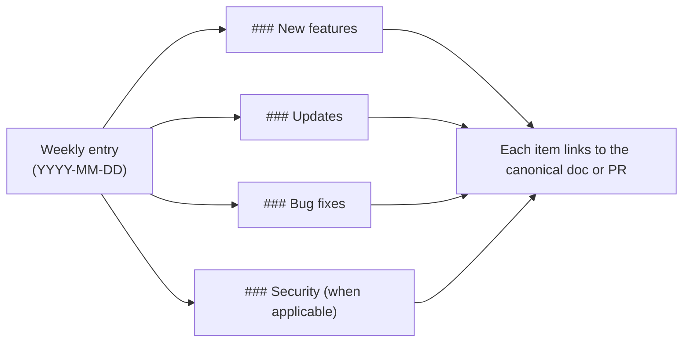

## Week of July 14, 2026

### New features

- **`coven scheduler` and `coven travel` read verbs.** The scheduler and travel daemon surfaces were API-only; ids they hand out (`coven hub routing` rows carry a `decisionId`, redispatch responses carry a `loopId`) had no CLI follow-up. `coven scheduler decision <id>`, `coven scheduler loop <loopId>`, and `coven travel state --client <id> [--profile <profileId>]` now render those read routes through the observe pattern — human prose by default, `--json` printing the exact `/api/v1/scheduler/*` / `/api/v1/travel/state` body. Write surfaces (decisions, redispatch, profiles, deltas) stay machine-to-machine like the executor protocol. See [observability commands](/reference/cli-observe) and [issue #390](https://github.com/OpenCoven/coven/issues/390).
- **Harness capability aggregate is reachable at `GET /api/v1/capabilities/harnesses`.** The endpoint returning Coven skills plus one capability manifest per harness (`{ coven_skills, harness_capabilities, scanned_at }`, with `?refresh=1` re-scan) was previously shadowed by the control-plane capability catalog on the bare `/api/v1/capabilities` path and unreachable. The catalog keeps the bare path, the aggregate now lives at `/capabilities/harnesses`, and unknown ids on `/capabilities/:harnessId` fail closed with a structured `404 harness_not_found` envelope. See [Capabilities endpoint](/reference/api-capabilities) and [issue #368](https://github.com/OpenCoven/coven/issues/368).
- **GitHub Copilot CLI is a supported built-in harness (v0.0.54).** `coven run copilot "…"` now launches the GitHub Copilot CLI (`npm install -g @github/copilot`) under the same project-rooted PTY supervision as Codex and Claude Code. `--permission full|read-only` maps to Copilot's native flags (`--allow-all` / `--deny-tool write --deny-tool shell`), `--model`, `--add-dir`, and `--think`/`--speed` (via `--effort`) forward natively, and `coven chat` keeps cross-turn conversations through pre-assigned `--session-id` UUIDs. Copilot has no long-lived stream mode, so chat turns run per-turn one-shots like Codex. `coven doctor` detects the binary and prints install/auth hints (`copilot login`). Adapter manifests gain optional `prompt_flag`/`interactive_prompt_flag` fields for harnesses whose prompt rides a flag instead of a positional. See [Copilot CLI harness](/harnesses/copilot-cli) and [issue #381](https://github.com/OpenCoven/coven/issues/381).

## Week of July 4, 2026

### New features

- **Travel mode foundations (v0.0.52).** The daemon now exposes `/api/v1/travel/profiles`, `/api/v1/travel/deltas`, and `/api/v1/travel/state` so laptop/offline clients can receive a gzip+base64 read-only profile, append offline results back to the hub, and surface handoff states without overwriting canonical memory. The profile artifact is written under `<covenHome>/travel/profiles/` and marked read-only. See [API contract](/API-CONTRACT) and `specs/coven-multi-host-daemon/`.
- **Multi-host scheduler recovery routes (v0.0.52).** Added persisted scheduler decisions and redispatch state through `/api/v1/scheduler/decisions`, `/api/v1/scheduler/decisions/:id`, `/api/v1/scheduler/redispatch`, and `/api/v1/scheduler/loops/:loopId`. The scheduler avoids heavyweight laptop-local work in travel mode, blocks low-battery laptop-local routing, preserves failed executor subqueues, and can recover loop state after daemon restart. See [API contract](/API-CONTRACT).

### Updates

- **CLI-login-only model selection (v0.0.53).** The model-selection docs now expose only the supported Codex CLI and Claude Code login paths. Provider/API-key option pages for OpenAI, Anthropic, Google, and local-model backends were removed from the selectable `/models` surface so clients and users are routed through `codex login` or `claude doctor` instead of raw provider credentials. See [Model selection](/models).
- **Multi-host daemon specs.** Added PRODUCT and TECH specs for travel profiles, offline deltas, scheduler roles, redispatch, failure handling, and the issue mapping for the multi-host daemon track.

### Bug fixes

- **Windows Codex stream bridge.** `coven run codex --stream-json` now launches `codex exec --json` through ordinary pipes, so npm's `codex.cmd` no longer relies on the headless ConPTY/OpenConsole handoff. Completed Codex messages are normalized into Coven `assistant` events, native thread ids are retained for resume, and timeout, protocol failure, and Unix cancellation are bounded with owned process-tree cleanup instead of leaving a session running forever. Windows uses a Job Object when assignment succeeds and `taskkill /T /F` for Coven-supervised fallback cleanup. See [stream-JSON protocol](/STREAM-JSON) and [Codex harness notes](/harnesses/codex).

## Week of June 24, 2026

### New features

- **Co-published external OpenClaw bridge plugin npm wrapper (v0.0.49).** The release pipeline now publishes a second wrapper package name, external OpenClaw bridge plugin, alongside the existing `@opencoven/cli`. Both wrappers depend on the same `@opencoven/cli-*` native platform packages, so installing either one ends up with the same `coven` binary. This lets docs and onboarding advertise the canonical *coven* name without breaking existing `@opencoven/cli` installs. See [PR #257](https://github.com/OpenCoven/coven/pull/257) and the [releasing runbook](/reference/releasing) for the trusted-publisher one-time setup the new package needs before its first OIDC release.
- **Coven Group Chat spec (v0.0.49).** Added the v1 design for a server-side group-chat primitive under `specs/coven-group-chat/` (PRODUCT + TECH). Today, group chat exists only as an iOS client-side fan-out illusion; the spec defines a durable, synced server object with monotonic event ordering so iOS, web, and CLI all read the same group. Implementation tracked separately. See [PR #258](https://github.com/OpenCoven/coven/pull/258).

### Updates

- **OpenMeow references removed from docs and code (v0.0.49).** OpenMeow is not an OpenCoven application — CastCodes is the canonical client. Stray OpenMeow examples and labels in English/Spanish/Russian docs, `DESIGN.md`, `ARCHITECTURE.md`, `AUTH.md`, `API-CONTRACT.md`, and related references were rewritten in product-neutral language. `crates/coven-cli/src/api.rs` renames the `openmeow` test origin to `external-client`, and `skills/coven-task-manager` drops `openmeow` from the recognized repo-label list. No runtime behavior changes. See [PR #256](https://github.com/OpenCoven/coven/pull/256).

## Week of June 18, 2026

### New features

- **Run reasoning controls (v0.0.48).** `coven run` now accepts `--think` and `--speed fast|balanced|thorough` alongside `--model`. Claude launches map the hints to `--effort`; unsupported harnesses warn and continue instead of failing. See [issue #246](https://github.com/OpenCoven/coven/issues/246), [PR #254](https://github.com/OpenCoven/coven/pull/254), and [Run command reference](/reference/cli-run).
- **Trusted Hermes adapter recipe (v0.0.41).** `coven adapter install hermes` now writes a trusted local adapter manifest under `COVEN_HOME/adapters/hermes.json`, and Coven loads manifests from that Coven-owned trust store automatically. New users no longer need to hand-write JSON or set `COVEN_HARNESS_ADAPTER_MANIFEST` just to try Hermes. See [Hermes harness notes](/harnesses/hermes) and [PR #245](https://github.com/OpenCoven/coven/pull/245).

### Updates

- **Windows x64 package status.** The public README now reflects that `@opencoven/cli-windows` is published, not staged. Windows users can install through the universal `@opencoven/cli` wrapper and verify local harness availability with `coven doctor`.

### Bug fixes

- **Resilient FTS event-index backfill (v0.0.48).** Existing-event backfill for `events_fts` now runs in bounded batches, records completion in `store_meta`, applies `busy_timeout` to read-only store connections, and treats `SQLITE_BUSY` as non-fatal so search indexing cannot block all agent dispatch on large histories. See [issue #249](https://github.com/OpenCoven/coven/issues/249) and [PR #254](https://github.com/OpenCoven/coven/pull/254).
- **Clearer unsupported-harness guidance.** Unknown harness errors now show configured harness ids and point Hermes users directly to `coven adapter install hermes` followed by `coven adapter doctor hermes`; other external harnesses still use trusted adapter manifests or the explicit manifest environment variables.
- **Windows home-directory fallback.** `coven doctor` and store-path resolution now work in PowerShell environments where `HOME` is absent by falling back through `USERPROFILE`, `HOMEDRIVE` + `HOMEPATH`, and the platform home directory before asking users to set `COVEN_HOME`.
- **PowerShell-native `coven-code` install guidance.** On Windows, `coven` now points missing interactive-UI users to the `install.ps1` installer and PowerShell-compatible `COVEN_LEGACY_TUI` syntax instead of showing Unix `curl | bash` commands.

## Week of June 3, 2026

### New features

- **Coven Parallel Work Protocol.** Coven now ships first-class `coven wt`, `coven claim`, and `coven hooks` commands for coordinating multiple AI coding agents in one repository. The protocol creates isolated git worktrees, records TTL-bound agent branch claims, installs chainable safety hooks, blocks accidental commits on protected branches, and requires an explicit merge-intent phrase before protected-branch pushes. See [issue #167](https://github.com/OpenCoven/coven/issues/167) and [PR #169](https://github.com/OpenCoven/coven/pull/169).
- **Session familiar identity persistence.** Sessions can now carry a resolved `familiar_id`, giving dashboards, APIs, and downstream agent surfaces a durable way to show which familiar launched or owns a session. See [PR #168](https://github.com/OpenCoven/coven/pull/168).

### Updates

- **Shared familiar resolution.** The CLI, daemon, and local API now resolve familiar identities through one shared path before launch, so stored session metadata reflects the canonical familiar identity rather than an unchecked input string.
- **Parallel-lane guardrails.** The worktree protocol includes status, doctor, prune, claim acquire/release/heartbeat/canary, and hook-install surfaces so agent coordination can scale from a single local checkout to multi-agent work without relying on ad hoc shell scripts.

### Bug fixes

- **Unknown familiar IDs no longer create sessions.** `POST /sessions` now rejects an unknown `familiarId` with `400 unknown_familiar` before inserting a session row or launching a runtime. Malformed familiar configuration returns `500 familiar_lookup_failed` without launching.
- **`coven run --familiar <id>` fails early for unknown familiars.** Local CLI launches now match daemon/API behavior and avoid silently recording unresolved familiar IDs.

## Week of May 20, 2026

### New features

- **Cast launcher.** `coven` (or the explicit `coven tui`) now opens **Cast**, the prompt-first launcher built against a single visual contract: a `Cast` identity row in brand purple, a thin-rule prompt area, a two-lane **Commands** rail + **Snapshot** body, a windowed list of slash commands with a `N of 14` scroll hint, an action preview, and a single `enter run · ↑↓ select · esc quit · ctrl+u clear` footer. The launcher resizes safely from 18 cols up to 96. See [Coven TUI](/start/coven-tui).
- **`/quest <goal>` — sequential goal flow.** A new spell decomposes any goal into a Quest with three default phases (**design → implement → verify**). Cast renders a handoff card before each phase showing the carried context and the verbatim sub-prompt the harness will see. At each prompt the user can press Enter to approve, type a replacement sub-prompt, `/skip [reason]` to skip the phase, or `/cancel [reason]` to stop the quest. Natural-language triggers (`start a quest to …`, `quest: …`) work too. The internal flow contract lives in `docs/design/cast-quest-flow.md`.
- **Resume an interrupted quest by attaching.** `coven attach <anchor-session>` on a quest's anchor session replays the quest's event log, reconstructs the in-memory Quest, and hands control back to the phase loop — so a Ctrl-C'd quest can be resumed exactly where it left off. Crashed-mid-phase work surfaces as Running so you can decide to re-run or skip.
- **Quest event ledger.** Every quest writes `cast.quest.{started, phase_started, phase_completed, phase_skipped, phase_edited, advanced, completed}` events on its anchor session — durable, queryable, and the source of truth for re-attach. Works in the daemon path (anchor = phase 0's session) **and** the local-PTY fallback path (anchor = a synthesized `quest-<uuid>` row in the local sessions table).
- **Cast plan and outcome cards.** Every spell now renders a plan card *before* any side effect (showing the resolved harness, the safety decision, the steps Cast will take) and an outcome card *after* (showing what landed, session ids, and concrete next steps).
- **Per-spell safety gate.** Cast's risk classifier inspects every spell for confirmation-required keywords (publish, push, deploy, sacrifice, etc.) and routes them through a typed confirmation before the harness sees them. Sacrifice still requires you to type the word `sacrifice` to proceed.

### Updates

- **Non-interactive Cast frame** (printed when `coven` is piped or run in CI) tightened to identity + one subtitle line + Context (project, harness) + Example spells + Slash spells + one dim footer hint. No second-person greeting; field labels are lowercase in a fixed 14-char column.
- **Structured failure detection in quest handoffs.** Non-zero exit codes — including `exit 2`, SIGKILL `137`, SIGINT `130` — now produce failure framing in the next phase's sub-prompt. Previously only the literal string `exit 1` matched.
- **Quest cursor advances past Skipped phases at the data layer.** `advance` and `skip_phase` walk the cursor forward to the next pending phase, so a skipped middle phase no longer strands the loop on a non-pending row.
- **`BORDER_SUBTLE` / `BORDER_STRONG` brand tokens** wired into the launcher prompt rules — top rule subtle, bottom rule strong — so focus reads visually without overemphasizing the prompt.
- **Cast attach surfaces a quest-anchor note** alongside the existing `cast.summary` line when you attach to a completed quest's anchor session.
- **Daemon-backed Cast attach.** `/attach` and `/summon` route through Cast so the resumed session also gets a Cast transcript and writes a `cast.summary` event when it exits.
- **TUI shell and session browser** extracted into focused modules (`tui/shell.rs`, `tui/sessions.rs`) so future surfaces can extend either without enlarging `main.rs`.
- **`sysinfo` bumped to 0.39.2** (was 0.30.13) and **`unicode-width` to 0.2.2** (was 0.2.0) via dependabot.

### Bug fixes

- **Re-attach reconstructs quests written by the local-PTY path.** Quests run without the daemon now write events to a synthetic anchor session in the local store, so `/attach <quest-id>` finds them.
- **Avoid full event-log scan for the `cast.summary` existence check.** Cast now uses a fast `event_kind_exists` query instead of fetching every event for a session every time it writes a summary.
- **Resolved a duplicate `list_events` fetch** during cast attach's summary lookup — the existing replay history is reused.
- **Sanitized terminal output in `coven chat` (v0.0.17).** Raw ANSI escape sequences (CSI cursor moves, OSC titles, OSC 8 hyperlinks, DCS/SOS/PM/APC payloads, color resets) and stray `\r` from attached daemon sessions no longer pollute the chat transcript. Consecutive output chunks from the same agent coalesce into a single message instead of creating a fresh bubble per event, and harness backspace (`\x08`) characters collapse into the prior glyph so in-place rewrites (progress spinners, status redraws) don't leave stale text behind. Pure cursor-visibility / mode-toggle chunks are dropped instead of surfacing as empty bubbles.
- **`coven --version` works on source builds (v0.0.19).** Native binaries produced by `cargo install`, `cargo build`, or extracted directly from a published npm tarball now answer `coven --version` / `coven -V` instead of returning an "unexpected argument" error. A `build.rs` stamps the binary with `git describe --tags --always --dirty` for local checkouts (e.g. `v0.0.17-2-g00a9c16-dirty`), falls back to `$GITHUB_REF_NAME` so CI-tag-triggered releases stamp the bare tag (e.g. `v0.0.19`), and falls back further to `<CARGO_PKG_VERSION> (unknown source)` for tarball builds without git. The npm wrapper (`@opencoven/cli`) still short-circuits `--version` to print its own `package.json` version, so npm users see no behavioral change. (The `v0.0.18` git tag exists but never reached npm — its workflow run hit a release-gate `cargo fmt --check` drift in two newly-added chat-sanitizer tests; the published artifact is v0.0.19.)
- **`coven chat` uses plain Codex responses instead of embedding the Codex full-screen TUI (v0.0.20).** Chat launches daemon-backed Codex sessions in non-interactive mode, so the transcript receives assistant text instead of Codex startup panels, tips, progress redraws, and terminal-control output. Interactive Cast launches still request interactive mode. Completed chat sessions now clear their active session id, so the next prompt starts a fresh clean session instead of trying to append input to a finished daemon session.

### Security

- **Provenance-attested releases (v0.0.16+).** Every Coven npm tarball — `@opencoven/cli`, `@opencoven/cli-macos`, `@opencoven/cli-linux-x64`, `@opencoven/cli-windows` — now ships with a [SLSA v1](https://slsa.dev/spec/v1.0/provenance) provenance attestation cryptographically linking the published bytes to the exact GitHub Actions workflow run, source commit SHA, and signed git tag that produced them. Verify your install end-to-end:

  ```sh
  npm install @opencoven/cli@0.0.16
  npm audit signatures
  ```

  Tampering at any layer between the workflow's build and your install breaks the chain and `npm audit signatures` fails. The published versions also carry a "Provenance" badge on each package's npm page linking back to the run that produced them.
- **Tag-driven release pipeline; no rotatable npm credentials in CI.** Releases are now triggered exclusively by pushing a GPG/SSH-signed annotated `v*` tag (`git tag -s vX.Y.Z -m "..." && git push origin vX.Y.Z`). The workflow refuses to build unless GitHub has cryptographically verified the tag signature. Authentication to npm is via [trusted publishing](https://docs.npmjs.com/trusted-publishers) over GitHub Actions OIDC, so the legacy `NPM_ACCESS_TOKEN` has been deleted from the `npm-publish` environment — token expiry, leakage, and rotation are no longer release-blocking concerns. See [Releasing Coven to npm](/reference/releasing) for the new operator flow.
- **Hardened release workflow.** All third-party actions in `.github/workflows/release-npm.yml` (`actions/checkout`, `actions/setup-node`, `actions/upload-artifact`, `actions/download-artifact`, `dtolnay/rust-toolchain`) are pinned to immutable commit SHAs per OpenSSF guidance. The workflow runs with `permissions: contents: read` by default and only the publish job escalates to `id-token: write` for the OIDC handshake. A `release-npm-${{ github.ref }}` concurrency group prevents overlapping releases from interleaving on the registry.

## Week of May 17, 2026

### Bug fixes

- **No more double keystrokes in the Windows TUI.** `coven tui` and the session browser now filter to key-press events only on Windows, so typing `a` no longer inserts `aa`, arrow keys advance one row at a time, and Enter activates a selection once. No behavior change on macOS or Linux. See [Coven TUI](/start/coven-tui) and [Windows install](/install/windows).
- **TUI no longer panics on small terminals.** Both `coven tui` and `coven chat` now guard their layout math against very small terminal sizes, so resizing to a narrow or short window no longer crashes the session. See [Coven TUI](/start/coven-tui).
- **Release gate hygiene.** The public-release secret guard now allows public GitHub advisory URLs and scans release history from `HEAD`, so stale remote branches do not block the current release gate.

### Security

- **Ratatui dependency advisory cleared.** Updated the underlying Ratatui rendering stack so the patched `lru` crate is pulled in, resolving advisory [GHSA-rhfx-m35p-ff5j](https://github.com/advisories/GHSA-rhfx-m35p-ff5j). No action required — pick up the latest release.

## Week of May 15, 2026

### Updates

- **Brand-aligned TUI theme.** Both `coven tui` and `coven chat` now share a unified, brand-aligned palette with consistent semantic tokens for primary, agent, user, hint, surface, and dim styles. Colors adapt to your terminal automatically: truecolor on 24-bit terminals, 256-color on legacy terminals, and no color when output is piped or `NO_COLOR` is set. See [Troubleshooting](/TROUBLESHOOTING).
- **Documented terminal color controls.** The environment variables that drive Coven's color output (`NO_COLOR`, `COLORTERM`, `TERM`) are now documented with examples for disabling color in CI, forcing truecolor, and selecting a 256-color render. See [Troubleshooting](/TROUBLESHOOTING).

### Bug fixes

- **Release secret guard false positives.** The public-release secret guard now allows documented OpenCoven repo links and local worktree paths as benign high-entropy tokens while still flagging explicit secret patterns.

## How to read this changelog



Entries are weekly, newest first. Items inside each week are grouped by category. Anything affecting the public API (CLI surface, socket routes, response shapes) also lands in [API contract](/API-CONTRACT) — the changelog is a pointer, not a substitute.

## Week of May 11, 2026

### New features

- **Prompt-first Coven TUI.** Running `coven` (or `coven tui`) now opens a Ratatui-based interactive interface. Type free-form tasks, run slash commands (`/help`, `/agent`, `/clear`, `/export`, `/exit`), and navigate ritual menus with arrow keys. Works over SSH and resizes safely. See [Coven TUI](/start/coven-tui).
- **`coven pc` diagnostics and relief.** A macOS-first system pressure tool. Read-only commands surface CPU, memory, disk, and top-process snapshots; write operations (`coven pc kill`, `coven pc cache clear`) require an explicit `--confirm` gate. See the [CLI reference](/reference/cli) and [Troubleshooting](/TROUBLESHOOTING).
- **Local API v1 contract.** The daemon socket API now exposes versioned health and capabilities endpoints, structured error responses, and cursor-based event pagination. Clients can negotiate features instead of guessing. See [API contract](/API-CONTRACT) and [Local API](/API).
- **JSON sessions output.** `coven sessions --json` emits machine-readable session listings for CastCodes, scripts, dashboards, and advanced clients. See [session JSON records](/sessions/comux-json).
- **Windows install path.** Coven now ships a Windows npm package so `npx @opencoven/cli` works on native Windows alongside macOS and Linux. See [Getting started](/GETTING-STARTED).

### Updates

- **OpenCoven positioning and brand.** Refreshed product copy across the docs and CLI to frame Coven as an ecosystem for persistent AI familiars, with updated brand tokens and design guidance. See [Brand](/BRAND).
- **Refined brand palette.** Updated the OpenCoven palette to a muted lavender-grey (`#9A8ECD`) with a new complementary accent system and dedicated dark- and light-mode surface tokens. Existing legacy color aliases are preserved, so no action is needed to pick up the new look. See [Brand](/BRAND).
- **Troubleshooting: system health and pressure.** Added a section that points from the canonical troubleshooting flow to `coven pc` for diagnosing local CPU, memory, and disk pressure. See [Troubleshooting](/TROUBLESHOOTING).
- **Full session IDs in plain output.** `coven sessions --plain` now prints full session IDs so they can be copied straight into follow-up commands.

### Bug fixes

- **Daemon status verification.** `coven` now verifies the daemon over its health socket before reporting `running`, clears dead stale metadata, and reports `stale` when metadata is live but unverified.
- **Corrupt daemon metadata recovery.** The CLI now recovers gracefully when on-disk daemon status metadata is corrupt instead of failing to start.
- **Stricter event pagination.** The API rejects non-integer `limit` and `afterSeq` values with a structured `invalid_request` error before doing any session lookup.
