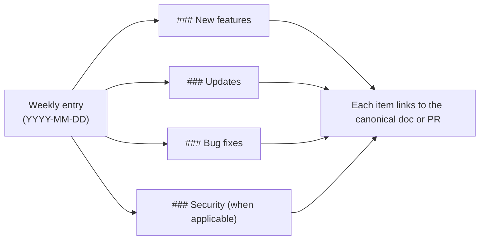

## Week of May 20, 2026

### New features

- **Cast launcher.** `coven` (or the explicit `coven tui`) now opens **Cast**, the prompt-first launcher built against a single visual contract: a `Cast` identity row in brand purple, a thin-rule prompt area, a two-lane **Commands** rail + **Snapshot** body, a windowed list of slash commands with a `N of 14` scroll hint, an action preview, and a single `enter run · ↑↓ select · esc quit · ctrl+u clear` footer. The launcher resizes safely from 18 cols up to 96. See [Coven TUI](/start/coven-tui).
- **`/quest <goal>` — sequential goal flow.** A new spell decomposes any goal into a Quest with three default phases (**design → implement → verify**). Cast renders a handoff card before each phase showing the carried context and the verbatim sub-prompt the harness will see. At each prompt the user can press Enter to approve, type a replacement sub-prompt, `/skip [reason]` to skip the phase, or `/cancel [reason]` to stop the quest. Natural-language triggers (`start a quest to …`, `quest: …`) work too. See [Cast quest flow](/design/cast-quest-flow).
- **Resume an interrupted quest by attaching.** `coven attach <anchor-session>` on a quest's anchor session replays the quest's event log, reconstructs the in-memory Quest, and hands control back to the phase loop — so a Ctrl-C'd quest can be resumed exactly where it left off. Crashed-mid-phase work surfaces as Running so you can decide to re-run or skip.
- **Quest event ledger.** Every quest writes `cast.quest.{started, phase_started, phase_completed, phase_skipped, phase_edited, advanced, completed}` events on its anchor session — durable, queryable, and the source of truth for re-attach. Works in the daemon path (anchor = phase 0's session) **and** the local-PTY fallback path (anchor = a synthesized `quest-<uuid>` row in the local sessions table).
- **Cast plan and outcome cards.** Every spell now renders a plan card *before* any side effect (showing the resolved harness, the safety decision, the steps Cast will take) and an outcome card *after* (showing what landed, session ids, and concrete next steps).
- **Per-spell safety gate.** Cast's risk classifier inspects every spell for confirmation-required keywords (publish, push, deploy, sacrifice, etc.) and routes them through a typed confirmation before the harness sees them. Sacrifice still requires you to type the word `sacrifice` to proceed.

### Updates

- **Non-interactive Cast frame** (printed when `coven` is piped or run in CI) tightened to identity + one subtitle line + Context (project, harness) + Example spells + Slash spells + one dim footer hint. No second-person greeting; field labels are lowercase in a fixed 14-char column.
- **Structured failure detection in quest handoffs.** Non-zero exit codes — including `exit 2`, SIGKILL `137`, SIGINT `130` — now produce failure framing in the next phase's sub-prompt. Previously only the literal string `exit 1` matched.
- **Quest cursor advances past Skipped phases at the data layer.** `advance` and `skip_phase` walk the cursor forward to the next pending phase, so a skipped middle phase no longer strands the loop on a non-pending row.
- **`BORDER_SUBTLE` / `BORDER_STRONG` brand tokens** wired into the launcher prompt rules — top rule subtle, bottom rule strong — so focus reads visually without overemphasizing the prompt.
- **Cast attach surfaces a quest-anchor note** alongside the existing `cast.summary` line when you attach to a completed quest's anchor session.
- **Daemon-backed Cast attach.** `/attach` and `/summon` route through Cast so the resumed session also gets a Cast transcript and writes a `cast.summary` event when it exits.
- **TUI shell and session browser** extracted into focused modules (`tui/shell.rs`, `tui/sessions.rs`) so future surfaces can extend either without enlarging `main.rs`.
- **`sysinfo` bumped to 0.39.2** (was 0.30.13) and **`unicode-width` to 0.2.2** (was 0.2.0) via dependabot.

### Bug fixes

- **Re-attach reconstructs quests written by the local-PTY path.** Quests run without the daemon now write events to a synthetic anchor session in the local store, so `/attach <quest-id>` finds them.
- **Avoid full event-log scan for the `cast.summary` existence check.** Cast now uses a fast `event_kind_exists` query instead of fetching every event for a session every time it writes a summary.
- **Resolved a duplicate `list_events` fetch** during cast attach's summary lookup — the existing replay history is reused.

## Week of May 17, 2026

### Bug fixes

- **No more double keystrokes in the Windows TUI.** `coven tui` and the session browser now filter to key-press events only on Windows, so typing `a` no longer inserts `aa`, arrow keys advance one row at a time, and Enter activates a selection once. No behavior change on macOS or Linux. See [Coven TUI](/start/coven-tui) and [Windows install](/install/windows).
- **TUI no longer panics on small terminals.** Both `coven tui` and `coven chat` now guard their layout math against very small terminal sizes, so resizing to a narrow or short window no longer crashes the session. See [Coven TUI](/start/coven-tui).
- **Release gate hygiene.** The public-release secret guard now allows public GitHub advisory URLs and scans release history from `HEAD`, so stale remote branches do not block the current release gate.

### Security

- **Ratatui dependency advisory cleared.** Updated the underlying Ratatui rendering stack so the patched `lru` crate is pulled in, resolving advisory [GHSA-rhfx-m35p-ff5j](https://github.com/advisories/GHSA-rhfx-m35p-ff5j). No action required — pick up the latest release.

## Week of May 15, 2026

### Updates

- **Brand-aligned TUI theme.** Both `coven tui` and `coven chat` now share a unified, brand-aligned palette with consistent semantic tokens for primary, agent, user, hint, surface, and dim styles. Colors adapt to your terminal automatically: truecolor on 24-bit terminals, 256-color on legacy terminals, and no color when output is piped or `NO_COLOR` is set. See [Troubleshooting](/TROUBLESHOOTING).
- **Documented terminal color controls.** The environment variables that drive Coven's color output (`NO_COLOR`, `COLORTERM`, `TERM`) are now documented with examples for disabling color in CI, forcing truecolor, and selecting a 256-color render. See [Troubleshooting](/TROUBLESHOOTING).

### Bug fixes

- **Release secret guard false positives.** The public-release secret guard now allows documented OpenCoven repo links and local worktree paths as benign high-entropy tokens while still flagging explicit secret patterns.

## How to read this changelog

Entries are weekly, newest first. Items inside each week are grouped by category. Anything affecting the public API (CLI surface, socket routes, response shapes) also lands in [API contract](/API-CONTRACT) — the changelog is a pointer, not a substitute.

## Week of May 11, 2026

### New features

- **Prompt-first Coven TUI.** Running `coven` (or `coven tui`) now opens a Ratatui-based interactive interface. Type free-form tasks, run slash commands (`/help`, `/agent`, `/clear`, `/export`, `/exit`), and navigate ritual menus with arrow keys. Works over SSH and resizes safely. See [Coven TUI](/start/coven-tui).
- **`coven pc` diagnostics and relief.** A macOS-first system pressure tool. Read-only commands surface CPU, memory, disk, and top-process snapshots; write operations (`coven pc kill`, `coven pc cache clear`) require an explicit `--confirm` gate. See the [CLI reference](/reference/cli) and [Troubleshooting](/TROUBLESHOOTING).
- **Local API v1 contract.** The daemon socket API now exposes versioned health and capabilities endpoints, structured error responses, and cursor-based event pagination. Clients can negotiate features instead of guessing. See [API contract](/API-CONTRACT) and [Local API](/API).
- **JSON sessions output.** `coven sessions --json` emits machine-readable session listings for scripts, dashboards, and external clients. See [comux JSON sessions](/sessions/comux-json).
- **Windows install path.** Coven now ships a Windows npm package so `npx @opencoven/cli` works on native Windows alongside macOS and Linux. See [Getting started](/GETTING-STARTED).

### Updates

- **OpenCoven positioning and brand.** Refreshed product copy across the docs and CLI to frame Coven as an ecosystem for persistent AI familiars, with updated brand tokens and design guidance. See [Brand](/BRAND).
- **Refined brand palette.** Updated the OpenCoven palette to a muted lavender-grey (`#9A8ECD`) with a new complementary accent system and dedicated dark- and light-mode surface tokens. Existing legacy color aliases are preserved, so no action is needed to pick up the new look. See [Brand](/BRAND).
- **Troubleshooting: system health and pressure.** Added a section that points from the canonical troubleshooting flow to `coven pc` for diagnosing local CPU, memory, and disk pressure. See [Troubleshooting](/TROUBLESHOOTING).
- **Full session IDs in plain output.** `coven sessions --plain` now prints full session IDs so they can be copied straight into follow-up commands.

### Bug fixes

- **Daemon status verification.** `coven` now verifies the daemon over its health socket before reporting `running`, clears dead stale metadata, and reports `stale` when metadata is live but unverified.
- **Corrupt daemon metadata recovery.** The CLI now recovers gracefully when on-disk daemon status metadata is corrupt instead of failing to start.
- **Stricter event pagination.** The API rejects non-integer `limit` and `afterSeq` values with a structured `invalid_request` error before doing any session lookup.
