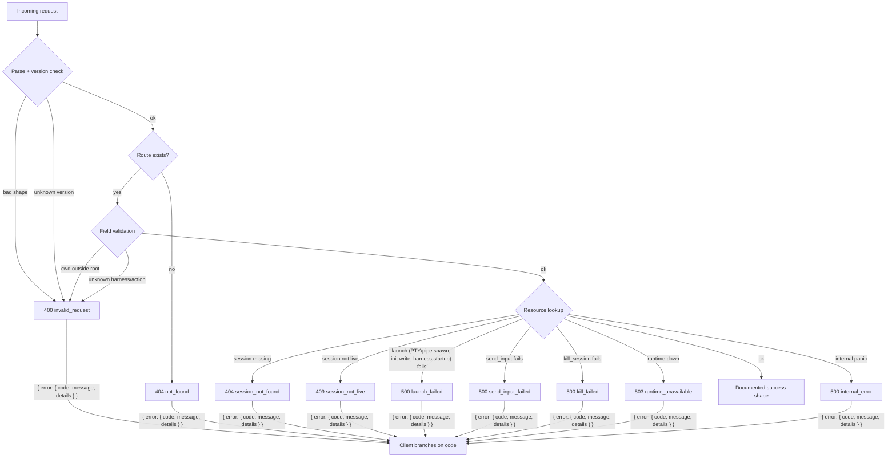
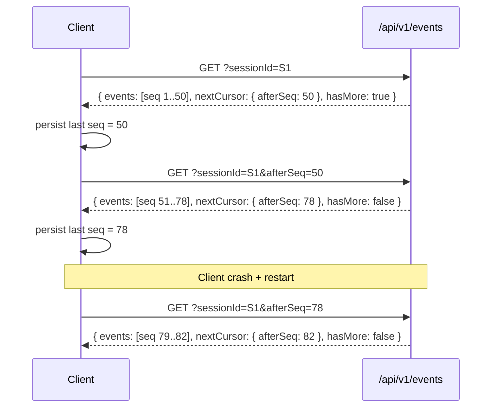

# Контракт локального API Coven

Socket API демона Coven — это публичная граница совместимости для comux и внешних клиентов, таких как external OpenClaw bridge plugin.

## Текущая стабильная версия

- `GET /api/v1/health` предоставляет `apiVersion: "coven.daemon.v1"`, `covenVersion` и читаемый машиной объект `capabilities`.
- Клиенты должны читать `/api/v1/health` перед предположением о любой форме ответа от других endpoint'ов.
- Старые неверсионированные маршруты, такие как `GET /health`, остаются алиасами раннего MVP; новые клиенты должны использовать `/api/v1`.
- Клиенты плоскости управления должны обнаруживать capabilities до отправки id действий.
- Все сбои API возвращаются как структурированные конверты `{ "error": { "code", "message", "details" } }`.
- События включают монотонный курсор `seq` для инкрементных чтений.

## `GET /api/v1/health`

`GET /api/v1/health` возвращает доступность демона, именованную версию контракта, версию coven и читаемые машиной capabilities:

```json
{
  "ok": true,
  "apiVersion": "coven.daemon.v1",
  "covenVersion": "0.0.0",
  "capabilities": {
    "sessions": true,
    "events": true,
    "eventCursor": "sequence",
    "structuredErrors": true
  },
  "daemon": {
    "pid": 12345,
    "startedAt": "2026-05-09T06:43:00Z",
    "socket": "/Users/alice/.coven/coven.sock"
  }
}
```

Если метаданные демона недоступны, `daemon` может быть `null`.

### Поля capability

| Поле              | Тип     | Описание                                                          |
|-------------------|---------|-------------------------------------------------------------------|
| `sessions`        | boolean | API сессий (`/sessions`, `/sessions/:id`) доступен.               |
| `events`          | boolean | API событий (`/events`) доступен.                                 |
| `eventCursor`     | string  | Поддерживаемый тип курсора; `"sequence"` означает, что `afterSeq` стабилен. |
| `structuredErrors`| boolean | Все ошибки используют форму `{ error: { code, message, details } }`. |

## Структурированный конверт ошибки



Все ошибки API используют следующий стабильный конверт. Клиенты должны ветвиться по `error.code`, а не по `error.message`:

```json
{
  "error": {
    "code": "session_not_found",
    "message": "Session was not found.",
    "details": {
      "sessionId": "abc-123"
    }
  }
}
```

`details` опционален и включается, когда полезен дополнительный контекст.

### Стабильные коды ошибок

| Код                    | HTTP-статус | Описание                                         |
|------------------------|-------------|--------------------------------------------------|
| `not_found`            | 404         | Общий маршрут не найден.                         |
| `invalid_request`      | 400 или 404 | Некорректный запрос, неизвестный id harness, отсутствует обязательное поле, или неподдерживаемая версия API. |
| `session_not_found`    | 404         | Id сессии не существует.                         |
| `session_not_live`     | 409         | Сессия существует, но не выполняется.            |
| `project_root_violation`| 400        | Зарезервировано. Нарушения cwd сейчас возвращают `invalid_request`; продвижение в отдельный код позволит клиентам ветвиться без парсинга текста. |
| `pty_spawn_failed`     | 500         | Зарезервировано. Сбои spawn PTY сейчас возвращают `launch_failed`; продвижение в отдельный код позволит различать "не удалось открыть PTY" и "CLI harness упал при старте". |
| `launch_failed`        | 500         | Демон принял payload запуска, но runtime (PTY/pipe spawn, начальная запись, старт CLI harness) дал сбой. `details.sessionId` — строка, помеченная как `failed`. |
| `send_input_failed`    | 500         | Демон принял payload ввода, но запись в runtime дала сбой (закрытый pipe, мёртвый процесс, ошибка IO). `details.sessionId` — затронутая сессия. |
| `kill_failed`          | 500         | Демон принял запрос kill, но сигнал/вызов runtime дал сбой (нет прав, отсутствует процесс, ошибка IO). `details.sessionId` — затронутая сессия. |
| `runtime_unavailable`  | 503         | Runtime сессии недоступен.                       |
| `internal_error`       | 500         | Неожиданная внутренняя ошибка.                   |

## Форма каталога capabilities (`v1`)

`GET /api/v1/capabilities` возвращает каталог capabilities демона/плоскости управления. Это предполагаемый handshake клиента чата/ввода для решения, какие действия показывать или маршрутизировать через Coven.

```json
{
  "capabilities": [
    {
      "id": "coven.control.actions",
      "label": "Coven control-plane action router",
      "adapter": "coven-daemon",
      "status": "available",
      "policy": "allow",
      "actions": ["coven.capabilities.refresh"]
    },
    {
      "id": "desktop.automation",
      "label": "Desktop automation adapters",
      "adapter": "desktop-use",
      "status": "planned",
      "policy": "requiresApproval",
      "actions": []
    }
  ]
}
```

Известные значения enum в `v1`:

- `status`: `available`, `planned`
- `policy`: `allow`, `requiresApproval`

Клиенты должны игнорировать неизвестные будущие id capabilities и id действий, если они не поддерживают их явно.

## Форма действия управления (`v1`)

`POST /api/v1/actions` принимает конверт действия в форме политики. Демон валидирует id действия до того, как разрешена любая работа адаптера.

```json
{
  "action": "coven.capabilities.refresh",
  "origin": "external-client",
  "intentId": "intent-1",
  "args": {}
}
```

Безопасные действия, завершённые немедленно, возвращают `200`:

```json
{
  "ok": true,
  "accepted": true,
  "action": "coven.capabilities.refresh",
  "status": "completed",
  "event": {
    "kind": "capabilities.refreshed",
    "action": "coven.capabilities.refresh",
    "origin": "external-client",
    "intentId": "intent-1",
    "payload": { "capabilities": 3 }
  }
}
```

Неизвестные id действий возвращают `400` и отказываются в закрытом виде:

```json
{
  "ok": false,
  "accepted": false,
  "action": "desktop.deleteEverything",
  "status": "rejected",
  "reason": "unknown action `desktop.deleteEverything`"
}
```

## Форма записи сессии (`v1`)

В `v1` ответы сессий остаются как сырые объекты JSON, используя snake_case имена полей демона на Rust.

Endpoint'ы, возвращающие эту форму:

- `GET /api/v1/sessions` → `SessionRecord[]`
- `POST /api/v1/sessions` → `SessionRecord`
- `GET /api/v1/sessions/:id` → `SessionRecord`

```json
{
  "id": "session-1",
  "project_root": "/repo",
  "harness": "codex",
  "title": "Fix the tests",
  "status": "running",
  "exit_code": null,
  "archived_at": null,
  "created_at": "2026-05-09T06:43:00Z",
  "updated_at": "2026-05-09T06:43:05Z"
}
```

## Форма записи события и курсорная пагинация (`v1`)

`GET /api/v1/events` возвращает пагинированный конверт с монотонными курсорами `seq`.

### Параметры query

| Параметр      | Обязателен | Описание                                                |
|---------------|------------|---------------------------------------------------------|
| `sessionId`   | Да         | Сессия, для которой нужно получить события.             |
| `afterSeq`    | Нет        | Возвращает только события с `seq > afterSeq` (предпочтительно). |
| `afterEventId`| Нет        | Курсор совместимости — разрешается в позицию последовательности. |
| `limit`       | Нет        | Максимальное число возвращаемых событий (применяется демоном, макс 1000). |

### Конверт ответа

```json
{
  "events": [
    {
      "seq": 42,
      "id": "event-uuid",
      "session_id": "session-uuid",
      "kind": "output",
      "payload_json": "{\"data\":\"hello\"}",
      "created_at": "2026-05-09T06:43:10Z"
    }
  ],
  "nextCursor": {
    "afterSeq": 42
  },
  "hasMore": false
}
```

`nextCursor` равен `null`, когда нет событий. `hasMore` равен `true`, когда применён `limit` и могут существовать больше событий.

### Шаблон инкрементного чтения

1. Опрашивай `GET /events?sessionId=<id>`, чтобы получить все события (с опциональным `limit`).
2. Используй `nextCursor.afterSeq` в последующих запросах: `GET /events?sessionId=<id>&afterSeq=<seq>`.
3. Повторяй, пока `hasMore` не станет `false`.

Это даёт клиентам стабильные инкрементные чтения. Доставка exactly-once также требует чекпоинтинга на стороне клиента и идемпотентности.



Сохранение `afterSeq` переживает перезапуски демона: события append-only, а номера seq монотонные, поэтому возобновлённый опрос всегда подбирает там, где остановился.

## Формы ответа живого управления (`v1`)

Оба endpoint'а живого управления возвращают одну и ту же форму принятого ответа при успехе:

- `POST /api/v1/sessions/:id/input`
- `POST /api/v1/sessions/:id/kill`

```json
{
  "ok": true,
  "accepted": true
}
```

Общие ответы при неуспехе используют структурированный конверт ошибки:

- `404`, когда сессия не существует:

```json
{
  "error": {
    "code": "session_not_found",
    "message": "Session was not found.",
    "details": { "sessionId": "session-1" }
  }
}
```

- `409`, когда сессия существует, но не жива:

```json
{
  "error": {
    "code": "session_not_live",
    "message": "Session is not live.",
    "details": { "sessionId": "session-1" }
  }
}
```

## Совместимость с comux и мостом OpenClaw

- comux читает объект `capabilities` из `/health`, чтобы решить, какие функции использовать.
- Мост external OpenClaw bridge plugin OpenClaw (`packages/openclaw-coven`) обновляется в этом репозитории вместе с демоном и использует `apiVersion === "coven.daemon.v1"` как защиту контракта.
- Обновления клиентов для использования курсоров `afterSeq` и пагинированных конвертов событий могут происходить независимо от обновления демона; форма, применяемая демоном, — это источник истины.
- Поле `supportedApiVersions` было удалено из ответа health в `coven.daemon.v1`; клиенты должны проверять `apiVersion` напрямую.

## Политика совместимости и миграции

- Клиенты `coven.daemon.v1` могут полагаться на задокументированные имена полей и формы ответов верхнего уровня выше.
- Аддитивные поля обратно совместимы. Клиенты должны игнорировать неизвестные поля, когда это безопасно.
- Любое несовместимое изменение должно выпускаться под новым значением `apiVersion`, предоставляемым `GET /api/v1/health` или его маршрутом-преемником.
- Перед тем как клиент переключится на новый мажорный контракт, репо Coven должен опубликовать обновлённые docs контракта и заметку о миграции, которая отображает старую форму в новую.

## Рекомендуемый handshake клиента

1. Вызови `GET /api/v1/health`.
2. Проверь, что `apiVersion === "coven.daemon.v1"` и `capabilities.structuredErrors === true`.
3. Проверь `capabilities.eventCursor === "sequence"` перед использованием пагинации `afterSeq`.
4. Только после этого полагайся на задокументированные формы sessions/events в `v1`.

## Граница области

Контракт `coven.daemon.v1` покрывает health демона, обнаружение capabilities, маршрутизацию действий, sessions, events, живой input и живой kill. Не считай будущие имена маршрутов оркестрации, handoff или маршрутизации задач зарезервированным API, пока они не реализованы и не задокументированы в этом файле.
