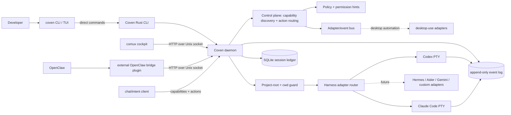
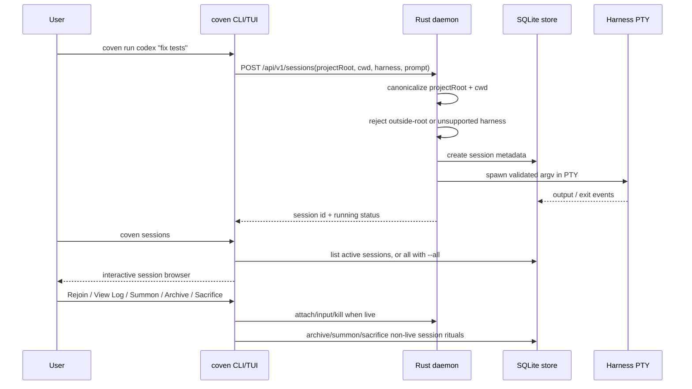
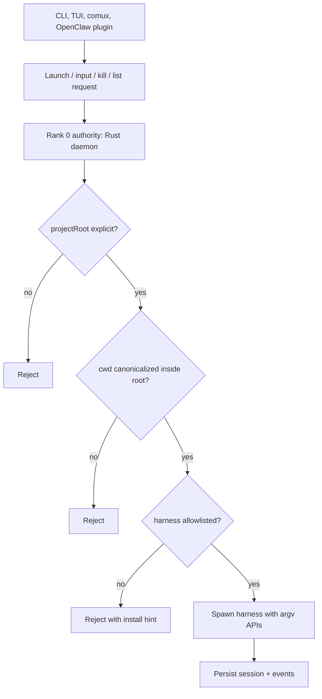

# Архитектура Coven

Coven — это локально-ориентированная подложка для harness-сессий. Rust CLI/демон является слоем авторитета; такие клиенты, как TUI CLI, comux и опциональный плагин OpenClaw, являются слоями представления/интеграции.

Версионированный контракт локального socket API находится в [`docs/API-CONTRACT.md`](/API-CONTRACT). Клиенты должны использовать `GET /api/v1/health` и согласовывать `apiVersion: "coven.daemon.v1"` и объект `capabilities` перед тем, как полагаться на формы ответов сессий или событий. Все ответы об ошибках используют структурированный конверт `{ error: { code, message, details } }`, описанный там.

## Топология среды выполнения



## Жизненный цикл сессии



## Граница авторитета



## Граница ввода / автоматизации

Клиент чата/ввода должен оставаться чат-интерфейсом, поверхностью для локального эхо/оптимистичного рендеринга, слоем захвата намерений и небольшим быстрым хостом для ультра-простых локальных действий. Он не должен становиться движком автоматизации.

Coven — это канонический общий локальный рантайм для переиспользуемой автоматизации, потому что он централизует:

- владение демоном/процессами
- решения по политике и разрешениям
- хранение конфигурации/профилей
- обнаружение возможностей
- маршрутизацию действий и эмиссию событий
- владение адаптерами для Accessibility, AppleScript, клавиатуры/мыши, окон, файловой системы, буфера обмена и мостов к конкретным приложениям

Предполагаемый поток таков:

```text
user -> chat/intent client -> Coven -> adapters -> desktop/apps
desktop/apps -> Coven -> chat/intent client UI updates
```

`GET /api/v1/capabilities` позволяет клиенту чата/ввода и другим клиентам обнаружить, что Coven может маршрутизировать. `POST /api/v1/actions` даёт клиентам стабильный конверт намерений без жёсткой связки с хрупкими API автоматизации ОС.

## Граница будущих адаптеров

Текущий публичный рантайм Coven — один harness на сессию. Демон уже удерживает правильную нижнеуровневую границу для будущей работы по координации: клиенты могут обнаруживать возможности, запускать известные harness'ы, читать события и сохранять обеспечение project-root в Rust.

Не документируйте будущие команды оркестрации как пользовательские, пока они не появятся в CLI и в socket API. Будущие слои координации должны строиться поверх текущего контракта сессий/событий, не обходя валидацию демона.

---

## Текущая пользовательская поверхность

- `coven` и `coven tui` открывают дружелюбную для новичков палитру slash-команд.
- `coven doctor` проверяет готовность store/проекта/harness и печатает следующие шаги.
- `coven daemon start/status/restart/stop` управляет локальным демоном.
- `coven run codex|claude <prompt>` запускает PTY-сессию с областью видимости проекта.
- `coven sessions` открывает человекочитаемый браузер сессий в терминале; `--plain` сохраняет вывод, пригодный для скриптов.
- Действия в браузере сессий показывают читаемые варианты: **Rejoin**, **View Log**, **Summon**, **Archive** и **Sacrifice**.
- `coven attach|summon|archive|sacrifice <session-id>` остаются явными низкоуровневыми глаголами для скриптов и рабочих процессов копирования/вставки.

## Сводка по дистрибуции

Wrapper-пакеты npm публикуются для ранних адоптеров:

- `@opencoven/cli`
- `@opencoven/cli-macos`
- `@opencoven/cli-linux-x64`
- `@opencoven/cli-windows` для Windows x64

Версии исходных пакетов остаются шаблонными в репозитории; release workflow dispatch предоставляет публикуемую версию и собирает пакеты платформ. Проверьте реестр npm и GitHub releases, прежде чем делать утверждения о конкретных версиях релизов.
