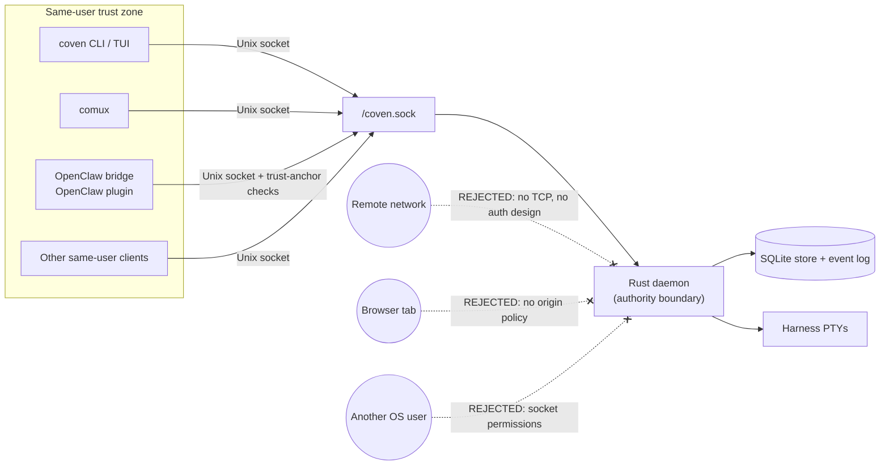

# Аутентификация и локальный доступ

_Последнее обновление: 2026-05-14_

В Coven сегодня нет аутентификации пользователя на уровне демона в смысле OAuth, JWT, bearer-токена, API-ключа, cookie браузера или хостовой учётной записи.

Текущее решение — это **модель локального доступа в рамках одного пользователя**:

- Демон предоставляет HTTP только через локальный Unix socket по адресу `<covenHome>/coven.sock`.
- Путь socket по умолчанию — `~/.coven/coven.sock`.
- Клиенты могут валидировать запросы для UX, но демон на Rust — это граница применения.
- Учётные данные провайдера harness'а остаются в нормальном локальном потоке auth провайдера harness'а.
- Coven не должен читать, проксировать, сохранять или выпускать учётные данные Codex, Claude Code, OpenAI, Anthropic, GitHub или OpenClaw.

Это намеренно local-first MVP-поза. Она подходит для локальных клиентов того же пользователя, таких как CLI/TUI Coven, comux, клиент чата/ввода и внешний OpenClaw-плагин. Это не схема auth для удалённого API.

Граница — это разрешения файловой системы плюс локальность процессов того же пользователя. Всё, что находится за пределами пунктирной зоны, отклоняется по дизайну; введение удалённой, браузерной или меж-пользовательской поверхности требует отдельного дизайна auth (а не туннеля существующего socket).

## Что защищает API сегодня

### Локальность Unix socket

API не предоставляется как TCP по умолчанию. Клиенты подключаются к локальному Unix socket, принадлежащему каталогу состояния Coven пользователя.

Новые клиенты должны рассматривать путь socket как якорь доверия и должны подключаться только к версионированному API под `/api/v1/...`.

### Проверки авторитета на Rust

Демон должен перепроверять чувствительные поля запроса перед действием, даже когда клиент уже их валидировал:

- версия API;
- корень проекта;
- рабочий каталог;
- id harness'а;
- id сессии;
- состояние живой сессии;
- запросы input;
- запросы kill; и
- id действий плоскости управления.

Неизвестные версии API, неизвестные id действий, неподдерживаемые harness'ы, недействительные id сессий и рабочие каталоги вне корня должны отказываться в закрытом виде.

### Auth провайдера, принадлежащий harness'у

Coven запускает поддерживаемые локальные CLI harness'ов. Он не реализует логин провайдера.

Примеры:

- Аутентификация Codex остаётся `codex login` или собственной локальной настройкой CLI Codex.
- Аутентификация Claude Code остаётся `claude doctor` или собственной локальной настройкой CLI Claude Code.

`coven doctor` может сообщать подсказки по настройке для этих инструментов, но Coven не владеет их учётными данными.

### Защитные меры внешнего OpenClaw-плагина

Интеграция OpenClaw вынесена через external OpenClaw bridge plugin. Ядро OpenClaw не является корнем доверия Coven.

Плагин отключён по умолчанию и должен быть явно выбран как ACP-backend. Он валидирует якорь доверия локального socket перед подключением:

- `covenHome` должен быть абсолютным каталогом без symlink.
- `socketPath` ограничен `<covenHome>/coven.sock`.
- Путь socket не должен быть symlink.
- Разрешённый socket должен быть Unix socket.
- Корень socket, каталог socket и socket должны принадлежать текущему пользователю.
- Корень socket и каталог не должны быть доступны группе или всем.
- Путь socket помечается отпечатком вокруг подключения, чтобы поймать гонки замены.

Эти проверки на стороне клиента улучшают глубокую защиту. Они не заменяют применение демона на Rust.

## Что это не есть

Текущее решение auth — это не:

- OAuth;
- OpenID Connect;
- JWT-сессии;
- auth с bearer-токеном;
- auth с API-ключом;
- auth с cookie браузера;
- RBAC;
- многопользовательская авторизация;
- политика CSRF/origin;
- граница облачной учётной записи; ни
- разрешение предоставлять socket API на localhost TCP, удалённой сети или странице браузера.

Если будущий дашборд, мобильное приложение, удалённый мост или браузерный сервис должен разговаривать с Coven, ему нужен явный дополнительный дизайн auth и pairing. Не туннелируй и не проксируй сырой socket демона в сетевой сервис и не называй это аутентифицированным.

## Текущий пробел в hardening

TypeScript-клиент OpenClaw-плагина уже выполняет строгую валидацию якоря доверия socket.

Демон на Rust в настоящее время владеет применением запросов и поведением socket API, но проверки приватной собственности и разрешений `COVEN_HOME` на стороне Rust перед созданием, привязкой или удалением состояния демона остаются приоритетом hardening. Пока это не реализовано, валидацию socket на стороне клиента следует рассматривать как глубокую защиту для сотрудничающих клиентов, а не как полную границу auth на стороне демона.

Перед широким распространением Rust должен отказываться в закрытом виде, когда:

- `COVEN_HOME` не принадлежит текущему пользователю;
- `COVEN_HOME` доступен группе или всем;
- `COVEN_HOME` разрешается через symlink;
- путь socket разрешается вне `COVEN_HOME`;
- существующий путь socket — это symlink или не-socket файл; или
- создание или очистка socket пересечёт границу доверенного каталога состояния.

## Требования для новых клиентов

Новые клиенты Coven должны:

- использовать маршруты `/api/v1/...`;
- вызывать `GET /api/v1/health` перед предположением о совместимости;
- рассматривать демон на Rust как границу авторитета;
- хранить учётные данные провайдера в потоке auth провайдера или harness'а;
- избегать хранения секретов репозитория, дампов окружения, приватных URL или логов, несущих токены;
- отвергать настраиваемые пути socket, которые не разрешаются в `<covenHome>/coven.sock`;
- отказываться в закрытом виде при неизвестных id harness'ов или неподдерживаемых версиях API; и
- избегать добавления любого сетевого, браузерного или удалённого транспорта без отдельного дизайна auth.
