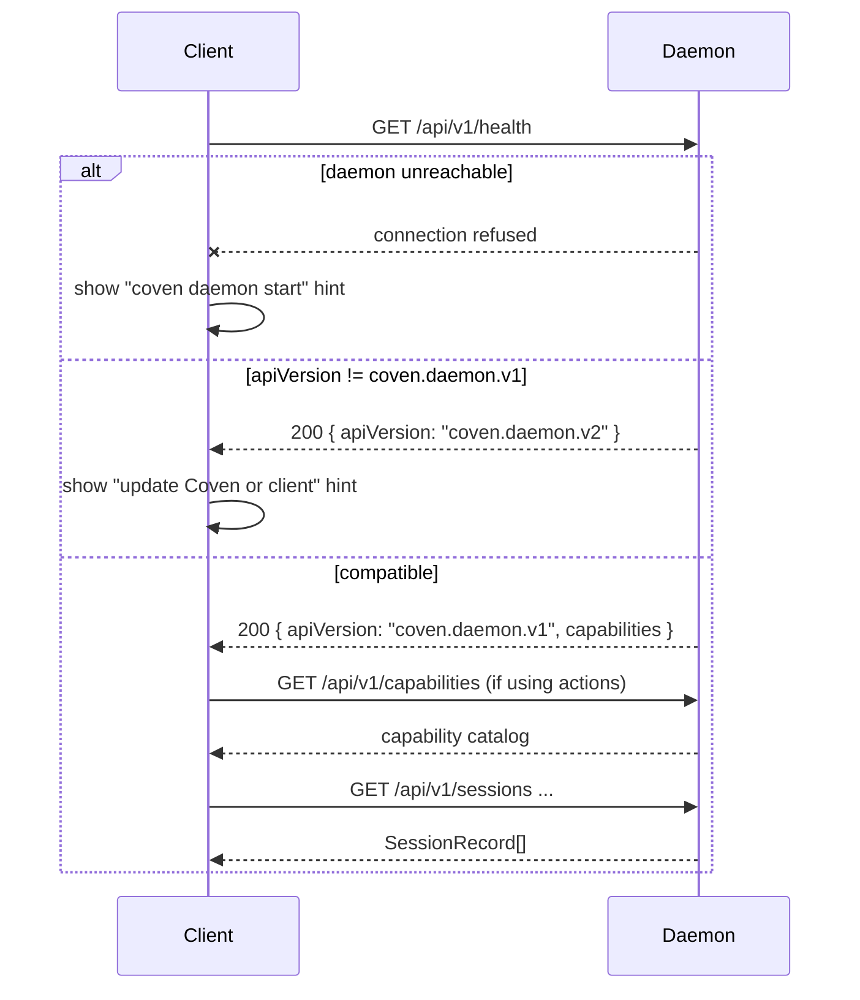

# Руководство по интеграции клиентов

Coven — это runtime-подложка. Клиенты должны представлять, маршрутизировать и наблюдать за работой, не захватывая границу авторитета.

## Правило интеграции

Разговаривай с Coven через локальный socket API. Не дублируй политику Coven по пути, harness'у, живой сессии или удалению таким образом, который может разойтись с демоном.

Рекомендуемый handshake:

1. Вызови `GET /api/v1/health`.
2. Подтверди, что `apiVersion === "coven.daemon.v1"` и нужные поля `capabilities` доступны.
3. Вызови `GET /api/v1/capabilities`, если используешь действия плоскости управления.
4. Используй только версионированные маршруты `/api/v1/...`.



Клиенты должны рассматривать handshake как **обязательный перед любым другим запросом**. Пропуск его означает зависимость от неопределённых форм ответа от будущей версии демона.

## Обязанности клиента

Клиенты могут владеть:

- навигацией;
- панелями;
- UI чата или приёма;
- формами задач;
- поверхностями diff/review;
- отрисовкой уведомлений;
- выбором сессии;
- оптимистичным локальным состоянием UI; и
- UX одобрения пользователя.

Клиенты не должны быть единственной точкой применения для:

- границ корня проекта;
- ограничений cwd;
- allowlist'ов harness'ов;
- проверок живой сессии;
- правил разрушительного удаления;
- доверия socket;
- одобрений внешних действий.

## comux

comux — это кокпит-слой.

Хорошие обязанности comux:

- перечислять сессии Coven;
- запускать сессии из видимого контекста проекта/worktree;
- открывать сессии в панелях;
- подключаться/возобновлять живую работу;
- читать `coven sessions --json` для простого локального обнаружения, когда управление на уровне демона не нужно;
- показывать логи и артефакты;
- помогать просматривать diff'ы;
- помогать делать merge, PR, архивировать или явно очищать.

comux должен оставаться полезным, когда Coven не установлен. Если Coven отсутствует, представляй понятные состояния установки и fallback вместо того, чтобы предполагать, что демон существует.

## Плагин OpenClaw

Интеграция OpenClaw принадлежит внешнему пакету external OpenClaw bridge plugin, а не ядру OpenClaw.

Плагин должен:

- регистрировать опциональный backend Coven;
- валидировать конфиг для UX;
- подключаться к локальному socket;
- запускать сессии через `POST /api/v1/sessions`;
- отображать события Coven в runtime-события OpenClaw;
- сохранять поведение fallback только при явной конфигурации; и
- рассматривать демон на Rust как авторитет запуска.

Плагин не должен:

- обходить демон для запусков;
- зависеть от внутренностей ядра OpenClaw;
- хранить учётные данные провайдера;
- предполагать, что неверсионированные маршруты стабильны; или
- расширять разрешения корня проекта.

## Поверхности ввода и приёма

Клиенты чата/ввода лучше всего рассматривать как слои приёма и представления.

Полезные обязанности:

- захват намерения пользователя;
- показ локального статуса;
- представление одобрений;
- отображение уведомлений;
- передача работы в Coven;
- показ обновлений сессии из Coven.

Избегай превращения клиентов приёма в движок автоматизации. Переиспользуемая автоматизация должна жить за capabilities и actions Coven, чтобы граница политики оставалась централизованной.

## Десктоп-клиенты и контрольные комнаты

Нативная контрольная комната может облегчить эксплуатацию Coven, показывая:

- активные сессии;
- архивные сессии;
- здоровье демона;
- корни проектов;
- доступность harness'ов;
- интеграции клиентов;
- каталог capabilities;
- очередь одобрения действий;
- логи и трассы;
- ссылки на docs и troubleshooting.

Используй `coven sessions --json` для активных сессий и `coven sessions --json --all`, когда клиенту также нужны архивные записи. CLI возвращает объект верхнего уровня с массивом `sessions`, и каждая запись использует те же имена полей `SessionRecord`, что и API демона, включая `project_root`, `status`, `created_at`, `updated_at` и nullable `archived_at`.

Контрольная комната должна по-прежнему использовать тот же socket API и тот же handshake capabilities, что и другие клиенты.

## Адаптеры десктоп-автоматизации

Десктоп-автоматизация полезна, когда у приложения нет чистого API. Она также достаточно мощна, чтобы нуждаться в чёткой политике.

Рекомендуемый шаблон:

```text
user request
  -> client captures intent
  -> Coven exposes capability and policy hints
  -> client asks for approval when required
  -> Coven routes a known action id
  -> adapter performs the local UI action
  -> event/result returns to the client
```

Не позволяй UI-клиентам напрямую связываться с библиотеками автоматизации ОС и потом называть это "интеграцией Coven". Переиспользуемой границей должна быть плоскость управления Coven.

## Ожидания совместимости

Для каждой интеграции:

- используй `/api/v1`;
- сначала вызывай health;
- игнорируй неизвестные аддитивные поля, когда это безопасно;
- отказывайся в закрытом виде при неизвестном требуемом поведении;
- тестируй против репрезентативных ответов демона;
- обновляй `docs/API-CONTRACT.md`, когда меняются формы ответов.

## Обработка ошибок

Хороший клиент должен переводить ошибки демона в UI, ориентированный на действие:

- демон недоступен: показать инструкции старта/перезапуска;
- неподдерживаемая версия API: попросить пользователя обновить Coven или клиент;
- отсутствующий harness: показать руководство `coven doctor`;
- cwd вне корня: объяснить границу проекта;
- сессия не жива: предложить просмотр логов вместо живого input;
- разрушительное действие заблокировано: объяснить, что сессия выполняется или отсутствует подтверждение.
