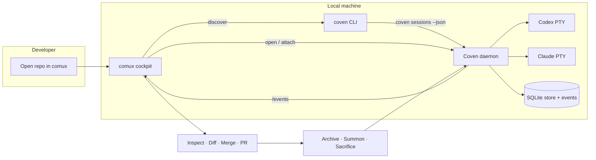

# Демо-цикл comux + Coven

Это контракт со стороны Coven для того, чтобы сделать сессии Codex и Claude Code, управляемые Coven, видимыми в comux.



Демо-цикл сквозной: comux никогда не обходит демон, а демон никогда не доверяет comux для применения корня проекта, harness'а или разрушительного удаления.

## Цикл

1. Открой целевой репозиторий в comux.
2. При необходимости запусти Coven:

   ```sh
   coven daemon start
   ```

3. Запусти сессию, поддерживаемую Coven, из того же репозитория:

   ```sh
   coven run codex "fix the failing tests"
   coven run claude "review the diff"
   ```

4. Позволь comux обнаружить сессии через любой поддерживаемый клиентский путь:
   - `coven sessions --json` для простого локального обнаружения по CLI.
   - `GET /api/v1/sessions` после `GET /api/v1/health` для клиентов демона.
5. Открой сессию как видимую панель comux или подключись вручную:

   ```sh
   coven attach <session-id>
   ```

6. Проверяй файлы, diff'ы и вывод сессии из comux.
7. Делай merge, создавай PR, архивируй, призывай, приноси в жертву или явно очищай после проверки.

## Обнаружение через CLI

`coven sessions --json` печатает стабильный объект с массивом `sessions`. Записи используют те же snake_case имена полей, что и API демона:

```json
{
  "sessions": [
    {
      "id": "session-1",
      "project_root": "/repo",
      "harness": "codex",
      "title": "Fix the tests",
      "status": "running",
      "exit_code": null,
      "archived_at": null,
      "created_at": "2026-05-14T07:00:00Z",
      "updated_at": "2026-05-14T07:00:01Z"
    }
  ]
}
```

Используй `--all --json`, когда архивные сессии должны оставаться видимыми.

## Обнаружение через демон

Клиенты демона должны использовать версионированный socket API:

1. `GET /api/v1/health`
2. Проверь `apiVersion === "coven.daemon.v1"` и `capabilities.sessions === true`.
3. `GET /api/v1/sessions`
4. Фильтруй сессии по проверенному корню проекта перед показом их в UI, ограниченном проектом.

Socket демона по умолчанию использует `~/.coven/coven.sock`. Демон остаётся авторитетом для корней проекта, cwd, id harness'ов, проверок живой сессии, input, запросов kill, состояния архива и правил разрушительного удаления.

## Состояния недоступности

Клиенты должны держать свой основной UI пригодным к использованию, когда Coven отсутствует или остановлен:

- Отсутствует CLI: показать руководство по установке для `@opencoven/cli`.
- Демон остановлен или socket отсутствует: предложить `coven daemon start`.
- Отсутствует harness: предложить `coven doctor`.
- Неподдерживаемая версия API: попросить пользователя обновить Coven или клиент.

## Roadmap

Более широкий roadmap OpenCoven остаётся публичной точкой отслеживания сквозной демонстрации: [ROADMAP.md](/ROADMAP).
