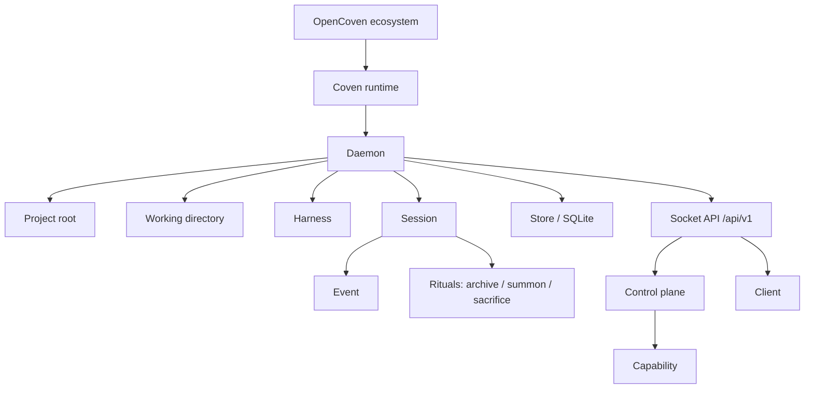

# Концепции Coven

Эта страница определяет существительные, используемые в CLI, демоне, API, docs и интеграциях клиентов Coven.



Каждый термин ниже — один узел в графе выше.

## OpenCoven

OpenCoven — это экосистема и организация вокруг runtime, кокпита и интеграций.

Используй **OpenCoven**, когда говоришь о более широком семействе проектов.

## Coven

Coven — это локальная runtime-подложка. Она владеет harness-сессиями, ограниченными проектом, PTY, логами, состоянием локального демона и socket API.

Используй **Coven** для CLI, демона, Rust-крейта, npm-wrapper'а и локального runtime сессий.

## `coven`

`coven` — это команда, ориентированная на пользователя.

Не говори пользователям запускать `opencoven` или `@opencoven`. Имена пакетов живут под `@opencoven/*`, но команда всегда `coven`.

## Harness

Harness — это внешний CLI кодирующего агента, который Coven может запускать и контролировать.

Текущие harness'ы v0:

- Codex, с id harness'а `codex`.
- Claude Code, с id harness'а `claude`.

Coven не хранит учётные данные провайдера. Каждый harness продолжает использовать свой собственный локальный поток аутентификации.

## Корень проекта

Корень проекта — это явная граница для сессии. Coven валидирует и канонизирует корень проекта перед запуском работы.

Корень имеет значение, потому что определяет, где harness'у позволено стартовать. Клиент не может расширить эту границу, отправив другой `cwd` или более вольное значение конфигурации.

## Рабочий каталог

Рабочий каталог — это каталог запуска для сессии harness'а. Он должен находиться внутри корня проекта после канонизации.

Примеры:

```sh
coven run codex "fix tests"
coven run codex "inspect the CLI package" --cwd packages/cli
```

Вторая команда действительна только тогда, когда `packages/cli` разрешается внутри выбранного корня проекта.

## Сессия

Сессия — это принадлежащая Coven запись одного запуска harness'а.

Она включает:

- стабильный id сессии;
- корень проекта;
- id harness'а;
- читаемый заголовок;
- статус;
- опциональный код выхода;
- состояние архива; и
- временные метки создания/обновления.

Записи сессий хранятся в SQLite.

## Событие

Событие — это append-only запись, связанная с сессией.

События включают записи вывода, выхода и метаданных. Они позволяют клиентам воспроизвести или проверить, что произошло после выхода процесса или перезапуска демона.

## Демон

Демон — это локальный процесс на Rust, который владеет состоянием живой сессии и предоставляет API HTTP-поверх-Unix-socket.

Демон — это граница авторитета. Он валидирует:

- запросы запуска;
- корни проектов;
- рабочие каталоги;
- id harness'ов;
- живой input;
- запросы kill; и
- id сессий.

## Хранилище

Хранилище — это локальная база SQLite Coven. Оно содержит метаданные сессий и append-only историю событий.

Состояние runtime принадлежит вне системы контроля версий. Не делай commit `.coven/`, баз данных, socket'ов, логов или файлов окружения.

## Клиент

Клиент — это всё, что разговаривает с Coven, а не запускает harness'ы напрямую.

Известные формы клиента:

- CLI/TUI `coven`.
- Кокпит comux.
- Внешний пакет плагина OpenClaw external OpenClaw bridge plugin.
- Будущие поверхности ввода или десктоп-поверхности приёма.

Клиенты — это слои удобства, а не корни доверия.

## Плоскость управления

Плоскость управления — это слой capabilities и маршрутизации действий перед будущими адаптерами.

Она позволяет клиентам обнаруживать, что Coven может делать, через `GET /api/v1/capabilities` и отправлять известные действия через `POST /api/v1/actions`. Неизвестные id действий отказываются в закрытом виде.

## Capability

Capability описывает функцию, принадлежащую демону или адаптеру, которую клиент может представить.

Записи capability включают:

- id;
- метку;
- владеющий адаптер;
- статус;
- подсказку политики; и
- id действий.

## Ритуалы

Ритуалы — это удобные для людей глаголы управления сессиями Coven:

- **Archive** скрывает завершённую сессию из активного списка, сохраняя события.
- **Summon** восстанавливает архивную сессию.
- **Sacrifice** навсегда удаляет не выполняющуюся сессию и её события.

Имена ритуалов — это продуктовый язык. Безопасное поведение под ними должно оставаться точным и консервативным.

## Socket API

Socket API — это публичная граница совместимости для локальных клиентов.

Текущий стабильный префикс:

```text
/api/v1
```

Клиенты должны делать handshake с:

```text
GET /api/v1/health
```

перед зависимостью от других форм ответа.
