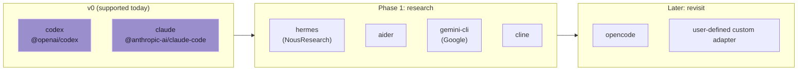

# Заметки о будущих harness'ах

Coven v0 намеренно поддерживает только адаптеры Codex и Claude Code. Эта заметка фиксирует то, что текущий шов адаптера должен сохранить перед добавлением дополнительных harness'ов, таких как Hermes.

OpenClaw не является целевым harness'ом Coven в v0. Интеграция OpenClaw вынесена через плагин `@opencoven/coven`, который действует как socket-клиент для демона на Rust.

## Текущий контракт адаптера

Адаптер harness'а Coven разрешается в:

- стабильный id harness'а Coven, например `codex` или `claude`;
- метку, ориентированную на пользователя, для `coven doctor`;
- имя исполняемого файла для обнаружения в `PATH`;
- опциональные фиксированные аргументы, которые должны идти перед prompt'ом; и
- prompt как последний аргумент команды.

Это сохраняет runtime достаточно общим для CLI, которые не имеют форму ровно как у Codex или Claude Code, без преждевременного добавления неподдерживаемых harness'ов.

## Наблюдения о Hermes

Hermes должен оставаться целью валидации фазы 2, пока Coven не получит больше прямого использования Codex/Claude/comux.

Наблюдаемая публичная поверхность CLI:

- Интерактивная сессия: `hermes`
- Режим TUI: `hermes --tui`
- Одноразовый prompt: `hermes chat -q "..."`
- Программный режим вывода: `hermes chat --quiet -q "..."`
- Переопределения модели/провайдера: `hermes chat --model ...`, `hermes chat --provider ...`
- Опции возобновления: `--resume <session>` и `--continue [name]`
- Режим worktree: `--worktree`
- Обход одобрения: `--yolo`

Источники:

- https://hermes-agent.nousresearch.com/docs/user-guide/cli
- https://hermes-agent.nousresearch.com/docs/reference/cli-commands

## Последствия для Coven

Адаптер Hermes, вероятно, не должен быть прямой копией формы Codex/Claude. Он, скорее всего, нуждается в одном из этих режимов:

1. **Одноразовая логированная сессия** с использованием `hermes chat --quiet -q <prompt>`.
   - Хорошо для захваченного вывода и событий выхода.
   - Менее полезно для долгоживущего attach/input, потому что процесс может выйти после ответа.
2. **Интерактивная PTY-сессия** с использованием `hermes` или `hermes --tui`.
   - Лучше для видимого человеку attach/вмешательства.
   - Требует проверки, возможна ли инъекция начального prompt через argv или Coven должен записывать prompt в stdin после spawn.
3. **Сессия с поддержкой возобновления** с использованием `--resume` / `--continue`.
   - Потенциально полезно, как только Coven получит first-class поле id upstream-сессии.
   - Не должно добавляться, пока собственная модель идентичности сессии Coven не стабильна.

## Решение

Не добавляй Hermes в `coven doctor` или `coven run` пока.

Сейчас сохраняй шов адаптера способным выражать CLI с prefix-args (`chat -q <prompt>`) и пересмотри настоящий адаптер Hermes после того, как:

- прямые сессии Coven Codex/Claude получат больше использования;
- attach/open comux получит реальное использование;
- мы узнаем, должен ли Hermes быть одноразовым, интерактивным или с поддержкой возобновления внутри Coven; и
- мы сможем тестировать против реальной установки Hermes.

## Ландшафт кандидатов в harness

Кандидат переходит из **Фазы 1: исследование** в публичную поддержку v0 только после прохождения каждого этапа в [контрольном списке зрелости адаптера harness'а](/HARNESS-ADAPTERS#suggested-adapter-maturity-stages). Сетка выше — направление, а не обещание.
