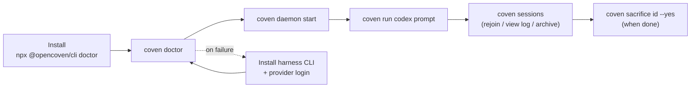

# Начать работу с Coven

Это руководство ведёт нового пользователя от свежего checkout или установки npm до видимой сессии агента, ограниченной проектом.

## Что такое Coven

Coven — это local-first runtime для harness'ов кодирующих агентов. Он запускает поддерживаемые CLI, такие как Codex и Claude Code, внутри явных границ проекта, записывает метаданные сессии и события и предоставляет работу через CLI, TUI и локальный socket API.

Короткое обещание:

> Один проект. Любой harness. Видимая работа.

## Пути установки

Используй npm-wrapper, когда нужна самая быстрая публичная установка:

```sh
npx @opencoven/cli doctor
pnpm dlx @opencoven/cli doctor
```

Собирай из исходников, когда вносишь вклад в Coven:

```sh
git clone https://github.com/OpenCoven/coven.git
cd coven
cargo build --workspace
cargo run -p coven-cli -- doctor
```

## Предварительные требования

Coven требует:

- Rust stable, если собираешь из исходников.
- Git.
- Unix-подобный локальный runtime для текущего пути socket демона и PTY.
- Хотя бы одну поддерживаемую CLI harness'а в `PATH`.

Поддерживаемые harness'ы v0:

- `codex`
- `claude`

Установи и аутентифицируй harness, прежде чем ожидать, что `coven run` сработает:

```sh
npm install -g @openai/codex
codex login

npm install -g @anthropic-ai/claude-code
claude doctor
```

## Первый запуск

Из каталога проекта:

```sh
coven
```

Команда по умолчанию открывает prompt-first TUI. Ты можешь:

- ввести задачу напрямую и нажать Enter (например, `fix the failing tests` или slash-команду `/run codex fix the failing tests`);
- выбрать пункт меню стрелками или его однобуквенным сокращением и нажать Enter;
- нажать `h` или ввести `/help`, чтобы увидеть примеры на естественном языке и slash-команды;
- нажать `Ctrl+C` или `Esc` для выхода.

Если предпочитаешь запустить явные проверки настройки:

```sh
coven doctor
```

`coven doctor` проверяет:

- готовность хранилища;
- обнаружение проекта;
- доступность встроенного harness'а; и
- следующие шаги для отсутствующей настройки.

## Запустить сессию

Запусти демон, затем запусти harness-сессию из репозитория или каталога проекта:

```sh
coven daemon start
coven run codex "fix the failing tests"
```

или:

```sh
coven run claude "polish the CLI help text"
```

Для более читаемого списка сессий передай заголовок:

```sh
coven run codex "update the docs" --title "Docs refresh"
```

Используй конкретный рабочий каталог только тогда, когда он внутри обнаруженного корня проекта:

```sh
coven run codex "inspect this package" --cwd packages/cli
```

Coven отвергает рабочие каталоги вне корня. Клиенты могут валидировать для лучшего UX, но демон на Rust — это авторитет.

## Просмотр сессий

В интерактивном терминале:

```sh
coven sessions
```

Это открывает браузер сессий. Можно выбрать сессию и выбрать контекстные действия:

- **Rejoin** для живых сессий.
- **View Log** для завершённых сессий.
- **Summon** для архивных сессий.
- **Archive** для видимых завершённых сессий.
- **Sacrifice** для постоянного удаления не выполняющихся сессий и событий.

Для скриптов или рабочих процессов copy/paste:

```sh
coven sessions --plain
coven sessions --all --plain
coven sessions --json
coven sessions --json --all
```

## Attach, archive, summon и sacrifice

Низкоуровневые глаголы сессий остаются доступными:

```sh
coven attach <session-id>
coven archive <session-id>
coven summon <session-id>
coven sacrifice <session-id> --yes
```

Archive обратим. Summon восстанавливает архивную сессию в активный список. Sacrifice — разрушительный и отказывается от живых сессий.

## Остановить демон

```sh
coven daemon stop
```

Используй `restart`, когда socket или состояние демона выглядит устаревшим:

```sh
coven daemon restart
```

## Диагностика и облегчение

`coven pc` — это macOS-first инструмент системной диагностики и облегчения, доступный через CLI Coven. Все операции чтения свободны от побочных эффектов.

Проверка:

```sh
coven pc                  # full report: CPU, memory, disk, top processes
coven pc status           # one-line health summary with 🟢/🟡/🔴 indicators
coven pc status --json    # machine-readable health summary
coven pc top --n 10       # top-N processes by CPU usage
coven pc disk             # disk usage breakdown
```

Операции облегчения изменяют состояние системы и требуют явного шлюза `--confirm`:

```sh
coven pc kill <pid> --confirm     # SIGTERM with PID identity re-check
coven pc cache clear --confirm    # clear ~/Library/Caches + /Library/Caches
```

Ограничения безопасности в v1:

- Все операции записи требуют `--confirm`. Пути обхода нет.
- Завершение — только SIGTERM. Никакого SIGKILL.
- Идентичность процесса перепроверяется непосредственно перед SIGTERM, чтобы предотвратить переиспользование PID.
- Очистка кэша использует жёстко закодированный список путей. Без glob-расширения.
- Аргументы процесса по умолчанию редактируются; передай `--verbose`, чтобы их проверить.
- Никакого `sudo`, никакой мутации LaunchAgent, никакого контроля системных сервисов.

## Сквозной поток



Цикл "install → doctor → daemon → run → sessions" — это весь счастливый путь для первой сессии. Всё остальное в этом руководстве — fallback или troubleshooting.


## Цикл проверки контрибьютора

Перед открытием PR:

```sh
cargo fmt --check
cargo clippy --workspace --all-targets -- -D warnings
cargo test --workspace --locked
python scripts/check-secrets.py
```

Для изменений демона/сессии также запусти smoke-тест:

```sh
cargo test -p coven-cli --test smoke -- --nocapture
```

Smoke-тест использует временный `COVEN_HOME` и фейковый исполняемый файл harness'а. Он не требует приватных учётных данных harness'а.
