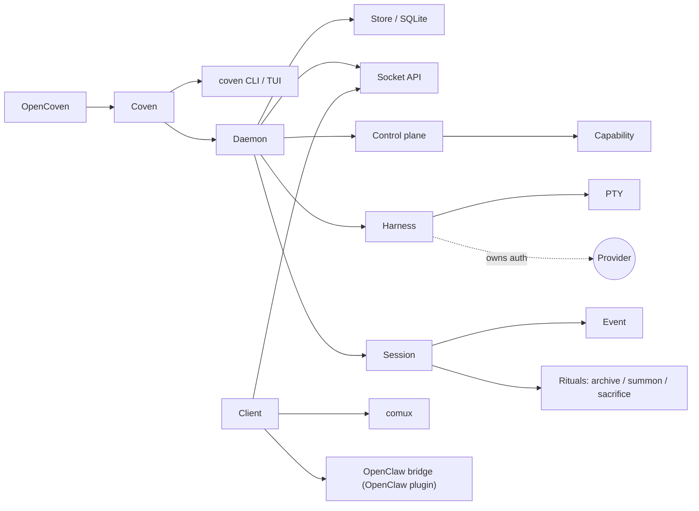

# Глоссарий

Как термины сочетаются с первого взгляда:

Определения следуют по алфавиту.

## ACP

Agent Client Protocol. В этом репо ACP появляется как поверхность интеграции для внешних runtime'ов агентов и совместимости с OpenClaw. Сам Coven не является реализацией ACP; внешний плагин OpenClaw отображает между runtime-событиями OpenClaw и сессиями Coven.

## Версия API

Именованный контракт совместимости, предоставляемый socket API демона. Текущее стабильное значение: `coven.daemon.v1`.

## Archive

Скрыть не выполняющуюся сессию из активного списка, сохраняя её запись и события.

## Capability

Обнаруживаемая функция демона или адаптера, возвращаемая `GET /api/v1/capabilities`.

## Клиент

Любой процесс или UI, который разговаривает с демоном Coven, включая CLI, comux, клиент чата/ввода или плагин OpenClaw.

## comux

Кокпит-слой для видимой работы агентов, панелей, worktree'ов, ревью и потока merge. comux может потреблять сессии Coven, но не является runtime'ом Coven.

## Плоскость управления

Слой демона, который предоставляет capabilities и маршрутизирует известные id действий к принадлежащим адаптерам.

## Coven

Локальная runtime-подложка OpenCoven и продукт командной строки.

## `coven`

Команда, ориентированная на пользователя.

## `coven pc`

macOS-first подкоманда системной диагностики и облегчения. Отчитывает CPU, память, диск и top-процессы. Операции записи (kill процесса, очистка кэша) защищены `--confirm`.

## `COVEN_HOME`

Локальный каталог, где Coven хранит состояние демон/socket/база данных, когда настроен. Состояние runtime не должно быть commit'нуто в систему контроля версий.

## Демон

Локальный процесс на Rust, который владеет состоянием живой сессии и socket API.

## Событие

Append-only запись для вывода, выхода или метаданных сессии.

## Harness

Поддерживаемая CLI кодирующего агента, которую Coven может запускать и контролировать.

## OpenCoven

Более широкая экосистема и организация вокруг Coven, comux и связанных интеграций.

## Плагин OpenClaw

Внешний пакет external OpenClaw bridge plugin, который позволяет OpenClaw использовать Coven через socket API. Не является частью ядра OpenClaw.

## Корень проекта

Явная граница репозитория или проекта для сессии.

## PTY

Псевдотерминал. Coven использует PTY, чтобы harness'ы вели себя как нативные терминальные инструменты, в то время как их вывод по-прежнему может записываться и воспроизводиться.

## Prompt-first TUI

Интерфейс по умолчанию `coven` и `coven tui`. Принимает свободный текст задачи или slash-команды, такие как `/run codex <task>`, в качестве input наряду с навигацией по меню стрелками.

## Облегчение

Операции стороны записи в `coven pc`, которые изменяют состояние системы (завершение процесса, удаление кэша). Всегда требуют явный флаг `--confirm`.

## Sacrifice

Постоянно удалить не выполняющуюся сессию и её события.

## Сессия

Принадлежащая Coven запись одного запуска harness'а.

## Socket API

Локальный HTTP-поверх-Unix-socket API, предоставляемый демоном.

## Summon

Восстановить архивную сессию в активный список и затем воспроизвести/следить за ней.

## Будущая координация

Многоhardness handoff и маршрутизация задач не являются текущими публичными функциями CLI/API. Их следует документировать только как работу roadmap, пока они не реализованы.
