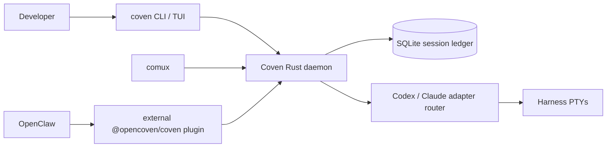
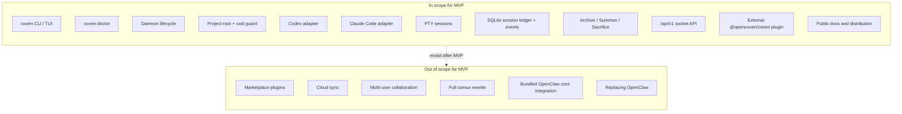

# Спецификация продукта Coven

## Продуктовый тезис

Coven — это Rust-first harness-подложка для запуска кодирующих агентов как сессий, ограниченных проектом, наблюдаемых и подключаемых. Она позволяет разработчикам приводить harness'ы, которым они уже доверяют, в контролируемый локальный runtime вместо принуждения к одному провайдеру агента или UI.

Полярная звезда: **Один проект. Любой harness. Видимая работа.**

## Область MVP

MVP доказывает основной цикл runtime:

- Отдельный бинарник CLI с именем `coven`
- Локальный демон для контролируемых сессий
- Явные границы корня проекта
- Интерактивное выполнение сессии через PTY
- Постоянство метаданных сессии и событий
- Команды и потоки TUI для запуска, просмотра, повторного подключения, просмотра, архивации, призыва, принесения в жертву и убийства живых сессий через API демона
- Минимальный локальный API для first-party клиентов
- Внешний пакет плагина OpenClaw, который потребляет этот API, не входя в ядро OpenClaw
- Публичное распространение и документация для ранних пользователей

Вне области MVP: marketplace-плагины, облачная синхронизация, многопользовательская коллаборация, полное переписывание comux, bundled-интеграция ядра OpenClaw или замена OpenClaw.

## Направление встроенных harness'ов v0

Coven v0 должен поставляться со встроенными адаптерами для Codex и Claude Code. Эти адаптеры должны обнаруживать доступность локальной CLI, конструировать команды без интерполяции shell где возможно, запускать harness внутри проверенного `cwd` проекта и предоставлять output/input через PTY-сессии, управляемые Coven.

UX терминала должен оставаться сосредоточенным на лёгкой команде `coven` и удобном для людей браузере сессий:

```sh
coven
coven tui
coven run codex "fix tests"
coven run claude "polish this UI"
coven sessions
coven sessions --plain
```

В интерактивном терминале `coven sessions` открывает браузер с читаемыми действиями, такими как **Rejoin**, **View Log**, **Summon**, **Archive** и **Sacrifice**, чтобы пользователям не приходилось запоминать id сессий. Plain-вывод остаётся доступным для скриптов и pipes.

## Будущий путь Hermes и адаптеров

Hermes и другие harness'ы должны приходить через небольшой контракт адаптера после того, как встроенный путь v0 будет стабилен. Модель адаптера должна поддерживать будущие цели, такие как Hermes, Aider, Gemini, OpenCode и адаптеры пользовательских команд, не требуя от Coven становиться полным marketplace плагинов в MVP.

## Текущая архитектура



Для более полных диаграмм см. [Диаграммы архитектуры](/ARCHITECTURE).

## Отношения с comux, OpenClaw и OpenMeow

Coven — это локальная runtime-подложка. comux может стать визуальным кокпитом для панелей и истории сессий, управляемых Coven. OpenClaw может делегировать запуски harness'а, ограниченные проектом, в Coven только через внешний плагин `@opencoven/coven`, а не через bundled-код ядра OpenClaw. OpenMeow может потреблять статус сессии, приём или уведомления Coven там, где это полезно.

Coven должен интегрироваться с этими проектами, не принадлежа никому из них: это общая комната, где запускаются harness'ы, а не вся UI или оркестратор.

## Граница внешнего плагина OpenClaw

Интеграция OpenClaw вынесена. Репо OpenClaw не должно включать код OpenCoven или Coven, а Coven не должен зависеть от внутренностей OpenClaw.

Пакет `@opencoven/coven` — это адаптер совместимости:

- Вызовы ACP-runtime OpenClaw входят в плагин.
- Плагин валидирует конфиг и подключается к локальному socket Coven.
- Демон на Rust перепроверяет корни проекта, cwd, id harness'ов, input и запросы kill.
- Coven запускает и контролирует PTY harness'а.
- Плагин отображает события Coven обратно в события ACP-runtime OpenClaw.

Это делает socket API контрактом. Версионирование протокола, тесты совместимости и заметки о релизе принадлежат репо Coven и пакету плагина, а не ядру OpenClaw.

## Публичный с самого начала статус

Coven публичен сейчас, пока модель безопасности, поведение демона, контракты адаптеров и пользовательский опыт продолжают созревать. Публичная упаковка должна оставаться консервативной, а готовность должна оцениваться по тому, могут ли ранние пользователи надёжно запускать Codex и Claude Code в видимых, подключаемых сессиях, ограниченных проектом.

## Область MVP с первого взгляда



Граница выше нормативна для v0. Всё в **OutOfScope** записано в roadmap, а не построено в runtime-подложку.

## Канонические handle сообщества

Используй эти точные публичные handle/ссылки, когда docs или метаданные пакета Coven упоминают каналы сообщества:

- Discord: `discord.gg/opencoven`
- X / Twitter: `@OpenCvn`
