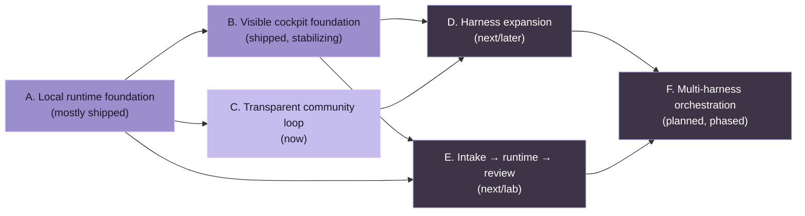

# Публичный roadmap OpenCoven

_Последнее обновление: 2026-05-09_

Этот roadmap — публичный журнал прогресса для **OpenCoven**, **Coven** и **comux**.

Он намеренно написан как карта, обращённая к сообществу, а не как лист внутренних обещаний. Элементы перемещаются, когда их проектируют, реализуют, тестируют, выпускают или намеренно вырезают. Даты избегаются, если релиз уже не запланирован.

## Полярная звезда

OpenCoven строит local-first рабочее пространство для агентов, где автономные кодирующие harness'ы могут работать внутри явных комнат:

- **Coven** — это runtime-подложка: harness-сессии в границах проекта, PTY, логи и локальные API.
- **comux** — это кокпит: видимые панели, worktree'ы, дорожки агентов, ритуалы, ревью и поток merge.
- **Интеграции OpenMeow / OpenClaw** — это поверхности приёма и оркестрации, которые могут передавать работу в тот же локальный runtime, не скрывая, что произошло.

Простое обещание:

> Один проект. Любой harness. Видимая работа.

## Как читать этот roadmap

- **Shipped** означает, что работа существует в публичном коде или публичных артефактах пакета/релиза.
- **Now** означает активную стабилизацию или ближайшую реализацию.
- **Next** означает запланировано после текущего среза стабилизации.
- **Later** означает направленно важно, но не разрешено отвлекать от local-first MVP.
- **Lab** означает экспериментальную работу, которую мы исследуем публично, когда это возможно, но пока не рассматриваем как стабильное обещание.

## Текущий снимок

### Coven

**Статус:** ранний публичный MVP, пригодный для авантюрных local-first разработчиков.

Shipped:

- Публичный репо `OpenCoven/coven`.
- CLI-команда на Rust с именем `coven`.
- Удобная для новичков точка входа `coven` / `coven tui`.
- Проверки настройки `coven doctor`.
- Жизненный цикл локального демона: `coven daemon start/status/restart/stop`.
- Охрана границы корня проекта и cwd.
- Встроенные адаптеры harness'ов Codex и Claude Code.
- Сессии `coven run codex|claude <prompt>` с PTY-поддержкой.
- Метаданные сессии и журнал событий с поддержкой SQLite.
- Браузер сессий и ритуалы: **Rejoin**, **View Log**, **Summon**, **Archive**, **Sacrifice**.
- Скриптуемый и человекочитаемый вывод сессий: `coven sessions`, `--plain` и `--all`.
- Локальный API HTTP-поверх-Unix-socket для клиентов.
- Версионированный контракт API `coven.daemon.v1` с именованной apiVersion, читаемыми машиной capabilities, структурированными ошибками и монотонными курсорами событий. См. [`docs/API-CONTRACT.md`](/API-CONTRACT).
- Тесты совместимости для внешнего моста OpenClaw против версионированных ответов демона.
- Подсказки восстановления первого запуска для отсутствующих CLI Codex или Claude Code.
- Реальное smoke-покрытие CLI для потоков перезапуска демона, replay attach, kill, archive, summon и sacrifice.
- Верификация установки и проводка релиза для путей npm-пакетов macOS, Linux x64 и Windows x64.
- Опубликованные wrapper-пакеты npm:
  - `@opencoven/cli`
  - `@opencoven/cli-macos`
  - `@opencoven/cli-linux-x64`
- Внешний bridge-пакет OpenClaw сохраняется вне ядра OpenClaw.
- Docs архитектуры, операционной модели, спецификации продукта, бренда и плана MVP.

Now:

- Держать выровненными версионированный контракт API демона и работу совместимости внешних клиентов. См. [`docs/API-CONTRACT.md`](/API-CONTRACT).
- Держать публичные docs выровненными с реальной поверхностью CLI/API.

Next:

- Превратить контрольный список MVP в связанные issue/milestone в GitHub.

Later:

- Универсальный адаптер команд после достаточного реального использования.
- Дополнительные адаптеры harness'ов, такие как Hermes, Aider, Gemini, OpenCode или пользовательские локальные harness'ы.
- Хуки политики/одобрения для чувствительных действий.
- Более богатые артефакты сессии и вложения.
- **Многоhardness оркестрация** (Phase 1-4, TBD timeline):
  - Phase 1: Протокол handoff и передача контекста между harness'ами
  - Phase 2: Обнаружение capability и интеллектуальная маршрутизация задач
  - Phase 3: Многоинстансная координация между harness'ами
  - Phase 4: Дашборд аудита и инструменты комплаенса
- Опциональная облачная/командная коллаборация только после того, как локальный runtime станет скучно надёжным.

### comux

**Статус:** ранний публичный продукт, полезный как отдельный терминальный кокпит и становящийся первым визуальным клиентом Coven.

Shipped:

- Публичный npm-пакет и CLI-команда `comux`.
- tmux-кокпит для видимой параллельной работы.
- Изоляция git worktree на каждую дорожку агента.
- Реестр launcher'ов агентов с несколькими кодирующими CLI.
- Запуски агентов с multi-select.
- Меню панели для потоков inspect, merge, PR, attach и cleanup.
- Браузер файлов, предпросмотр кода и affordance ревью, ориентированные на diff.
- Sidebar проекта, контроль видимости панелей и потоки повторного открытия.
- Ритуалы для повторяемых настроек проекта.
- Docs хуков жизненного цикла и сгенерированная справка по хукам.
- Docs-сайт и публичные README/spec/smoke.
- Видимость сессий Coven и интеграция запуска через локальный путь моста.
- Направление ритуала восстановления OpenClaw начато публично.

Now:

- Стабилизировать UX сессий Coven в comux: list, open, launch, attach/rejoin и состояния недоступности.
- Держать comux полезным без установленного Coven.
- Продолжать dogfooding comux-на-comux для гигиены веток/worktree.
- Подтянуть потоки ревью/merge, чтобы вывод агента оставался явным и инспектируемым.

Next:

- Продвигать чёткий демо-цикл `comux + Coven`:
  1. Открыть проект в comux.
  2. Запустить сессию Codex или Claude, поддерживаемую Coven.
  3. Наблюдать её как видимую панель/сессию.
  4. Проверять файлы и diff'ы.
  5. Делать merge, PR, archive или явную очистку.
- Добавить публичные issue для шероховатостей, обнаруженных во время dogfooding.
- Улучшить onboarding для tmux, обнаружения CLI агентов и доступности Coven.
- Сделать лёгким генерацию обновлений Discord из shipped-коммитов и issue roadmap.

Lab:

- Исследование нативного кокпита macOS.
- Десктоп-ярлыки и более быстрое переключение проектов/сессий.
- Передача приёма OpenMeow в сессии comux/Coven.

### Путь интеграции OpenClaw / OpenMeow

**Статус:** opt-in направление моста, не bundled в ядро OpenClaw.

Shipped:

- Технический spike моста OpenClaw завершён и намеренно припаркован перед слиянием в ядро.
- Направление внешнего плагина `@opencoven/coven` установлено, чтобы ядро OpenClaw оставалось чистым.
- Граница локального socket/API делает Coven слоем авторитета.

Now:

- Рассматривать API Coven как границу совместимости.
- Добавить тесты совместимости перед поощрением широкого использования плагина.
- Держать копию OpenMeow/OpenClaw честной: приём и оркестрация сидят над Coven; они не заменяют runtime-подложку.

Next:

- Публично задокументировать поддерживаемый путь плагина после приземления версионирования API.
- Добавить демо, показывающее задачу, перемещающуюся из приёма в runtime Coven в ревью comux.

## Карта milestones



Цветовая кодировка отражает зрелость: заполненный лавандовый — shipped или стабилизируется; контурный сланцевый — next/later. Рёбра показывают направление пререквизита, а не строгий график.

> **Image asset prompt (to be generated and dropped into `docs/images/roadmap-banner.svg`):** Vector banner 2400×600, dark OpenCoven background. Six pill-shaped nodes labelled A–F (matching the milestone names above) arranged left-to-right along a soft lavender arc, with thin dashed lines connecting the prerequisite chain. A–B–C filled with `#9A8ECD`, D–E–F outlined with `#9A8ECD` and a slate fill (`#3D3547`). Header text "OpenCoven roadmap" in `DM Sans` `700`, lower-right caption "shipped → stabilizing → now → next → planned" in `Fragment Mono`.

## Публичные milestones

### Milestone A — Основа локального runtime

Статус: **mostly shipped**

- [x] Публичный репо и docs
- [x] CLI `coven`
- [x] Безопасность корня проекта
- [x] Адаптеры Codex и Claude
- [x] PTY-сессии
- [x] SQLite-журнал сессий/событий
- [x] Жизненный цикл демона
- [x] Локальный API sessions/events
- [x] Версионированный контракт API
- [x] Тесты совместимости для внешних клиентов

### Milestone B — Основа видимого кокпита

Статус: **shipped, stabilizing**

- [x] Публичный пакет `comux`
- [x] tmux-панели
- [x] git worktree
- [x] реестр launcher'ов агентов
- [x] браузер файлов / ревью diff'ов
- [x] ритуалы
- [x] меню панели, ориентированное на merge и PR
- [x] Видимость сессий Coven
- [ ] Полировка UX attach/rejoin Coven
- [ ] Задокументированное сквозное демо comux + Coven

### Milestone C — Прозрачный цикл сообщества

Статус: **now**

- [x] Документ публичного roadmap
- [ ] Метки GitHub milestone для `roadmap`, `now`, `next`, `later`, `area:coven`, `area:comux`, `good first issue`, `help wanted`
- [ ] Первый публичный пост roadmap в Discord
- [ ] Еженедельная каденция обновлений shipped/building/next
- [ ] Публичная доска issue, связанная из Discord

### Milestone D — Расширение harness

Статус: **next/later**

- [x] Исследование будущих harness'ов начато
- [x] Задокументирован контракт адаптера
- [ ] Дизайн универсального адаптера команд из реального использования
- [ ] Доказательство третьего harness
- [ ] Docs совместимости harness'ов

### Milestone E — От приёма к runtime к ревью

Статус: **next/lab**

- [ ] Приём OpenMeow/OpenClaw создаёт или запрашивает задачу Coven
- [ ] Coven владеет сессией и журналом событий
- [ ] comux показывает сессию для ревью
- [ ] пользователь явно делает merge, PR, archive или удаляет работу

### Milestone F — Многоhardness оркестрация (Фаза 1-4)

Статус: **planned, TBD start**

**Фаза 1: Протокол handoff (недели 1-2)**
- [ ] Дизайн API handoff и реализация TypeScript
- [ ] Формат передачи контекста и валидация
- [ ] Явный handoff harness-к-harness (например, OpenClaw → Claude Code)
- [ ] Журнал handoff (PostgreSQL)
- [ ] Сквозной тест: Cody передаёт ошибку теста Claude для редактирования файла

**Фаза 2: Обнаружение capabilities и роутер (недели 3-4)**
- [ ] Реестр и объявление capabilities harness'ов
- [ ] Роутер задач: авто-выбор лучшего harness'а
- [ ] Балансировка нагрузки и цепочки fallback
- [ ] Применение SLA и обработка таймаутов
- [ ] Тест: "Fix this bug" автоматически маршрутизируется к лучшему harness'у

**Фаза 3: Многоинстансная координация (недели 5-6)**
- [ ] Распределённое хранилище контекста (Redis + PostgreSQL)
- [ ] Регистрация harness'а и heartbeat здоровья
- [ ] Маршрутизация по affinity задачи (ограничения ресурсов)
- [ ] Масштабирование до нескольких инстансов Coven на пользователя
- [ ] Тест: локальные + удалённые harness'ы координируются без коллизии

**Фаза 4: Аудит и наблюдаемость (недели 7-8)**
- [ ] Дашборд аудита: timeline задачи и трасса handoff
- [ ] Экспорт комплаенса (редактированные трассы)
- [ ] Метрики Prometheus и оповещения
- [ ] Полная видимость оркестрированной работы
- [ ] Тест: легал/комплаенс может запрашивать полную историю

## Модель прозрачности Discord

Мы должны держать обновления Discord лёгкими и повторяемыми.

### Предлагаемые каналы

- `#roadmap` или forum-style канал `Roadmap` для тредов milestone.
- `#dev-updates` для еженедельных сводок.
- `#help-wanted` для конкретных issue, которые члены сообщества действительно могут взять.

### Шаблон еженедельного обновления

```md
## OpenCoven weekly update — YYYY-MM-DD

### Shipped
- ...

### Building now
- ...

### Next up
- ...

### Help wanted
- ...

### Links
- Roadmap: https://github.com/OpenCoven/coven/blob/main/docs/ROADMAP.md
- Coven issues: https://github.com/OpenCoven/coven/issues
- comux issues: https://github.com/BunsDev/comux/issues
```

### Правила честных обновлений

- Не обещай даты, если мы уже не в режиме релиза.
- Связывай shipped-работу с коммитами, релизами, issue или docs.
- Маркируй эксперименты как **Lab**, а не делай вид, что это committed пункты roadmap.
- Разделяй **runtime Coven**, **кокпит comux** и **приём OpenMeow/OpenClaw**, чтобы люди понимали архитектуру.
- Предпочитай небольшие публичные issue вместо гигантских расплывчатых задач.
- Проси помощь только тогда, когда у задачи есть чёткое условие принятия.

## Первый публичный пост в Discord

```md
We opened a public roadmap for OpenCoven/Coven/comux so progress is easier to follow.

The short version:
- Coven is the local runtime substrate: project-scoped Codex/Claude sessions, PTYs, logs, daemon API.
- comux is the visible cockpit: tmux panes, worktrees, rituals, review, merge/PR flows.
- The next serious focus is hardening the Coven API contract and polishing the comux + Coven demo loop.

Roadmap: https://github.com/OpenCoven/coven/blob/main/docs/ROADMAP.md
Coven: https://github.com/OpenCoven/coven
comux: https://github.com/BunsDev/comux

We'll start posting lightweight shipped / building / next updates here so the work is easier to follow and easier to help with.
```
