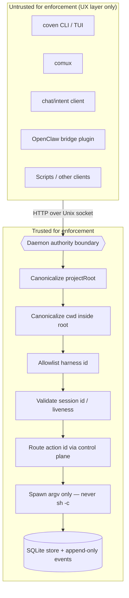

# Модель безопасности Coven

Coven local-first, но локальный не означает безвредный. Он может запускать harness'ы агентов в реальных репозиториях, пересылать input в живые процессы и сохранять логи. Этот документ излагает границы безопасности, которые должны сохранять docs, клиенты и код.

## Граница доверия

Демон на Rust — это граница авторитета.

Каждый клиент недоверен для целей применения, включая:

- CLI/TUI;
- comux;
- клиенты чата/ввода;
- внешний плагин OpenClaw;
- скрипты; и
- будущие десктоп-клиенты.

Клиенты могут улучшать UX, но не должны быть единственным местом, где применяется чувствительное решение.



Всё, что находится в **UntrustedZone**, может лгать, расходиться или быть заменено. Всё, что находится в **TrustedZone**, — это работа демона на Rust, и она должна отказываться в закрытом виде при неизвестных. Направление стрелки — единственное направление, в котором разрешено течь чувствительное решение: из недоверенного в границу, где оно перепроверяется.

## Аутентификация и локальный доступ

Текущее решение auth Coven — это модель локального доступа в рамках одного пользователя, а не сетевой протокол аутентификации.

- API демона работает поверх `<covenHome>/coven.sock`, а не TCP.
- В v0 нет OAuth, JWT, bearer-токена, API-ключа, cookie браузера, RBAC или сессии хостовой учётной записи демона.
- Учётные данные провайдера остаются в локальном потоке auth провайдера/harness'а, таком как Codex или Claude Code.
- Клиенты недоверены для применения; демон на Rust должен по-прежнему перепроверять каждый чувствительный запрос.
- Внешний плагин OpenClaw выполняет валидацию якоря доверия socket перед подключением, но проверки приватной собственности и разрешений `COVEN_HOME` на стороне Rust остаются приоритетом hardening.
- Не предоставляй сырой socket API через TCP localhost, страницу браузера, удалённый мост или мобильный pairing-поток без отдельного явного дизайна auth.

Подробный контракт живёт в [Аутентификация и локальный доступ](/AUTH).

## Основные правила

- Запускай только с явным корнем проекта.
- Канонизируй `projectRoot` и `cwd` перед сравнением путей.
- Отвергай рабочие каталоги вне корня проекта.
- Держи id harness'ов в allowlist, пока не появится реальный слой политики.
- Строй команды harness'а с argv API.
- Не выполняй prompt через `sh -c`.
- Держи учётные данные провайдера в потоке аутентификации провайдера или harness'а.
- Рассматривай socket API как локальный контракт продукта, а не приватную деталь реализации.
- Отказывайся в закрытом виде при неизвестных версиях API, неизвестных id действий, неподдерживаемых harness'ах и недействительных id сессий.

## Данные и секреты

Coven не должен требовать секретов, хранимых в репозитории.

Не делай commit состояния runtime:

- `.coven/`
- `*.sqlite`
- `*.sqlite3`
- `*.db`
- `*.sock`
- `.env*`
- приватные ключи
- сертификаты
- логи, несущие токены

Docs и примеры должны использовать placeholder'ы, такие как `/path/to/project`, `/Users/example`, `session-1` и `intent-1`.

## Предостережение журнала событий

Журнал событий записывает вывод harness'а. Harness может напечатать чувствительные данные, если пользователь просит проверить чувствительный репозиторий или если вывод команды включает секреты.

Рекомендуемое руководство для пользователя:

- Не запускай недоверенные prompt в чувствительных репозиториях.
- Не проси harness дампить переменные окружения.
- Не вставляй секреты в prompt.
- Используй одноразовые проекты для демо и smoke-тестов.
- Запускай `python scripts/check-secrets.py` перед публикацией docs, fixtures или артефактов релиза.

## Поза локального socket

API демона работает поверх локального Unix socket. Он предназначен для локальных клиентов того же пользователя.

Приоритеты hardening:

- приватная собственность и разрешения `COVEN_HOME`;
- безопасное создание и очистка socket;
- ограничения размера запроса;
- таймауты чтения;
- структурированные коды ошибок;
- пагинация событий; и
- тесты совместимости для внешних клиентов.

## Управление живой сессии

Запросы живого input и kill требуют действительный id живой сессии.

Ожидаемое поведение:

- неизвестный id сессии возвращает not found;
- input/kill к не-живой сессии возвращает conflict;
- разрушительное удаление сессии отказывает выполняющимся сессиям;
- интерактивное удаление требует явного подтверждения.

## Десктоп-автоматизация и управление локальным UI

Будущие адаптеры десктоп-автоматизации следует рассматривать как привилегированные локальные capabilities.

Требуемая поза:

- обнаруживать capabilities перед показом действий;
- ясно маркировать рискованные действия;
- требовать явное одобрение для кликов, ввода, удаления, отправки, покупки, публикации или модификации внешнего состояния;
- логировать запросы действий и результаты без записи секретов;
- держать адаптеры за плоскостью управления Coven, а не позволять каждому клиенту напрямую связываться с API автоматизации ОС.

Разделение должно оставаться:

```text
client intent -> Coven policy/control plane -> adapter -> desktop/app
```

## Внешние действия

Coven должен спрашивать или требовать политику на уровне хоста перед действиями, которые покидают машину или влияют на внешние сервисы, включая:

- отправку сообщений;
- отправку email;
- публичную публикацию;
- покупку;
- удаление удалённых данных;
- push в git remote; и
- модификацию облачных ресурсов.

Локальный runtime может сделать эти действия видимыми, но видимость — это не согласие.
