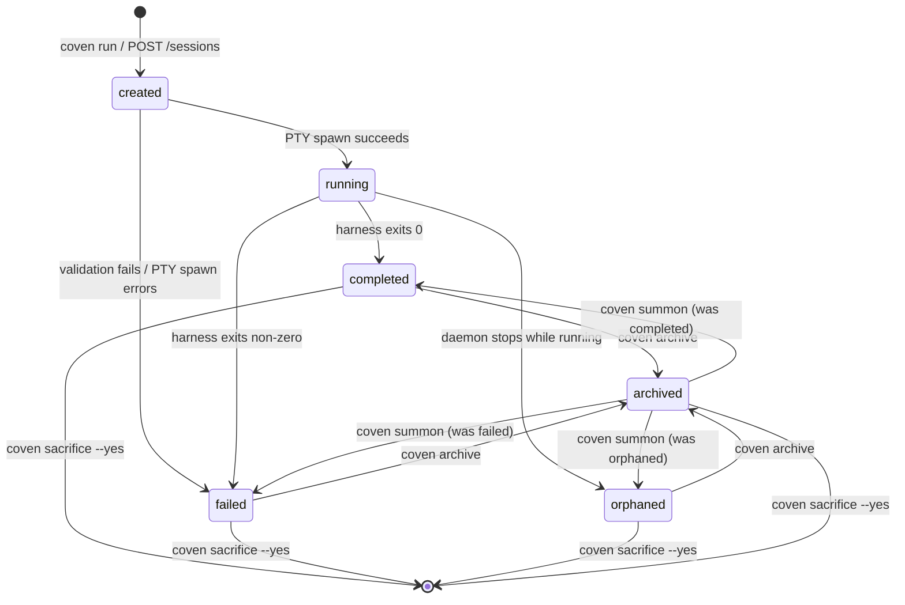
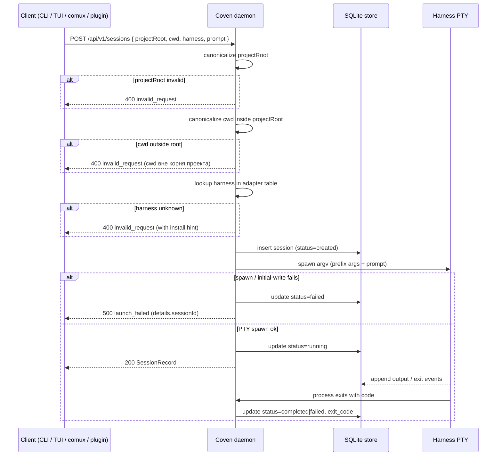

# Жизненный цикл сессии

Этот документ объясняет, что происходит от `coven run` до завершения, replay, archive, summon и удаления.

## Состояния жизненного цикла

Текущее хранилище записывает статус сессии как строку. Распространённые состояния включают:

- `created` - запись сессии существует до того, как начинается живое выполнение.
- `running` - процесс harness'а активен под надзором демона.
- `completed` - harness вышел успешно.
- `failed` - настройка или запуск не удались до нормального завершения.
- `orphaned` - предыдущий демон остановился, пока сессия всё ещё была помечена как выполняющаяся.

Состояние archive хранится отдельно как `archived_at`. Завершённую или неуспешную сессию можно скрыть из активного списка без изменения её финального статуса.



Диаграмма выше нормативна для хранилища v0. `running` сессии нельзя архивировать или приносить в жертву напрямую — убей их или дождись выхода. `created → running` — единственный переход, требующий spawn PTY; каждый другой переход — это изменение состояния только в хранилище, управляемое демоном на Rust.

## Путь запуска

Нормальный поток запуска:

1. Пользователь или клиент отправляет задачу через CLI или локальный API.
2. Coven разрешает корень проекта.
3. Coven канонизирует корень проекта и рабочий каталог.
4. Coven отвергает рабочие каталоги вне корня.
5. Coven проверяет, что id harness'а поддерживается.
6. Coven создаёт запись сессии в SQLite.
7. Демон делает spawn harness'а в PTY с использованием argv API.
8. Данные вывода и выхода записываются как события.
9. Статус сессии и код выхода обновляются.

Слой Rust выполняет проверки авторитета, даже когда TypeScript-клиент уже валидировал запрос для UX.



## Отсоединённые записи

`coven run ... --detach` создаёт запись сессии без запуска harness'а. Это полезно для потоков тестирования и разработки, которым нужна запись журнала без запуска внешнего процесса.

Отсоединённые записи не должны представляться как завершённая работа агента.

## Attach и replay

`coven attach <session-id>` воспроизводит известный вывод событий и следит за живым выводом, когда сессия всё ещё активна.

Для завершённой сессии attach действует как просмотрщик логов. Для выполняющейся сессии attach также пересылает input в живую сессию демона.

## Поведение браузера сессий

`coven sessions` выбирает режим вывода на основе контекста:

- В интерактивном терминале он открывает браузер сессий.
- Когда пайпится или запускается с `--plain`, печатает табличный вывод.
- `--json` печатает читаемые машиной записи сессий для локальных клиентов.
- `--all` включает архивные сессии.
- `--manage` принудительно открывает браузер.

Браузер предлагает контекстные действия, чтобы пользователям не приходилось запоминать id сессий.

## Archive

Archive скрывает не выполняющуюся сессию из активного списка по умолчанию, сохраняя запись сессии и журнал событий.

```sh
coven archive <session-id>
```

Используй archive для старой работы, которая должна оставаться инспектируемой.

## Summon

Summon восстанавливает архивную сессию в активный список и затем воспроизводит/следит за ней:

```sh
coven summon <session-id>
```

Summon не перезапускает оригинальный prompt harness'а. Он меняет состояние archive и открывает существующую запись.

## Sacrifice

Sacrifice навсегда удаляет не выполняющуюся сессию и каскадирует удаление на её события:

```sh
coven sacrifice <session-id> --yes
```

Команда отказывает живым сессиям. Интерактивный браузер просит пользователя ввести `sacrifice` перед удалением.

Используй sacrifice только тогда, когда сессия и её логи должны быть удалены из локального журнала.

## Восстановление осиротевших сессий

Если демон запускается и обнаруживает сессии, которые были помечены `running` из предыдущей жизни демона, эти сессии помечаются `orphaned`.

Осиротевшая сессия означает, что Coven больше не владеет живым процессом для этой записи. Журнал событий может всё ещё быть полезен, но операции живого input и kill должны отказывать.

## Долговечность событий

События — это append-only записи в SQLite. Это даёт клиентам стабильный источник replay, даже когда оригинальный процесс PTY вышел.

Не записывай намеренно секреты, дампы окружения, приватные URL или вывод команды, несущий токены, в события. Coven не может гарантировать, что вывод harness'а свободен от секретов, поэтому пользователи должны избегать запуска недоверенных prompt в чувствительных репозиториях.
