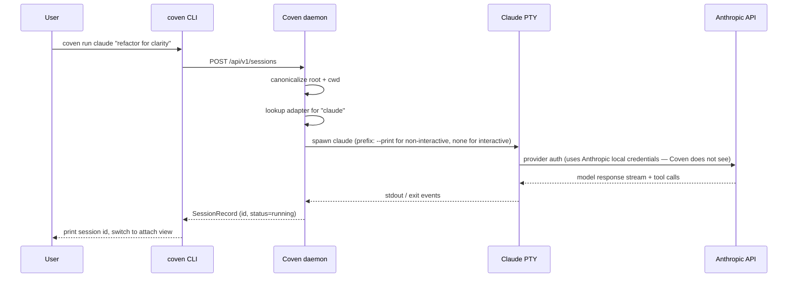

Claude Code — это CLI кодирующего агента Anthropic. Coven оборачивает её в PTY, ограниченный проектом, чтобы запуски, attach и ритуалы работали так же, как для любого другого harness'а.

| Поле | Значение |
|---|---|
| Id harness'а | `claude` |
| Установка | `npm install -g @anthropic-ai/claude-code` |
| Auth | `claude doctor` (одноразово, со стороны Anthropic) |
| Проверка doctor | `coven doctor` сообщает разрешённый путь и версию Claude. |

## Настройка

<Steps>
  <Step title="Установи Claude Code">
    ```bash
    npm install -g @anthropic-ai/claude-code
    ```
  </Step>
  <Step title="Запусти собственный doctor Claude">
    ```bash
    claude doctor
    ```
    Учётные данные провайдера остаются с Claude Code. Coven никогда их не читает.
  </Step>
  <Step title="Подтверди с Coven">
    ```bash
    coven doctor
    ```
    Вывод должен включать `claude: ok (/usr/local/bin/claude)`.
  </Step>
  <Step title="Запуск">
    ```bash
    coven run claude "polish this UI"
    ```
  </Step>
</Steps>

## Флаги для каждой сессии

```bash
coven run claude "refactor for clarity" --cwd packages/web --title "Web refactor"
```

- `--cwd` — канонизирован внутри корня проекта.
- `--title` — задаёт читаемый заголовок в браузере сессий.
- `--json` — печатает структурированные метаданные запуска для клиентов.

## Граница auth провайдера

Claude Code владеет собственным потоком OAuth и кэшем токенов. Coven никогда не читает ключи Anthropic или cookies сессии.

## Решение проблем

| Симптом | Вероятная причина | Решение |
|---|---|---|
| `coven doctor` сообщает, что `claude` отсутствует | Claude Code не в `PATH` | `npm install -g @anthropic-ai/claude-code`, затем повторно запусти doctor. |
| Claude просит логин | Auth не завершён | `claude doctor`. |
| Сессия показывает долгую паузу pre-flight | Claude разрешает конфигурацию | Только при первом запуске; последующие запуски быстры. |

## Как Coven контролирует Claude Code



Вызовы инструментов Claude Code выполняются внутри процесса Claude — Coven их не арбитрирует. PTY захватывает их вывод как обычный stdout/stderr.


## Связанное

- [Установка CLI harness'ов](/harnesses/installing)
- [Граница auth провайдера](/harnesses/provider-auth)
- [Решение проблем harness'а](/harnesses/troubleshooting)
