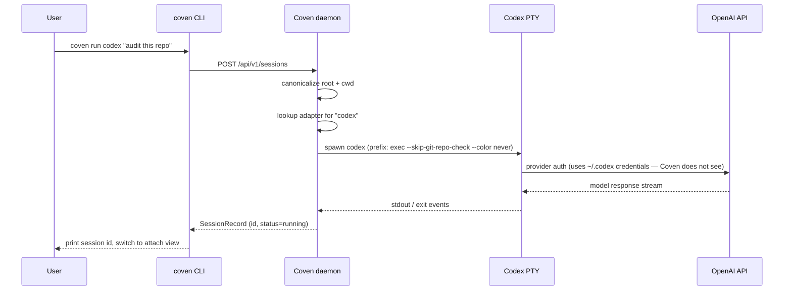

Codex — это CLI кодирующего агента OpenAI. Coven оборачивает её в PTY, ограниченный проектом, чтобы запуски, attach и ритуалы работали так же, как для любого другого harness'а.

| Поле | Значение |
|---|---|
| Id harness'а | `codex` |
| Установка | `npm install -g @openai/codex` |
| Auth | `codex login` (одноразово, со стороны OpenAI) |
| Проверка doctor | `coven doctor` сообщает разрешённый путь и версию Codex. |

## Настройка

<Steps>
  <Step title="Установи Codex">
    ```bash
    npm install -g @openai/codex
    ```
    Другие методы установки (Homebrew cask, менеджеры пакетов) перечислены в [репо Codex](https://github.com/openai/codex).
  </Step>
  <Step title="Войди в OpenAI">
    ```bash
    codex login
    ```
    Учётные данные провайдера остаются с Codex. Coven никогда их не читает.
  </Step>
  <Step title="Подтверди с Coven">
    ```bash
    coven doctor
    ```
    Вывод должен включать строку вроде `codex: ok (/usr/local/bin/codex)`.
  </Step>
  <Step title="Запуск">
    ```bash
    coven run codex "fix the failing tests"
    ```
  </Step>
</Steps>

## Флаги для каждой сессии

```bash
coven run codex "audit this repo" --cwd packages/cli --title "CLI audit"
```

- `--cwd` — канонизирован внутри корня проекта.
- `--title` — задаёт читаемый заголовок в браузере сессий.
- `--json` — печатает структурированные метаданные запуска для клиентов.

## Граница auth провайдера

Codex владеет собственным потоком OAuth и кэшем токенов. Если ты видишь `Invalidated OAuth token`, снова запусти `codex login`. Coven сохранит существующую запись сессии, чтобы ты мог перезапустить с тем же заголовком.

Для локального пути спасения:

```bash
coven patch openclaw "fix Codex auth profile order after invalidated OAuth token"
```

## Решение проблем

| Симптом | Вероятная причина | Решение |
|---|---|---|
| `coven doctor` сообщает, что `codex` отсутствует | Codex не в `PATH` | `npm install -g @openai/codex`, затем повторно запусти doctor. |
| Codex просит логин при каждом запуске | Устаревший токен | `codex login`. |
| Сессия зависает при старте | Codex ждёт prompt TTY | Отсоединись с `Ctrl-]`, перезапусти с `coven run` напрямую. |

## Как Coven контролирует Codex



Пунктирная линия, на которую стоит обратить внимание: Coven никогда не подключается к API OpenAI сам. Путь учётных данных — **CLI Codex ↔ OpenAI**, при этом Coven только наблюдает вывод PTY.


## Связанное

- [Установка CLI harness'ов](/harnesses/installing)
- [Граница auth провайдера](/harnesses/provider-auth)
- [Решение проблем harness'а](/harnesses/troubleshooting)
