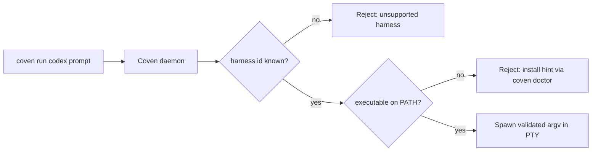

Coven **не** содержит CLI harness'ов. Каждый поддерживаемый harness — это независимая CLI, которую Coven обнаруживает в `PATH` во время запуска и контролирует через PTY-адаптер. Эта страница показывает команды установки для каждого harness'а v0 и объясняет, как `coven doctor` сообщает результаты обнаружения.

## Как работает обнаружение

И `coven doctor`, и `POST /api/v1/sessions` разрешают id harness'а (`codex`, `claude`, …) в имя исполняемого файла в `PATH`, используя таблицу адаптеров в [Адаптеры harness'ов](/HARNESS-ADAPTERS). Если бинарник отсутствует, Coven отказывается в закрытом виде с подсказкой по установке, а не пытается запустить.



Демон перепроверяет id harness'а при каждом запросе запуска. Клиенты не могут расширить allowlist, отправив другой argv или путь; принимаются только встроенные id адаптеров.

## Поддерживаемые harness'ы v0

| Id harness'а | Исполняемый файл | Команда установки | Логин провайдера | Страница подробностей |
|---|---|---|---|---|
| `codex` | `codex` | `npm install -g @openai/codex` | `codex login` | [Harness Codex](/harnesses/codex) |
| `claude` | `claude` | `npm install -g @anthropic-ai/claude-code` | `claude doctor` | [Harness Claude Code](/harnesses/claude-code) |

Другие CLI (Hermes, Aider, Gemini CLI, Cline, пользовательские команды) **не** входят в v0. См. [Заметки о будущих harness'ах](/FUTURE-HARNESSES) для направления адаптеров.

## Пошаговая установка

<Steps>
  <Step title="Установи хотя бы один harness">
    Выбери harness, которым хочешь управлять первым. Можно установить больше позже.

    ```bash
    # OpenAI Codex
    npm install -g @openai/codex

    # Anthropic Claude Code
    npm install -g @anthropic-ai/claude-code
    ```

    Другие пути установки (Homebrew, менеджеры пакетов, сборка из исходников) задокументированы в собственном README каждого проекта. Coven требует только, чтобы бинарник был в `PATH` под ожидаемым именем исполняемого файла.
  </Step>

  <Step title="Заверши auth провайдера в CLI harness'а">
    Coven никогда не трогает учётные данные провайдера. Запусти собственный поток логина каждой CLI один раз.

    ```bash
    codex login
    claude doctor
    ```

    См. [Граница auth провайдера](/harnesses/provider-auth) для обоснования.
  </Step>

  <Step title="Проверь, что Coven видит harness">
    ```bash
    coven doctor
    ```

    Ожидаемый вывод (сокращённый):

    ```text
    store:    ok
    project:  ok  (/path/to/project)
    daemon:   running  (pid 12345)
    codex:    ok       (/usr/local/bin/codex 0.x.y)
    claude:   ok       (/usr/local/bin/claude 0.x.y)
    ```

    Если строка показывает `missing`, doctor также печатает точную команду установки, показанную в таблице выше.
  </Step>

  <Step title="Запусти сессию">
    ```bash
    coven run codex "describe this repo"
    coven run claude "polish the CLI help text"
    ```
  </Step>
</Steps>

## Обновление harness'а

Coven не авто-обновляет CLI harness'ов. Рассматривай их как обычные глобальные npm-установки (или другого менеджера пакетов):

```bash
npm install -g @openai/codex@latest
npm install -g @anthropic-ai/claude-code@latest
```

После обновления повторно запусти `coven doctor`, чтобы подтвердить, что разрешённый путь/версия по-прежнему соответствует ожидаемому.

## Пользовательские расположения исполняемых файлов

Если harness установлен в каталоге вне `PATH` (например, локальный для проекта `node_modules/.bin`), убедись, что этот каталог в `PATH` **до** запуска демона. Coven уважает окружение процесса демона, а не окружение вызывающего shell, при запуске PTY.

Если ты меняешь `PATH` системно, перезапусти демон:

```bash
coven daemon restart
coven doctor
```

## Решение проблем

| Симптом | Вероятная причина | Решение |
|---|---|---|
| `coven doctor` сообщает harness как `missing` даже после установки | Новый `PATH` shell'а не подхвачен демоном | `coven daemon restart`, затем `coven doctor`. |
| Doctor находит бинарник, но `coven run` падает немедленно | Auth провайдера не завершён | Перезапусти `codex login` / `claude doctor`. См. [auth провайдера](/harnesses/provider-auth). |
| Doctor показывает устаревшую версию | Старый бинарник раньше в `PATH` | `which -a codex` (или `claude`) и удали дубликат. |
| Doctor сообщает `unsupported harness` | Опечатка в id harness'а | Используй один из id из таблицы выше. |


## Связанное

- [Harness'ы](/harnesses/index)
- [Harness Codex](/harnesses/codex)
- [Harness Claude Code](/harnesses/claude-code)
- [Адаптеры harness'ов](/HARNESS-ADAPTERS)
- [Заметки о будущих harness'ах](/FUTURE-HARNESSES)
