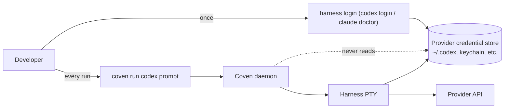

Coven контролирует PTY harness'ов. Он никогда не читает, не проксирует, не сохраняет и не выпускает учётные данные провайдера. Каждый поддерживаемый harness продолжает использовать **свой собственный** поток логина для OpenAI, Anthropic или любого будущего провайдера, с которым он говорит. Эта страница фиксирует, почему, что это означает на практике, и точную границу, которую применяет демон на Rust.

## TL;DR

- Токены провайдера живут там, где harness уже их кладёт — обычно `~/.codex/`, `~/.config/anthropic/` или системный keychain, управляемый этой CLI.
- Демон Coven никогда их не читает, никогда не хранит в SQLite, никогда не пересылает через socket API и никогда не логирует в журнал событий.
- `coven doctor` только проверяет, существует ли бинарник harness'а; он **не** тестирует учётные данные провайдера. Каждый harness уже поставляет собственный `login` / `doctor` для этого.
- Рассматривай Coven как имеющий **нулевое** знание о состоянии auth провайдера. Граница намеренная.

## Почему Coven отказывается владеть учётными данными

Стрелка, которая имеет значение, — это отсутствующая: у демона нет пунктирной линии в хранилище учётных данных провайдера. Три причины:

1. **Меньший радиус взрыва.** Скомпрометированный демон, socket или клиент Coven не может слить токены провайдера, которых у него никогда не было. Баг в логировании событий не может случайно записать токен, которым Coven никогда не владел.
2. **Без drift учётных данных.** Codex, Claude Code и будущие harness'ы итерируют свои собственные потоки auth (OAuth refresh, device codes, on-device keys). Coven должен был бы гоняться за каждым изменением. Оставаясь в стороне, мы никогда не выходим из синхронизации.
3. **Ясность аудита.** Когда что-то идёт не так с биллингом, лимитами или отозванными токенами, пользователь знает, что ответ живёт в **одном** месте — собственной CLI harness'а. Coven — это не слой учётных данных для дебагинга.

## Что это означает на каждой поверхности

### CLI

`coven run codex|claude <prompt>` запускает harness с пустым вектором аргументов, кроме валидированного prompt и prefix args адаптера. Он не инъецирует `OPENAI_API_KEY`, `ANTHROPIC_API_KEY` или любую env var, несущую токен. Если harness нуждается в учётных данных, он читает их так же, как при запуске напрямую из твоего shell.

### API демона

`POST /api/v1/sessions` принимает корень проекта, cwd, id harness'а, prompt и опциональный заголовок. Нет поля для API-ключа, OAuth-токена, refresh-токена, id учётной записи или id организации. Схема задокументирована в [Контракт API](/API-CONTRACT) — ни одного из этих полей не существует.

### Журнал событий

Append-only журнал событий записывает stdout/stderr harness'а по мере его выдачи. Демон не интроспектирует и не редактирует его; это значит, что если **ты** просишь harness напечатать `cat ~/.codex/auth.json`, вывод **попадёт** в журнал. См. [Модель безопасности](/SAFETY-MODEL#event-log-caution) для руководства со стороны пользователя.

### Клиентские интеграции

Клиенты (comux, клиент чата/ввода, плагин OpenClaw) подключаются к локальному socket. Они не могут получить токены провайдера от демона, потому что у демона их нет. Любой клиент, который хочет показать "logged in as ...", должен вызывать собственную команду статуса harness'а напрямую.

## Логин провайдера на harness

| Harness | Команда логина | Где живут учётные данные | Заметки |
|---|---|---|---|
| `codex` | `codex login` | `~/.codex/auth.json` (или платформенный keychain, в зависимости от версии Codex) | Используй `codex logout`, чтобы отозвать. Coven не нужно перезапускать. |
| `claude` | `claude doctor`, затем следуй подсказкам | `~/.config/anthropic/` и/или системный keychain | `claude doctor` также является общей проверкой здоровья; Coven полагается только на наличие бинарника. |
| `copilot` | `copilot login` | `~/.copilot/` (токен device-flow GitHub, управляемый самой CLI) | Используй `copilot logout`, чтобы отозвать. Доступ к Copilot на стороне GitHub определяется твоим планом GitHub. |

Если поток `login` самого harness'а имеет проблему (истёкший refresh-токен, отозванная org, сетевой сбой), Coven отображает это как нормальный выход harness'а — сессия заканчивается с тем кодом выхода, который вернула CLI, а журнал событий содержит сообщение об ошибке, напечатанное CLI.

## Что применяет Coven

Ответственность демона — **оставаться вне пути учётных данных**. Конкретно:

- Демон не читает переменные окружения, которые выглядят как учётные данные провайдера, перед запуском harness'а.
- Демон не инъецирует env vars провайдера в PTY-child за пределами того, что унаследовал сам процесс демона при запуске.
- CLI не принимает флаг `--token`, `--api-key`, `--openai-key` или подобный в `coven run`. Если ты видишь такой в форке или PR, это регрессия — пожалуйста, открой issue.
- Socket API не принимает поля учётных данных. Неизвестные поля игнорируются; явные поля учётных данных были бы отвергнуты и рассматривались как нарушение контракта.

## Что должен делать пользователь

Поскольку Coven отказывается владеть учётными данными, **пользователь** ответственен за:

- Запуск собственного потока `login` / `doctor` каждого harness'а хотя бы раз перед ожиданием, что `coven run` будет успешен.
- Ротацию токенов провайдера через CLI harness'а при необходимости.
- Обращение с любым выводом harness'а, который печатает учётные данные (потому что ты попросил), как с записанным в журнал — очисти его с помощью [`coven sacrifice`](/SESSION-LIFECYCLE#sacrifice) при необходимости.

## Связанное

- [Аутентификация и локальный доступ](/AUTH)
- [Модель безопасности](/SAFETY-MODEL)
- [Установка CLI harness'ов](/harnesses/installing)
- [Адаптеры harness'ов](/HARNESS-ADAPTERS)
- [Harness Codex](/harnesses/codex)
- [Harness Claude Code](/harnesses/claude-code)
