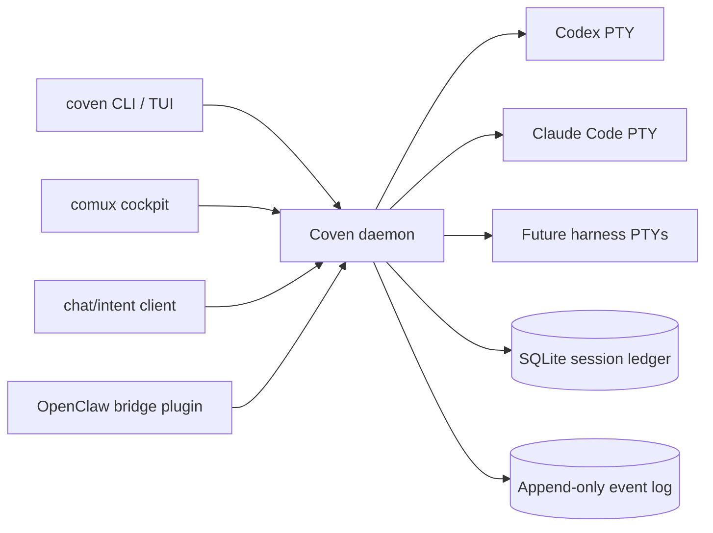

<div class="home-intro">
  
  <div>
    <p class="home-intro-kicker"><strong>Приведи любого фамильяра в круг.</strong></p>
    <p><strong>OpenCoven — это открытая экосистема для постоянных AI-фамильяров. Coven — это локальная runtime-подложка, которая управляет каждым harness — Codex, Claude Code и будущими Hermes, Aider и Gemini CLI — внутри явных границ проекта.</strong></p>
    <p>Запусти сессию, наблюдай за PTY, подключайся позже, архивируй по завершении. Один демон, один socket, все фамильяры в равных условиях.</p>
  </div>
</div>

<Columns>
  <Card title="Начать" href="/GETTING-STARTED" icon="rocket">
    Установи Coven, запусти `coven doctor` и запусти harness-сессию в границах проекта.
  </Card>
  <Card title="Модель runtime" href="/ARCHITECTURE" icon="compass">
    Демон, надзор за PTY, валидация корня проекта, сессии, события и авторитет локального socket.
  </Card>
  <Card title="Справочник по CLI" href="/reference/cli" icon="terminal">
    Текущие команды `coven`: run, sessions, attach, daemon, doctor, archive, summon и sacrifice.
  </Card>
</Columns>

## Что такое Coven?

Coven — это **local-first runtime-подложка**: единственный демон на Rust, который владеет PTY harness'ов, состоянием сессий и append-only журналом событий на твоей собственной машине. Клиенты вроде CLI/TUI `coven`, кокпит comux, клиент чата/ввода и внешний OpenClaw-плагин все координируются через один версионированный контракт HTTP-поверх-Unix-socket.

**Для кого это?** Разработчики и операторы, которые хотят, чтобы их AI-фамильяры продолжали работать локально, помнили, что они делали, и оставались внутри границ проекта, которые можно проаудитить.

**Что делает его другим сегодня?**

- **Local-first** — демон, хранилище и socket живут под `$COVEN_HOME`. Без облачного релея, без OAuth демона.
- **Нейтрален к harness'у** — Codex и Claude Code сегодня, с задокументированной планкой адаптера для будущих harness'ов. Тот же жизненный цикл, те же ритуалы.
- **С привязкой к проекту** — каждый запуск несёт явный корень проекта и канонизированный рабочий каталог. Демон на Rust перепроверяет каждый запрос.
- **Инспектируемый** — сессии и события — это строки SQLite, которые можно просмотреть с помощью `coven sessions`, воспроизвести с `coven attach` или принести в жертву, когда они больше не нужны.
- **Лицензия MIT** — упакован для ранних пользователей под `@opencoven/*`, команда всегда `coven`.

**Что тебе нужно?** Стабильный toolchain Rust (или опубликованный wrapper `@opencoven/cli`), хотя бы одна поддерживаемая CLI harness'а в `PATH` и проект, в котором запускаться.

## Как это работает



Демон — единственный источник истины для сессий, жизненного цикла PTY и маршрутизации capabilities.

## Ключевые возможности

<Columns>
  <Card title="Runtime, нейтральный к harness" icon="layers" href="/HARNESS-ADAPTERS">
    Codex и Claude Code запускаются через один контролируемый слой PTY.
  </Card>
  <Card title="Сессии в границах проекта" icon="folder-tree" href="/SESSION-LIFECYCLE">
    Каждая сессия фиксирует канонический корень проекта и отказывается отходить от него.
  </Card>
  <Card title="Append-only журнал событий" icon="scroll" href="/SESSION-LIFECYCLE">
    Воспроизводи вывод, восстанавливайся после перезапусков демона и проверяй, что harness реально делал.
  </Card>
  <Card title="Ритуалы" icon="moon" href="/SESSION-LIFECYCLE">
    Archive, summon и sacrifice — явные, безопасные для новичков глаголы вокруг разрушительных операций.
  </Card>
  <Card title="Локальный socket API" icon="plug" href="/API">
    Сначала `GET /api/v1/health`; затем sessions, events, capabilities и actions через Unix socket.
  </Card>
  <Card title="Интеграция клиентов" icon="plug-zap" href="/CLIENT-INTEGRATION">
    comux, клиент чата/ввода и мост OpenClaw интегрируются как socket-клиенты, а не как авторитеты запуска.
  </Card>
</Columns>

## Быстрый старт

<Steps>
  <Step title="Установи Coven">
    ```bash
    npm install -g @opencoven/cli
    ```
    Собираешь из исходников? См. [Начать](/GETTING-STARTED).
  </Step>
  <Step title="Проверь окружение">
    ```bash
    coven doctor
    ```
    `doctor` сообщает, есть ли `codex` и `claude` в `PATH`, может ли socket демона привязаться и что устанавливать дальше.
  </Step>
  <Step title="Запусти демон">
    ```bash
    coven daemon start
    coven daemon status
    ```
  </Step>
  <Step title="Запусти первую сессию">
    ```bash
    cd /path/to/your/project
    coven run codex "describe this repo"
    ```
    Или открой удобный для людей браузер сессий:

    ```bash
    coven sessions
    ```
  </Step>
</Steps>

Нужны полные инструкции по установке и настройке для разработчиков? См. [Начать](/GETTING-STARTED).

## Браузер сессий

`coven sessions` открывает удобный для людей браузер каждой живой и архивной сессии. Выбери одну, затем выбери ритуал:

- **Rejoin** — подключись к живому PTY и следи за его выводом.
- **View log** — открой append-only журнал событий.
- **Summon** — восстанови архивную сессию в активном списке.
- **Archive** — скрой завершённую сессию без удаления событий.
- **Sacrifice** — навсегда удали не выполняющуюся сессию (требует `--yes`).

Существуют также варианты, дружественные к pipe: `coven sessions --plain` для таблиц, `coven sessions --json` для клиентов.

## Конфигурация (опционально)

Состояние Coven живёт под `$COVEN_HOME` (по умолчанию `~/.coven` на macOS/Linux). Демон привязывает Unix socket по адресу `<covenHome>/coven.sock` и по умолчанию отказывается от TCP.

- Если ты **ничего не делаешь**, Coven использует твои существующие локальные логины harness'ов.
- Если хочешь ограничить это, ограничь `$COVEN_HOME` на каждый корень проекта или каждого фамильяра.

Пример:

```bash
export COVEN_HOME="$HOME/.local/share/coven"
coven daemon restart
```

## Начни здесь

<Columns>
  <Card title="Концепции" href="/CONCEPTS" icon="book-open">
    Топология runtime, граница авторитета, жизненный цикл сессии и плоскость управления.
  </Card>
  <Card title="Harness'ы" href="/HARNESS-ADAPTERS" icon="layers">
    Настройка по каждому harness, граница auth провайдера и ожидания адаптера.
  </Card>
  <Card title="Локальный API" href="/API" icon="plug">
    Версионированный socket API для comux, клиента чата/ввода, OpenClaw-плагина и твоих собственных клиентов.
  </Card>
  <Card title="Сессии" href="/SESSION-LIFECYCLE" icon="moon">
    Archive, summon и sacrifice — безопасные для новичков глаголы вокруг состояния сессии.
  </Card>
  <Card title="Помощь" href="/TROUBLESHOOTING" icon="life-buoy">
    Распространённые проблемы установки, переменные окружения и как подать пакет диагностики.
  </Card>
</Columns>

## Узнать больше

<Columns>
  <Card title="Операционная модель" href="/OPERATIONAL-MODEL" icon="list">
    Граница авторитета, гарантии хранилища, поддерживаемые harness'ы и сигналы roadmap.
  </Card>
  <Card title="Модель безопасности" href="/SAFETY-MODEL" icon="shield">
    Граница доверия, обращение с секретами, поза socket и одобрения автоматизации.
  </Card>
  <Card title="Решение проблем" href="/TROUBLESHOOTING" icon="wrench">
    Диагностика демона, подсказки по установке harness'ов, восстановление осиротевших сессий и проверка.
  </Card>
  <Card title="Roadmap" href="/ROADMAP" icon="map">
    Текущие milestones, направление адаптеров и публичные границы продукта.
  </Card>
</Columns>
