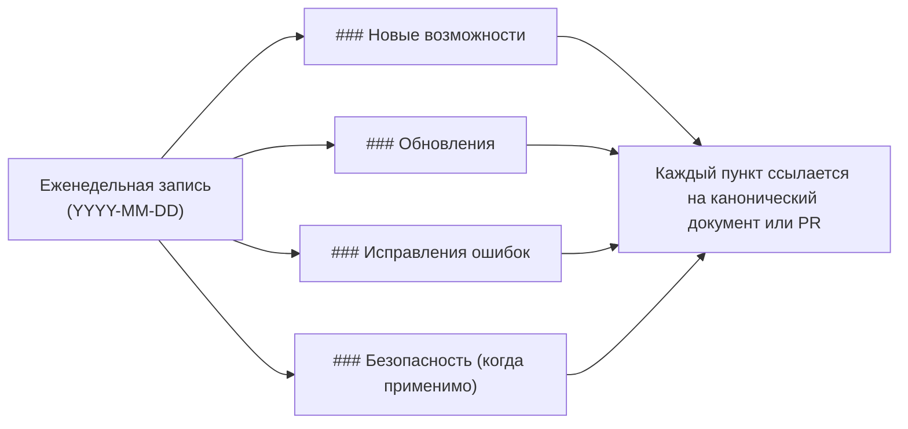

## Неделя от 17 мая 2026

### Исправления ошибок

- **TUI больше не падает на маленьких терминалах.** И `coven tui`, и `coven chat` теперь защищают свои расчёты разметки от очень маленьких размеров терминала, поэтому изменение размера окна на узкое или низкое больше не приводит к аварийному завершению сессии. См. [Coven TUI](/start/coven-tui).

### Безопасность

- **Уведомление безопасности Ratatui устранено.** Обновлён рендеринг-стек Ratatui, чтобы подтянуть пропатченный crate `lru`, что устраняет уведомление [GHSA-rhfx-m35p-ff5j](https://github.com/advisories/GHSA-rhfx-m35p-ff5j). Никаких действий не требуется — просто установите последнюю версию.

## Неделя от 15 мая 2026

### Обновления

- **Тема TUI в фирменном стиле.** И `coven tui`, и `coven chat` теперь используют единую палитру в фирменном стиле с согласованными семантическими токенами для стилей primary, agent, user, hint, surface и dim. Цвета автоматически адаптируются к вашему терминалу: truecolor в 24-битных терминалах, 256-цветный режим в устаревших терминалах и без цвета, когда вывод перенаправлен или установлен `NO_COLOR`. См. [Переменные окружения](/help/environment).

## Как читать этот changelog

Записи еженедельные, новые сверху. Элементы внутри каждой недели сгруппированы по категориям. Всё, что затрагивает публичный API (поверхность CLI, маршруты сокета, формы ответов), также попадает в [Контракт API](/API-CONTRACT) — changelog является указателем, а не заменой.

## Неделя от 11 мая 2026

### Новые возможности

- **TUI Coven, ориентированный на промпты.** Запуск `coven` (или `coven tui`) теперь открывает интерактивный интерфейс на основе Ratatui. Вводите задачи в свободной форме, выполняйте slash-команды (`/help`, `/agent`, `/clear`, `/export`, `/exit`) и навигируйте по меню ритуалов клавишами со стрелками. Работает через SSH и безопасно меняет размер. См. [Coven TUI](/start/coven-tui).
- **Диагностика и облегчение `coven pc`.** Инструмент давления на систему, ориентированный в первую очередь на macOS. Команды только для чтения показывают снимки CPU, памяти, диска и топовых процессов; операции записи (`coven pc kill`, `coven pc cache clear`) требуют явного `--confirm`. См. [справочник CLI](/reference/cli) и [Troubleshooting](/help/troubleshooting).
- **Контракт локального API v1.** Socket API демона теперь предоставляет версионированные эндпоинты health и capabilities, структурированные ответы об ошибках и пагинацию событий на основе курсора. Клиенты могут согласовывать возможности, а не угадывать их. См. [API contract](/reference/api-contract) и [События](/reference/api-events).
- **JSON-вывод сессий.** `coven sessions --json` выдаёт машиночитаемые списки сессий для скриптов, дашбордов и внешних клиентов. См. [comux JSON sessions](/sessions/comux-json).
- **Путь установки в Windows.** Coven теперь поставляет npm-пакет для Windows, так что `npx @opencoven/cli` работает на нативном Windows наряду с macOS и Linux. См. [Установка в Windows](/install/windows).

### Обновления

- **Позиционирование и брендинг OpenCoven.** Обновлены продуктовые тексты в документации и CLI, чтобы представить Coven как экосистему для постоянных AI-фамильяров, с обновлёнными брендовыми токенами и дизайн-руководством. См. [Бренд](/reference/brand).
- **Обновлённая палитра бренда.** Палитра OpenCoven обновлена до приглушённого лавандово-серого (`#9A8ECD`) с новой системой комплементарных акцентов и выделенными токенами поверхностей для тёмной и светлой темы. Существующие легаси-алиасы цветов сохранены, поэтому никаких действий для перехода на новый вид не требуется. См. [Бренд](/reference/brand).
- **Тема TUI в фирменном стиле.** TUI Coven теперь использует единую тему, согласованную с палитрой OpenCoven. Изящные фолбэки для терминалов без цвета, 256-цветных и truecolor сохраняют её читаемость локально, по SSH и в CI. См. [Coven TUI](/start/coven-tui).
- **Troubleshooting: здоровье и давление системы.** Добавлен раздел, который ведёт из канонического потока troubleshooting к `coven pc` для диагностики локального давления на CPU, память и диск. См. [Troubleshooting](/help/troubleshooting).
- **Полные идентификаторы сессий в plain-выводе.** `coven sessions --plain` теперь печатает полные идентификаторы сессий, чтобы их можно было копировать прямо в последующие команды.

### Исправления ошибок

- **Проверка статуса демона.** `coven` теперь проверяет демон через его health-сокет перед тем, как сообщить `running`, очищает мёртвые устаревшие метаданные и сообщает `stale`, когда метаданные живы, но не проверены.
- **Восстановление при повреждённых метаданных демона.** CLI теперь корректно восстанавливается, когда метаданные статуса демона на диске повреждены, вместо того чтобы не запускаться.
- **Более строгая пагинация событий.** API отклоняет нецелочисленные значения `limit` и `afterSeq` со структурированной ошибкой `invalid_request` до того, как выполнять какой-либо поиск сессии.
- **Ложные срабатывания guard'а секретов релиза.** Guard секретов публичного релиза теперь разрешает документированные ссылки на репозиторий OpenCoven и локальные пути worktree как безобидные токены с высокой энтропией, продолжая при этом помечать явные паттерны секретов.
