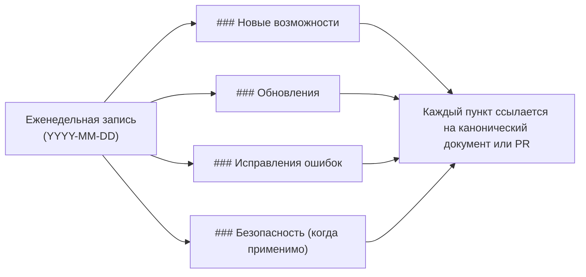

## Неделя от 14 июля 2026

### Новые возможности

- **GitHub Copilot CLI — поддерживаемый встроенный harness (v0.0.54).** `coven run copilot "…"` теперь запускает GitHub Copilot CLI (`npm install -g @github/copilot`) под тем же PTY-наблюдением в границах проекта, что Codex и Claude Code. `--permission full|read-only` отображается в нативные флаги Copilot (`--allow-all` / `--deny-tool write --deny-tool shell`), `--model`, `--add-dir` и `--think`/`--speed` (через `--effort`) пробрасываются нативно, а `coven chat` сохраняет беседы между ходами через предварительно назначенные UUID `--session-id`. См. [Harness Copilot CLI](/harnesses/copilot-cli) и [issue #381](https://github.com/OpenCoven/coven/issues/381).

## Неделя от 4 июля 2026

### Обновления

- **Выбор модели только через login CLI (v0.0.53).** Документация выбора модели теперь показывает только поддерживаемые пути Codex CLI и Claude Code. Провайдерские/API-key страницы для OpenAI, Anthropic, Google и локальных model backend'ов убраны из выбираемой поверхности `/models`, чтобы клиенты и пользователи шли через `codex login` или `claude doctor`, а не через сырые учётные данные провайдера. См. [Model selection](/models).

## Неделя от 24 июня 2026

### Новые возможности

- **Сопубликованный npm-обёртка external OpenClaw bridge plugin (v0.0.49).** Release-pipeline теперь публикует второе имя обёртки, external OpenClaw bridge plugin, рядом с существующим `@opencoven/cli`. Обе обёртки зависят от одних и тех же native-пакетов `@opencoven/cli-*`, поэтому установка любой из них даёт тот же бинарь `coven`. Это позволяет docs и онбордингу рекламировать каноническое имя *coven*, не ломая существующие установки `@opencoven/cli`. См. [PR #257](https://github.com/OpenCoven/coven/pull/257) и [руководство по релизам](/reference/releasing) для одноразовой настройки Trusted Publisher, которая нужна для первого OIDC-релиза нового пакета.
- **Spec Coven Group Chat (v0.0.49).** Добавлен v1-дизайн серверной примитивы группового чата в `specs/coven-group-chat/` (PRODUCT + TECH). Сегодня групповой чат существует только как клиентская fan-out-иллюзия в iOS; spec определяет долговременный серверный объект с монотонной нумерацией событий, чтобы iOS, web и CLI видели одну и ту же группу. Реализация отслеживается отдельно. См. [PR #258](https://github.com/OpenCoven/coven/pull/258).

### Обновления

- **Убраны упоминания OpenMeow в docs и коде (v0.0.49).** OpenMeow не является приложением OpenCoven — канонический клиент это CastCodes. Оставшиеся примеры и метки OpenMeow в английских/испанских/русских docs, в `DESIGN.md`, `ARCHITECTURE.md`, `AUTH.md`, `API-CONTRACT.md` и смежных файлах переписаны нейтрально по отношению к продукту. `crates/coven-cli/src/api.rs` переименовывает тестовое origin `openmeow` в `external-client`, а `skills/coven-task-manager` убирает `openmeow` из списка распознаваемых меток репозиториев. Изменений в runtime-поведении нет. См. [PR #256](https://github.com/OpenCoven/coven/pull/256).

## Неделя от 18 июня 2026

### Новые возможности

- **Управление reasoning для `coven run` (v0.0.48).** `coven run` теперь принимает `--think` и `--speed fast|balanced|thorough` вместе с `--model`. Запуски Claude преобразуют эти подсказки в `--effort`; неподдерживаемые harnesses предупреждают и продолжают работу вместо аварийного завершения. См. [issue #246](https://github.com/OpenCoven/coven/issues/246), [PR #254](https://github.com/OpenCoven/coven/pull/254) и [справочник `coven run`](/reference/cli-run).
- **Доверенный рецепт адаптера Hermes (v0.0.41).** `coven adapter install hermes` теперь записывает доверенный локальный manifest в `COVEN_HOME/adapters/hermes.json`, а Coven автоматически загружает manifests из собственного trust store. Новым пользователям больше не нужно вручную писать JSON или задавать `COVEN_HARNESS_ADAPTER_MANIFEST`, чтобы попробовать Hermes.

### Обновления

- **Статус пакета Windows x64.** Публичный README теперь отражает, что `@opencoven/cli-windows` опубликован, а не находится в staging. Пользователи Windows могут установить универсальный wrapper `@opencoven/cli` и проверить локальные harnesses через `coven doctor`.

### Исправления ошибок

- **Устойчивый backfill FTS-индекса событий (v0.0.48).** Backfill существующих событий в `events_fts` теперь выполняется ограниченными batch-ами, записывает завершение в `store_meta`, применяет `busy_timeout` к read-only соединениям и считает `SQLITE_BUSY` нефатальным, чтобы поисковая индексация не блокировала все запуски агентов на больших историях. См. [issue #249](https://github.com/OpenCoven/coven/issues/249) и [PR #254](https://github.com/OpenCoven/coven/pull/254).
- **Более понятная подсказка для неподдерживаемых harnesses.** Ошибки неизвестного harness теперь показывают настроенные IDs и направляют пользователей Hermes к `coven adapter install hermes`, затем к `coven adapter doctor hermes`.
- **Fallback домашнего каталога на Windows.** `coven doctor` и выбор store path работают в PowerShell без `HOME`, последовательно проверяя `USERPROFILE`, `HOMEDRIVE` + `HOMEPATH` и системный home перед тем, как попросить задать `COVEN_HOME`.

## Неделя от 3 июня 2026

### Новые возможности

- **Протокол параллельной работы Coven.** В Coven появились команды `coven wt`, `coven claim` и `coven hooks` для координации нескольких AI-агентов разработки в одном репозитории. Протокол создаёт изолированные git worktree, записывает claims на ветки с TTL, устанавливает цепочечные safety hooks, блокирует случайные коммиты в защищённые ветки и требует явную фразу намерения merge перед push в защищённые ветки. См. [issue #167](https://github.com/OpenCoven/coven/issues/167) и [PR #169](https://github.com/OpenCoven/coven/pull/169).
- **Сохранение идентичности familiar в сессиях.** Сессии теперь могут хранить разрешённый `familiar_id`, чтобы dashboards, API и агентские поверхности могли стабильно показывать, какой familiar запустил сессию или владеет ей. См. [PR #168](https://github.com/OpenCoven/coven/pull/168).

### Обновления

- **Общая резолюция familiars.** CLI, daemon и локальный API теперь разрешают familiar identities через один общий путь перед запуском, поэтому сохранённые метаданные сессии отражают каноническую familiar identity, а не непроверенную входную строку.
- **Guardrails для параллельных lane.** Протокол worktree включает поверхности status, doctor, prune, claim acquire/release/heartbeat/canary и установку hooks, чтобы координация агентов масштабировалась без ad hoc shell-скриптов.

### Исправления ошибок

- **Неизвестные familiar IDs больше не создают сессии.** `POST /sessions` теперь отклоняет неизвестный `familiarId` с `400 unknown_familiar` до вставки строки сессии или запуска runtime. Некорректная конфигурация familiars возвращает `500 familiar_lookup_failed` без запуска.
- **`coven run --familiar <id>` рано завершается для неизвестных familiars.** Локальные CLI-запуски теперь соответствуют поведению daemon/API и не сохраняют неразрешённые familiar IDs.

## Неделя от 17 мая 2026

### Исправления ошибок

- **Больше никаких двойных нажатий в TUI на Windows.** `coven tui` и браузер сессий теперь фильтруют только события нажатия клавиш в Windows, поэтому при наборе `a` больше не вставляется `aa`, стрелки переходят на одну строку за нажатие, а Enter активирует выбор один раз. На macOS и Linux поведение не меняется. См. [Coven TUI](/start/coven-tui) и [Установка в Windows](/install/windows).
- **TUI больше не падает на маленьких терминалах.** И `coven tui`, и `coven chat` теперь защищают свои расчёты разметки от очень маленьких размеров терминала, поэтому изменение размера окна на узкое или низкое больше не приводит к аварийному завершению сессии. См. [Coven TUI](/start/coven-tui).
- **Гигиена release gate.** Guard секретов публичного релиза теперь разрешает публичные URL GitHub advisories и сканирует историю релиза от `HEAD`, чтобы устаревшие удалённые ветки не блокировали текущий gate.

### Безопасность

- **Уведомление безопасности Ratatui устранено.** Обновлён рендеринг-стек Ratatui, чтобы подтянуть пропатченный crate `lru`, что устраняет уведомление [GHSA-rhfx-m35p-ff5j](https://github.com/advisories/GHSA-rhfx-m35p-ff5j). Никаких действий не требуется — просто установите последнюю версию.

## Неделя от 15 мая 2026

### Обновления

- **Тема TUI в фирменном стиле.** И `coven tui`, и `coven chat` теперь используют единую палитру в фирменном стиле с согласованными семантическими токенами для стилей primary, agent, user, hint, surface и dim. Цвета автоматически адаптируются к вашему терминалу: truecolor в 24-битных терминалах, 256-цветный режим в устаревших терминалах и без цвета, когда вывод перенаправлен или установлен `NO_COLOR`. См. [Troubleshooting](/TROUBLESHOOTING).

## Как читать этот changelog

Записи еженедельные, новые сверху. Элементы внутри каждой недели сгруппированы по категориям. Всё, что затрагивает публичный API (поверхность CLI, маршруты сокета, формы ответов), также попадает в [Контракт API](/API-CONTRACT) — changelog является указателем, а не заменой.

## Неделя от 11 мая 2026

### Новые возможности

- **TUI Coven, ориентированный на промпты.** Запуск `coven` (или `coven tui`) теперь открывает интерактивный интерфейс на основе Ratatui. Вводите задачи в свободной форме, выполняйте slash-команды (`/help`, `/agent`, `/clear`, `/export`, `/exit`) и навигируйте по меню ритуалов клавишами со стрелками. Работает через SSH и безопасно меняет размер. См. [Coven TUI](/start/coven-tui).
- **Диагностика и облегчение `coven pc`.** Инструмент давления на систему, ориентированный в первую очередь на macOS. Команды только для чтения показывают снимки CPU, памяти, диска и топовых процессов; операции записи (`coven pc kill`, `coven pc cache clear`) требуют явного `--confirm`. См. [справочник CLI](/reference/cli) и [Troubleshooting](/TROUBLESHOOTING).
- **Контракт локального API v1.** Socket API демона теперь предоставляет версионированные эндпоинты health и capabilities, структурированные ответы об ошибках и пагинацию событий на основе курсора. Клиенты могут согласовывать возможности, а не угадывать их. См. [API contract](/API-CONTRACT) и [Local API](/API).
- **JSON-вывод сессий.** `coven sessions --json` выдаёт машиночитаемые списки сессий для скриптов, дашбордов и внешних клиентов. См. [comux JSON sessions](/sessions/comux-json).
- **Путь установки в Windows.** Coven теперь поставляет npm-пакет для Windows, так что `npx @opencoven/cli` работает на нативном Windows наряду с macOS и Linux. См. [Getting started](/GETTING-STARTED).

### Обновления

- **Позиционирование и брендинг OpenCoven.** Обновлены продуктовые тексты в документации и CLI, чтобы представить Coven как экосистему для постоянных AI-фамильяров, с обновлёнными брендовыми токенами и дизайн-руководством. См. [Бренд](/BRAND).
- **Обновлённая палитра бренда.** Палитра OpenCoven обновлена до приглушённого лавандово-серого (`#9A8ECD`) с новой системой комплементарных акцентов и выделенными токенами поверхностей для тёмной и светлой темы. Существующие легаси-алиасы цветов сохранены, поэтому никаких действий для перехода на новый вид не требуется. См. [Бренд](/BRAND).
- **Тема TUI в фирменном стиле.** TUI Coven теперь использует единую тему, согласованную с палитрой OpenCoven. Изящные фолбэки для терминалов без цвета, 256-цветных и truecolor сохраняют её читаемость локально, по SSH и в CI. См. [Coven TUI](/start/coven-tui).
- **Troubleshooting: здоровье и давление системы.** Добавлен раздел, который ведёт из канонического потока troubleshooting к `coven pc` для диагностики локального давления на CPU, память и диск. См. [Troubleshooting](/TROUBLESHOOTING).
- **Полные идентификаторы сессий в plain-выводе.** `coven sessions --plain` теперь печатает полные идентификаторы сессий, чтобы их можно было копировать прямо в последующие команды.

### Исправления ошибок

- **Проверка статуса демона.** `coven` теперь проверяет демон через его health-сокет перед тем, как сообщить `running`, очищает мёртвые устаревшие метаданные и сообщает `stale`, когда метаданные живы, но не проверены.
- **Восстановление при повреждённых метаданных демона.** CLI теперь корректно восстанавливается, когда метаданные статуса демона на диске повреждены, вместо того чтобы не запускаться.
- **Более строгая пагинация событий.** API отклоняет нецелочисленные значения `limit` и `afterSeq` со структурированной ошибкой `invalid_request` до того, как выполнять какой-либо поиск сессии.
- **Ложные срабатывания guard'а секретов релиза.** Guard секретов публичного релиза теперь разрешает документированные ссылки на репозиторий OpenCoven и локальные пути worktree как безобидные токены с высокой энтропией, продолжая при этом помечать явные паттерны секретов.
