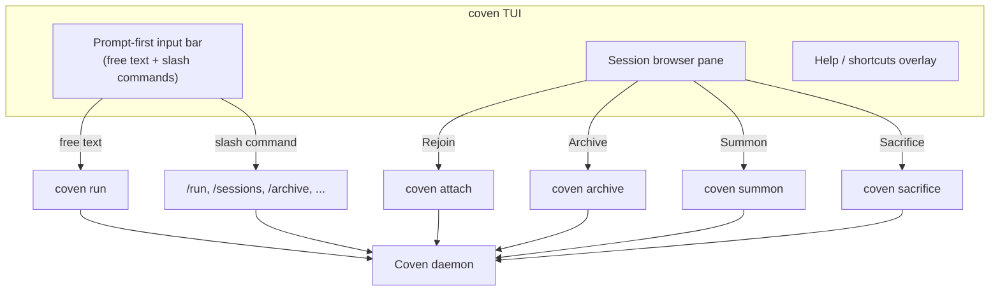

`coven` (или явное `coven tui`) открывает **prompt-first TUI**: интерфейс, основанный на Ratatui, где можно вводить задачи в свободной форме, запускать slash-команды или навигировать по меню ритуалов стрелками. Это рекомендуемая отправная точка для новых пользователей, и она работает через SSH или в локальном терминале.

## Когда её использовать

| Ситуация | Лучшая поверхность |
|---|---|
| Свежая установка, изучение того, что Coven может делать | **TUI** (`coven`) |
| Разовая задача в знакомом проекте | **TUI** или `coven run <harness> "<task>"` |
| Скриптинг, пайпинг, читаемый машиной вывод | `coven sessions --json`, `--plain` |
| Долгий attach/replay | Браузер сессий TUI или `coven attach <id>` |
| Быстрая проверка здоровья | `coven doctor` |

TUI — это тонкий слой представления. Каждое действие, которое она предлагает, отображается на базовый глагол CLI или вызов socket API — демон на Rust остаётся авторитетом.

## Анатомия



TUI никогда не обходит демон. Корень проекта, cwd и id harness'а перепроверяются на стороне сервера при каждом запуске.

## Режимы input

Строка prompt принимает три формы input взаимозаменяемо:

1. **Свободный текст задачи** — всё, что **не** начинается с `/`. Нажатие `Enter` запускает harness по умолчанию против текущего проекта.

   ```text
   fix the failing tests
   review the diff in packages/cli
   ```

2. **Slash-команды** — начинаются с `/` и маршрутизируются к конкретному глаголу.

   ```text
   /run codex "audit this repo"
   /run claude "polish the help text" --title "Help polish"
   /sessions
   /archive session-1
   /help
   ```

3. **Навигация меню стрелками** — `↑` / `↓` циклически проходят через карты ритуалов (Rejoin, View Log, Summon, Archive, Sacrifice) для выбранной в данный момент сессии. `Enter` подтверждает. `Esc` отменяет.

## Справочник slash-команд

| Команда | Что делает |
|---|---|
| `/help` | Показывает overlay помощи со всеми сокращениями и примерами. |
| `/run <harness> "<task>"` | Запускает сессию, ограниченную проектом. Так же, как `coven run`. |
| `/sessions` | Открывает браузер сессий. Так же, как `coven sessions`. |
| `/attach <session-id>` | Подключиться к (или воспроизвести) сессии. |
| `/archive <session-id>` | Скрыть не выполняющуюся сессию, сохраняя события. |
| `/summon <session-id>` | Восстановить архивную сессию. |
| `/sacrifice <session-id>` | Навсегда удалить не выполняющуюся сессию. Просит ввести `sacrifice` для подтверждения. |
| `/doctor` | Запустить `coven doctor` и отрендерить результат inline. |
| `/clear` | Очистить строку input и любой inline-вывод. |
| `/export` | Скопировать запись текущей выбранной сессии как JSON в буфер обмена. |
| `/agent <harness>` | Установить harness по умолчанию для свободного input в этой сессии TUI. |
| `/exit` | Чисто закрыть TUI. Эквивалент `Ctrl+C` или `Esc` в корне. |

## Клавиатурные сокращения

| Клавиши | Действие |
|---|---|
| `h` (корень) | Открывает overlay `/help` |
| `↑ / ↓` | Перемещает выбор в браузере сессий или меню |
| `Enter` | Подтверждает выбор / отправляет prompt |
| `Esc` | Возврат из меню или выход в корне |
| `Ctrl+C` | Немедленный выход |
| `Tab` | Циклическое переключение фокуса между строкой input и браузером сессий |
| `Ctrl+L` | Перерисовка (полезно через нестабильный SSH) |

TUI безопасно изменяет размер. Терминалы, такие маленькие, как 80×24, остаются пригодными к использованию; более широкие терминалы автоматически расширяют список сессий, предпросмотр логов и overlay помощи.

## Действия браузера сессий

Выбор сессии и нажатие `Enter` показывает контекстные действия. Каждое ограничено состоянием сессии — действия, которые небезопасны для текущего состояния, скрываются, а не делаются серыми, поэтому меню никогда не предлагает разрушительный глагол, который ты не можешь выполнить.

| Действие | Доступно когда | Эффект |
|---|---|---|
| **Rejoin** | сессия `running` | Подключение к живому PTY; input пересылается в harness. |
| **View Log** | сессия не `running` | Воспроизведение журнала событий (только для чтения). |
| **Summon** | `archived_at` установлен | Восстановить в активный список и воспроизвести/следить. |
| **Archive** | сессия не `running` и не архивирована | Скрыть из активного списка; события сохраняются. |
| **Sacrifice** | сессия не `running` | Постоянное удаление; требует ввод подтверждения. |

Отображение между действиями и глаголами CLI задокументировано в [Жизненный цикл сессии](/SESSION-LIFECYCLE).

## SSH и удалённое использование

TUI основана на Ratatui и переживает обычные враждебные окружения:

- Терминалы через SSH (без локальных зависимостей мыши/шрифта).
- Изменение размера во время сессии (перерисовывает на `SIGWINCH`).
- `TERM=xterm-256color` или `screen-256color`.

Она **не** требует графического терминала, бэкенда буфера обмена или `tmux`. Если ты внутри `tmux` или `screen`, TUI ведёт себя как любое другое приложение Ratatui — splits панелей и detach по-прежнему работают.

## Fallback в plain-text

Если предпочитаешь неинтерактивный поток (CI, скриптинг, логи аудита), пропусти TUI полностью:

```bash
coven run codex "fix the failing tests"
coven sessions --plain
coven attach <session-id>
```

Эти глаголы производят стабильный, скриптуемый вывод, и это те же глаголы, к которым TUI в конечном итоге маршрутизирует.


## Связанное

- [Начать работу с Coven](/GETTING-STARTED)
- [Жизненный цикл сессии](/SESSION-LIFECYCLE)
- [Справочник CLI](/reference/cli)
- [Решение проблем](/TROUBLESHOOTING)
