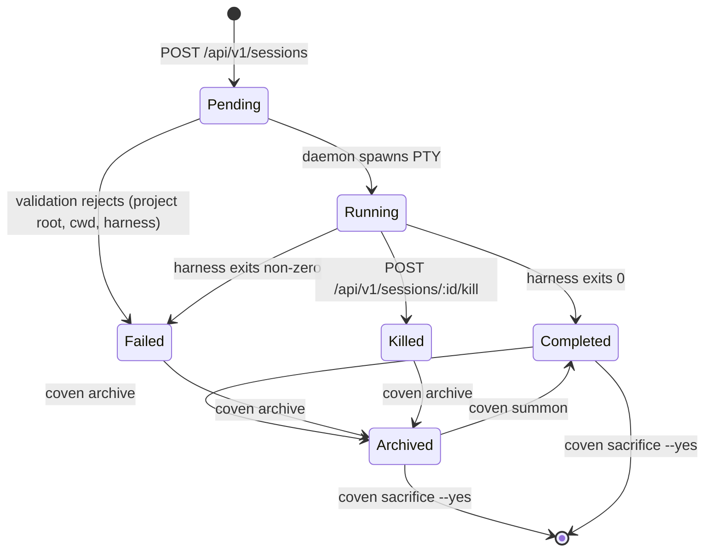

Every Coven session moves through the same states, regardless of which harness is driving it.



## State definitions

| State | Meaning |
|---|---|
| `pending` | Daemon accepted the request; PTY not yet spawned. |
| `running` | PTY is live; output and input flow through Coven. |
| `completed` | Harness exited with code 0. |
| `failed` | Harness exited with a non-zero code. The exit code is recorded. |
| `killed` | Operator or client called `kill`. |
| `archived` | Session is hidden from the active list. Events preserved. |

## Launch

```bash
coven run codex "describe this repo"
```

Equivalent socket call:

```http
POST /api/v1/sessions
Content-Type: application/json

{
  "projectRoot": "/absolute/path",
  "cwd": "/absolute/path/subdir",
  "harness": "codex",
  "prompt": "describe this repo"
}
```

The Rust daemon revalidates `projectRoot` and `cwd` before spawning the PTY. See [Authority boundary](/concepts/authority-boundary).

## Attach

```bash
coven attach <session-id>
```

`attach` streams output from the event log (replay) and then follows live output. Input is forwarded to the PTY. Use `Ctrl-]` to detach without killing the session.

## Archive / summon / sacrifice

These are the three rituals around finished sessions:

<Columns>
  <Card title="Archive" href="/rituals/archive" icon="archive">
    Hide a non-running session. Reversible. Events preserved.
  </Card>
  <Card title="Summon" href="/rituals/summon" icon="moon-star">
    Restore an archived session to the active list, then replay/follow it.
  </Card>
  <Card title="Sacrifice" href="/rituals/sacrifice" icon="flame">
    Permanently delete. Refuses live sessions. Requires `--yes`.
  </Card>
</Columns>

## Orphan recovery

If the daemon restarts while a PTY is running, the session is marked **orphaned**. On the next start, the daemon:

1. Reads the session ledger.
2. Marks orphaned sessions as `failed` with a recovery note in their event stream.
3. Refuses to re-attach to a dead PTY.

See [Orphan recovery](/daemon/orphan-recovery).

## Related

- [Events](/sessions/events)
- [comux JSON sessions](/sessions/comux-json)
- [Rituals](/rituals)
- [CLI: coven sessions](/reference/cli-sessions)
