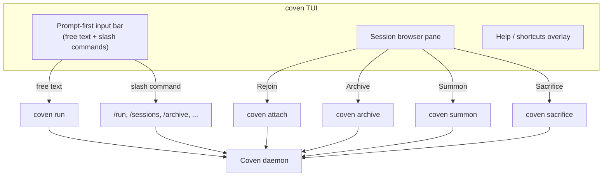

`coven` (or the explicit `coven tui`) opens the **prompt-first TUI**: a Ratatui-backed interface where you can type free-form tasks, run slash commands, or navigate ritual menus with arrow keys. It is the recommended starting point for new users and works over SSH or in a local terminal.

## When to use it

| Situation | Best surface |
|---|---|
| Brand-new install, exploring what Coven can do | **TUI** (`coven`) |
| One-off task in a known project | **TUI** or `coven run <harness> "<task>"` |
| Scripting, piping, machine-readable output | `coven sessions --json`, `--plain` |
| Long-running attach/replay | TUI's session browser, or `coven attach <id>` |
| Quick health check | `coven doctor` |

The TUI is a thin presentation layer. Every action it offers maps to an underlying CLI verb or socket API call — the Rust daemon remains the authority.

## Anatomy



The TUI never bypasses the daemon. Project root, cwd, and harness id are revalidated server-side on every launch.

## Input modes

The prompt bar accepts three input shapes interchangeably:

1. **Free-form task text** — anything that does **not** start with `/`. Pressing `Enter` launches the default harness against the current project.

   ```text
   fix the failing tests
   review the diff in packages/cli
   ```

2. **Slash commands** — start with `/` and route to a specific verb.

   ```text
   /run codex "audit this repo"
   /run claude "polish the help text" --title "Help polish"
   /sessions
   /archive session-1
   /help
   ```

3. **Arrow-key menu navigation** — `↑` / `↓` cycle through ritual cards (Rejoin, View Log, Summon, Archive, Sacrifice) for the currently selected session. `Enter` confirms. `Esc` cancels.

## Slash command reference

| Command | What it does |
|---|---|
| `/help` | Show the help overlay with all shortcuts and examples. |
| `/run <harness> "<task>"` | Launch a project-scoped session. Same as `coven run`. |
| `/sessions` | Open the session browser. Same as `coven sessions`. |
| `/attach <session-id>` | Attach to (or replay) a session. |
| `/archive <session-id>` | Hide a non-running session while preserving events. |
| `/summon <session-id>` | Restore an archived session. |
| `/sacrifice <session-id>` | Permanently delete a non-running session. Asks you to type `sacrifice` to confirm. |
| `/doctor` | Run `coven doctor` and render the result inline. |
| `/clear` | Clear the input bar and any inline output. |
| `/export` | Copy the current selected session's record as JSON to the clipboard. |
| `/agent <harness>` | Set the default harness for free-form input in this TUI session. |
| `/exit` | Close the TUI cleanly. Equivalent to `Ctrl+C` or `Esc` at the root. |

## Keyboard shortcuts

| Keys | Action |
|---|---|
| `h` (root) | Open `/help` overlay |
| `↑ / ↓` | Move selection in the session browser or menu |
| `Enter` | Confirm selection / submit prompt |
| `Esc` | Back out of a menu, or quit at root |
| `Ctrl+C` | Quit immediately |
| `Tab` | Cycle focus between input bar and session browser |
| `Ctrl+L` | Re-render (useful over flaky SSH) |

The TUI resizes safely. Terminals as small as 80×24 remain usable; wider terminals expand the session list, log preview, and help overlay automatically.

## Session browser actions

Selecting a session and pressing `Enter` shows contextual actions. Each one is gated by session state — actions that are not safe for the current state are hidden, not greyed out, so the menu never offers a destructive verb you cannot run.

| Action | Available when | Effect |
|---|---|---|
| **Rejoin** | session is `running` | Attach to the live PTY; input is forwarded to the harness. |
| **View Log** | session is not `running` | Replay the event log (read-only). |
| **Summon** | `archived_at` is set | Restore to the active list and replay/follow. |
| **Archive** | session is not `running` and not archived | Hide from the active list; events preserved. |
| **Sacrifice** | session is not `running` | Permanent delete; requires typed confirmation. |

The map between actions and CLI verbs is documented in [Session lifecycle](/SESSION-LIFECYCLE).

## SSH and remote use

The TUI is Ratatui-based and survives the usual hostile environments:

- Terminals over SSH (no local mouse/font dependencies).
- Resizing during a session (re-renders on `SIGWINCH`).
- `TERM=xterm-256color` or `screen-256color`.

It does **not** require a graphical terminal, a clipboard backend, or `tmux`. If you are inside `tmux` or `screen`, the TUI behaves like any other Ratatui app — pane splits and detach still work.

## Plain-text fallback

If you prefer a non-interactive flow (CI, scripting, audit logs), skip the TUI entirely:

```bash
coven run codex "fix the failing tests"
coven sessions --plain
coven attach <session-id>
```

These verbs produce stable, scriptable output and are the same ones the TUI ultimately routes to.

## Related

- [Get started with Coven](/GETTING-STARTED)
- [Session lifecycle](/SESSION-LIFECYCLE)
- [CLI reference](/reference/cli)
- [Troubleshooting](/TROUBLESHOOTING)
