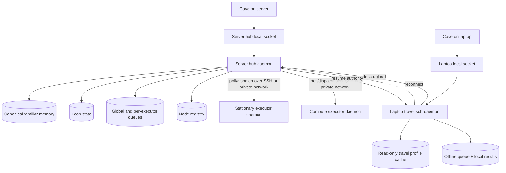

# Coven Multi-Host Daemon Architecture - PRODUCT

**Status:** Draft v0.1 - 2026-07-04
**Owner:** Coven runtime - Coven Cave
**Tracks:** GitHub issues #264, #265, #267, #268, #269, #270

## Problem

Coven is currently documented as a same-user local daemon: one machine, one Rust authority boundary, one Unix socket, and local harness PTYs. That model is still the correct trust foundation, but it does not cover the product shape Val needs next:

1. A server machine should be the durable home for familiar memory, loop state, job queues, and node registry.
2. Stationary and compute machines should execute work without becoming canonical memory authorities.
3. A laptop should keep working while traveling, disconnected, or on unreliable networks.
4. Offline laptop work must reconcile back to the hub without overwriting canonical familiar memory.
5. Cave needs enough explicit state to show when work is local, pending handoff, syncing, or resumed on the hub.

This spec defines the multi-host daemon architecture and the travel-mode contract before implementation.

## Goals

- Preserve Coven runtime as the authority boundary.
- Introduce a Server hub role that owns canonical familiar memory, loop state, node registry, and global/per-executor job queues.
- Introduce stateless executor nodes dispatched by the hub over SSH/private network links.
- Introduce a Laptop travel client with a local-only sub-daemon, read-only travel profile cache, local lightweight agents, offline queue, and reconnect delta.
- Make conflict behavior simple: the hub wins canonical familiar-memory conflicts; offline laptop results append as evidence/events instead of replacing hub memory.
- Split implementation responsibilities cleanly between `OpenCoven/coven` and `OpenCoven/coven-cave`.

## Non-goals

- No hosted Coven account system.
- No browser-exposed raw daemon socket.
- No peer-to-peer executor mesh.
- No executor-initiated callback channel to the hub.
- No multi-writer familiar memory.
- No automatic remote trust based only on network reachability.
- No replacement for the existing same-user local socket model on each node.

## Roles

### Server hub

The Server hub is the canonical Coven authority for a multi-host installation.

It owns:

- familiar memory and identity audit state;
- loop state;
- node registry;
- scheduler decisions;
- global job queues;
- per-executor subqueues;
- travel profile generation;
- travel delta reconciliation; and
- reconnect state transitions.

The hub may run local work, but that is not its defining role. Its defining role is authority.

### Executor nodes

Stationary and compute executor nodes are stateless work runners from the product perspective.

They may keep local process/session state needed to run assigned jobs, but they do not own canonical familiar memory, scheduler policy, global queues, or reconciliation.

Executor constraints:

- The hub polls and dispatches; executor nodes do not initiate contact.
- Communication uses SSH or a private-network transport selected by the hub.
- Executors advertise capability, availability, queue pressure, and health.
- If an executor disappears, the hub preserves queue state and decides whether to pause, redispatch, or mark work blocked.

### Laptop travel client

The Laptop travel client is Cave plus a local-only Coven sub-daemon.

It owns only temporary travel-mode state:

- a read-only travel profile cache;
- local lightweight-agent execution;
- an offline queue;
- local result artifacts; and
- reconnect delta staging.

It does not own canonical familiar memory. While offline, it may append local observations, draft results, and task outcomes to its offline queue. On reconnect, it uploads a delta for hub reconciliation.

## Travel mode

Travel mode activates when the Laptop travel client cannot reach the Server hub and has a non-expired travel profile for the selected familiar/workspace.

Expected user-visible states:

| State | Meaning |
| --- | --- |
| `hub_active` | Hub is reachable and authoritative. |
| `travel_local` | Hub is unreachable; laptop is running from a read-only travel profile. |
| `travel_stale` | Laptop can run locally, but the cached profile has passed its freshness window. |
| `handoff_pending` | Hub is reachable again; laptop has offline delta to upload before hub resumes. |
| `syncing_delta` | Laptop is uploading offline results and artifacts to the hub. |
| `hub_resumed` | Hub has accepted reconciliation and resumed authority. |

Travel profile requirements:

- compressed;
- read-only after generation;
- scoped to a familiar/workspace;
- contains memory/context needed for local lightweight work;
- contains `version`;
- contains `generated_at`;
- contains source hub identity;
- contains expiry and staleness metadata;
- contains the canonical memory revision it was generated from; and
- contains enough policy metadata for the laptop to fail closed when local work would exceed travel-mode permissions.

## Reconciliation model

Reconciliation is append-only.

The laptop uploads an offline delta containing:

- travel profile identity and revision;
- local sessions started while offline;
- user inputs and assistant outputs;
- tool-call summaries and artifacts;
- result metadata;
- local errors;
- clock and monotonic ordering data where available; and
- proposed memory additions, if any.

The hub:

- verifies the delta was produced from a known travel profile;
- records the delta as an append-only artifact;
- appends offline results to session/history surfaces;
- routes proposed memory additions through hub-side Ward/policy review;
- refuses direct overwrites of canonical familiar memory; and
- returns the new hub state required by Cave to leave handoff mode.

## Scheduler product contract

The scheduler chooses where work runs from:

- required capabilities;
- node availability;
- queue pressure;
- expected task weight;
- network reachability;
- battery/travel mode;
- user policy; and
- executor health.

Laptop-local agents in travel mode must avoid heavyweight work by default. Heavyweight work waits for hub connectivity or explicit user approval to run locally if policy allows it.

Cave needs scheduler explanation data so it can show why a job is running on the hub, a stationary executor, a compute executor, or the laptop.

## Implementation split

### `OpenCoven/coven`

Coven owns:

- hub daemon state model;
- node registry;
- executor polling and dispatch protocol;
- travel profile generation;
- travel profile validation;
- offline delta upload API;
- reconciliation;
- scheduler decisions;
- queue persistence;
- failure simulation test harnesses; and
- release gates for multi-host safety.

### `OpenCoven/coven-cave`

Cave owns:

- hub/travel-client UI;
- travel-state display;
- stale-cache warning display;
- reconnect handoff flow;
- local-only laptop controls;
- scheduler explanation rendering; and
- user approval surfaces for travel-mode exceptions.

Cave may improve UX before sending requests, but all sensitive decisions are revalidated by Coven.

## Conflicts with current design

The current local daemon model remains valid for single-machine use, but these conflicts must be resolved before shipping multi-host mode:

- **Local socket only:** current docs reject remote access. Multi-host mode must not tunnel the raw local socket; it needs explicit hub-to-node transport and auth.
- **Single authority assumption:** current store/session docs assume one daemon owns all state. The hub model must define which state is canonical and which state is local cache.
- **Per-familiar SSH patterns:** any existing or planned per-familiar SSH runtime must not bypass the hub scheduler or create executor-initiated authority.
- **Event log locality:** event IDs and session ordering need hub-owned sequencing or a reconciliation-safe mapping for offline travel deltas.
- **Memory writes:** current local memory behavior must become hub-authoritative in multi-host mode; travel clients can propose additions, not overwrite.
- **Health semantics:** local `health` is insufficient; Cave needs hub reachability, travel profile freshness, node availability, queue pressure, and handoff state.

## Issue map

- #264 tracks the epic.
- #265 is satisfied by this product/technical spec pair.
- #267 implements the stateless executor protocol and SSH dispatcher.
- #268 implements travel profile and reconcile APIs.
- #269 implements scheduler intelligence and loop redispatch.
- #270 implements failure simulations and release gates.
